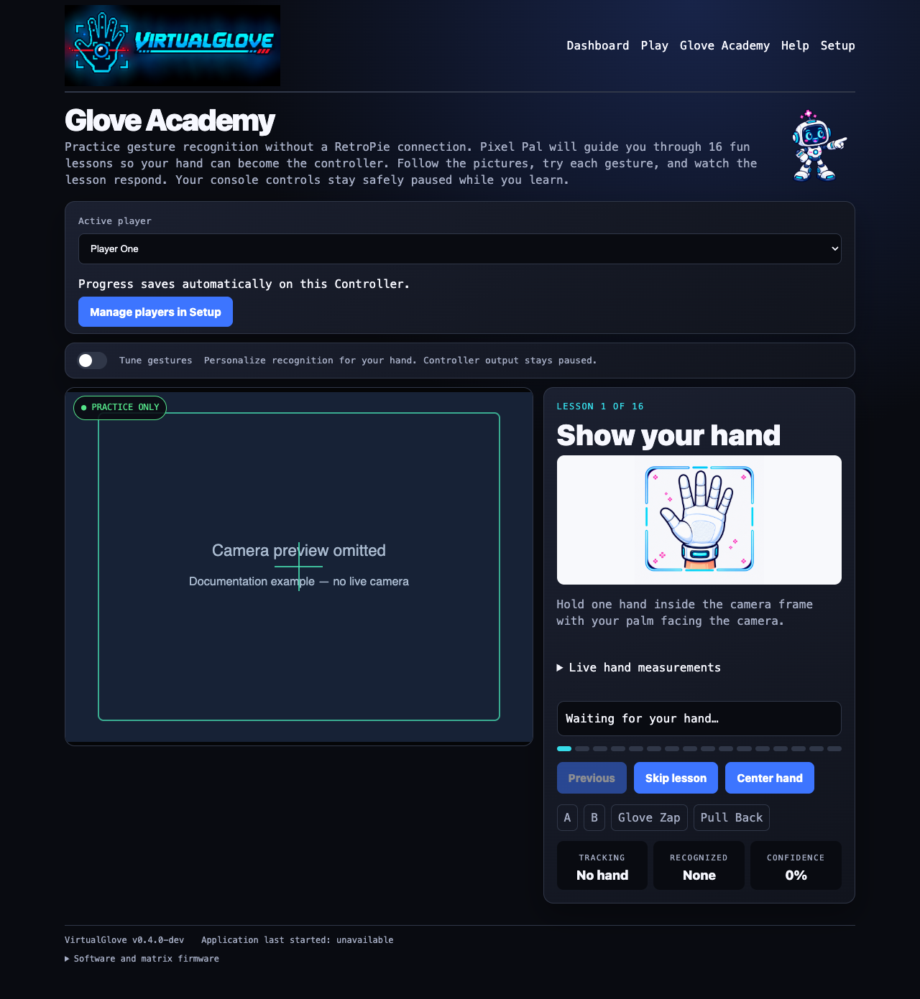
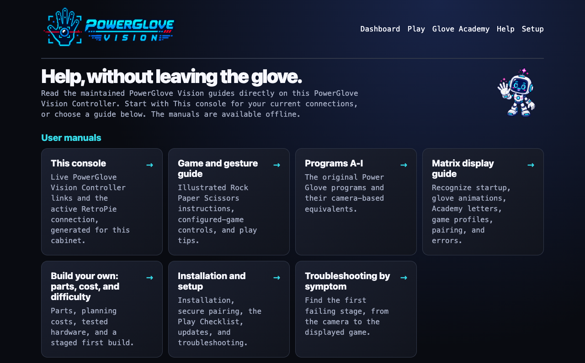
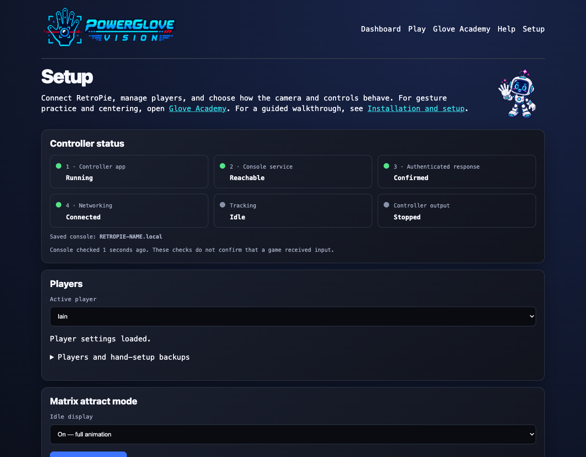

<p align="center">
  
</p>

# PowerGlove Vision

Camera-only hand tracking for an Arduino UNO Q and a RetroPie arcade cabinet.
The hand may be bare or covered by a plain white or black glove; the glove is
only a visual tracking aid and contains no electronics.

The project has two processes:

- `powerglove-vision` runs on the UNO Q. It observes one hand, calibrates a
  comfortable neutral pose, converts motion and finger flex into controller
  state, and sends that state over UDP.
- `powerglove-receiver` runs on the Raspberry Pi. It exposes the received state
  as a Linux virtual gamepad that RetroArch can bind like any other controller.

The current milestone supplies a complete standard-gamepad path, all nine
cartridge-free Programs A-I, automatic RetroPie game selection, and preserves
four analogue channels plus individual finger values in the network protocol.
Native Power Glove packets for Super Glove Ball will be added later through an
`lr-nestopia` integration; no ROM modification is required.

The standard gamepad path has been verified on the arcade cabinet with
`lr-nestopia`, including automatic selection of the Super Glove Ball profile,
directional movement, finger-curl actions, and the held V-sign Start gesture.

Bad Street Brawler's unusual cartridge-resident Programs A-I and their direct
camera equivalents are documented in
[bad-street-brawler-programs.md](docs/bad-street-brawler-programs.md).

## Pick up the right guide

| Guide | Best for |
| --- | --- |
| [PowerGlove Vision Installation Guide](docs/INSTALL_README.md) | First build, secure pairing, RetroArch setup, the Play Checklist, updates, and troubleshooting |
| [Illustrated game and gesture guide](docs/GAMEPLAY_GUIDE.md) | One-page instructions, gesture drawings, and play tips for every automatically configured game |
| [Programs A-I: The Cartridge-Free Field Manual](docs/bad-street-brawler-programs.md) | Choosing and understanding the nine classic configuration profiles |
| [Configuration reference](docs/CONFIGURATION_REFERENCE.md) | Every repository, installed, private, and generated configuration file and field |
| [Security policy](docs/SECURITY.md) | Private reporting, pairing boundaries, network exposure, shutdown permissions, and release integrity |
| [Contributing guide](docs/CONTRIBUTING.md) | Source style, tests, documentation, changelog, packaging, commits, and pull requests |
| [Third-party runtime components](docs/THIRD_PARTY_COMPONENTS.md) | MediaPipe repackaging, model provenance, checksums, licenses, and update procedure |
| [Changelog](docs/CHANGELOG.md) | Versioned features, fixes, security changes, and documentation updates |
| [docs/cheatsheet.md](docs/cheatsheet.md) | Machine-specific URLs and maintenance notes; contains no private pairing token |

The Installation Guide is organized as a six-stage build. New makers can follow it in
order; returning builders can jump directly to the Play Checklist, workshop,
or symptom-based troubleshooting sections. Print-ready editions live in
[output/pdf/](output/pdf/).

## Current web interface

The UNO Q hosts four pages. They remain available even when RetroPie is off,
and the status pages remain available while the camera is disconnected.

| Debug dashboard | Offline gesture lessons |
| --- | --- |
| [](docs/images/debug-dashboard.png) | [](docs/images/learn-page.png) |

| Built-in Help library | Connection setup |
| --- | --- |
| [](docs/images/help-page.png) | [](docs/images/setup-page.png) |

- `/debug` shows the camera, selected profile, recognition state and generated
  controller output.
- `/learn` provides ten guided exercises and automatically stops controller
  transmission so it is safe to practise without RetroPie.
- `/help` renders the maintained Markdown manuals as an offline Help library,
  with guide navigation, contents links, illustrations, tables, code samples,
  access to the original Markdown, and downloadable PDF editions of every
  public guide.
- `/help/cabinet` generates a live, non-secret quick reference. UNO Q links use
  the hostname or IP that opened the page, and RetroPie details come from the
  active public configuration.
- `/setup` configures the receiver, profile, camera and controller state. Pairing
  credentials are accepted only by the HTTPS version on port 8443.
- **Shutdown system** on Dashboard or Setup safely powers off Linux after a
  confirmation. Restoring or cycling power is required to start the UNO Q again.

The screenshots show the intentionally recoverable camera-offline state: the
web interface and pairing controls continue working while the camera is absent.

## Quick start

1. Provision the UNO Q over USB in Arduino App Lab, join the same trusted Wi-Fi
   network as RetroPie, import the App Lab installation ZIP, and enable **Run
   at startup**.
2. Connect a UVC-compatible USB camera to the UNO Q through a powered USB hub.
3. Install the receiver on RetroPie and run
   `sudo /opt/powerglove/bin/powerglove-pair`.
4. Open `https://<uno-q-name>.local:8443/setup`, compare the browser
   certificate fingerprint with the `ID` on the matrix, enter the matrix `PN`
   digits and the RetroPie one-time code, then complete pairing.
5. Start the controller from Setup or Debug, configure the `PowerGlove Vision`
   virtual gamepad in RetroArch, and use `/learn` before playing.

Detailed installation, both pairing methods, automatic game profiles, and
recovery procedures are in the [Installation Guide](docs/INSTALL_README.md).

## Controls

Eleven profiles are included: Programs A-I plus dedicated mappings for Bad
Street Brawler and Super Glove Ball.

### Programs A-I

These profiles reproduce the useful controller output of the original glove
programs directly. Bad Street Brawler never needs to be started. The included
game registry selects B for Joust, C for Gyruss, E for Defender II, F for
Sesame Street 1-2-3, G for Gun.Smoke, and I for Knight Rider. Programs A, D,
and H are fully implemented but intentionally have no default ROM assignment:
A is the pinball profile, D is the reversed-direction challenge profile, and H
is the general-play and training profile. Assign them to an exact ROM basename
in `config/games.json` when wanted.

### Bad Street Brawler

| Motion | Output |
| --- | --- |
| Move hand left or right | D-pad left or right |
| Raise or lower hand | D-pad up or down |
| Curl thumb | Pulsed NES B |
| Curl middle finger | NES A+B |
| Roll hand clockwise/counter-clockwise | A+right / A+left |
| Push hand toward the camera | Glove Zap auxiliary event |
| Hold a V sign | Start |
| Hold a thumbs-up with other fingers closed | Select |

The auxiliary event is exposed as `BTN_TR2`. Standard `lr-fceumm` cannot unlock
the game's glove-only zap from an ordinary controller; the event is retained so
the future native-glove core can consume it.

### Super Glove Ball

X, Y, estimated depth, wrist roll, and all five finger curl values are sent
continuously. The standard-gamepad fallback maps hand position to the D-pad,
index curl to A, and thumb curl to B. Hold a V sign for about 0.7 seconds to
press Start. Hold a thumbs-up with the other four fingers closed for Select.
Menu poses suppress directional and attack output while they form.

## UNO Q setup

Use the 4 GB UNO Q when possible. Connect a UVC-compatible USB camera through an
externally powered USB-C hub, then connect to the board over the network. Power
Glove Vision has been tested with a Razer Kiyo, but the Kiyo is not required.

The repository root is also an Arduino App Lab app. Build and import its App Lab
installation ZIP to install the Linux vision process and matrix sketch as one
unit. Because
the UNO Q's system Python is newer than the compatible hand-tracking build, the
App Lab supervisor maintains an isolated Python 3.12 worker with MediaPipe
0.10.18 and headless OpenCV. On first launch it creates
`data/device.json`, defaults the receiver to `retropieconsole.local`, and
generates a private random pairing token. Keep `data/device.json` out of Git;
copy its token to `/etc/powerglove/token` on the console.

The camera setting defaults to `auto`. If an active profile cannot use the
camera, the app stays alive, shows the matrix error state, and retries quietly.
Connecting a UVC-compatible USB camera starts the tracker without a reboot.
The **Gestures off** profile is a healthy idle state: camera capture and
MediaPipe stop while the website and profile-command listener remain online.

### Wi-Fi and pairing

Controller packets and profile changes travel over the local Wi-Fi network.
The camera remains connected directly to the UNO Q. Hostnames are preferred to
fixed addresses: the default console name is `retropieconsole.local`, and the
console can address the board by its `.local` name even if the router later
assigns a different IP address.

Open `http://<uno-q-name>.local:8088/setup` for the friendly setup page. It edits
the persistent `data/device.json` and can change the console hostname,
controller port, startup profile, camera, and white/black/no-glove tracking
hint. **Test console name** verifies local DNS/mDNS resolution. **Save & restart
tracker** applies the new settings without rebooting the UNO Q.

PowerGlove Vision always boots with controller transmission stopped. Use
**Start controller** or **Stop controller** on either the setup page or debug
dashboard. Vision remains active while stopped, and stopping releases every
virtual input without restarting the camera.

The Dashboard also changes the active profile without visiting Setup. This is
a live, session-level choice and does not replace the startup profile saved on
the Setup page. Selecting **Gestures off** releases all controls and closes the
camera until the Dashboard or RetroPie launch hook activates another profile.
Opening **Learn** temporarily starts the camera and gesture recognition even
when **Gestures off** is selected, while keeping controller output suppressed.
Leaving Learn restores the selected profile, camera state, and controller
state. Loading or refreshing the Dashboard also clears any abandoned Learn
session and reapplies the selected mode.

**Shutdown system** appears on both pages after the fixed-purpose host helper
is installed. It stops controller output and asks Linux to power off cleanly.
The confirmation warns that the UNO Q must have power restored or cycled to
start again. The helper watches one fixed trigger file and cannot run commands
provided by the browser.

The cabinet installation was validated on September 3, 2026: the host watcher
reported `enabled` and `active`, its readiness marker was present, both live
pages displayed **Shutdown system**, and rejected test requests created no
shutdown trigger. The destructive, fully confirmed path was deliberately not
invoked during validation.

Secure pairing is available at
`https://<uno-q-name>.local:8443/setup`. The UNO Q creates a local certificate
on first boot. Preparing either pairing method makes the physical LED matrix
scroll an `ID` (the first seven characters of the certificate's SHA-256
fingerprint) followed by a six-digit `PIN`. Compare the `ID` with the
certificate details shown by the browser, then enter the `PIN`. This provides
physical confirmation before the controller secret can leave the UNO Q.
Username/password pairing uses the credentials for one SSH operation and never
stores them. The password field remains disabled until confirmation begins.
Alternatively, run `sudo /opt/powerglove/bin/powerglove-pair` on RetroPie and
enter its 20-character, two-minute code on the secure setup page. That code
authenticates an ephemeral RetroPie certificate, carries the token through
pinned TLS, expires after one use, and stops accepting attempts after five
failures.

The pairing token is deliberately write-only in the browser. The page reports
whether a token exists but never sends its value to the browser or includes it
in dashboard status. Advanced users can still copy it from `data/device.json`
to the protected `/etc/powerglove/token` file on RetroPie. Selecting **Generate
a new private pairing token** invalidates the old pairing, so update RetroPie
immediately afterward.

For a complete first-install sequence, including the two secure pairing
methods and USB-to-Wi-Fi bootstrap, follow
[docs/INSTALL_README.md](docs/INSTALL_README.md). The recommended pairing method uses
the temporary code printed by `powerglove-pair`; username/password pairing is
also supported and those credentials are never stored.

```sh
scripts/fetch-runtime-assets.sh
python3 -m venv .venv
. .venv/bin/activate
python -m pip install -U pip
python -m pip install -e '.[vision]'
```

Run the tracker, replacing the receiver address and token:

```sh
powerglove-vision \
  --receiver 192.168.1.50 \
  --token 'replace-with-a-long-random-value' \
  --profile bad_street_brawler \
  --glove-color white
```

The vision service also listens for authenticated profile changes from
RetroPie on UDP port 55356. A change first releases every virtual control,
starts a new packet session, changes the mapping, begins neutral-position
calibration, and acknowledges the selected profile.

Open `http://<uno-q-name>.local:8088/debug` from another machine. The live
dashboard shows the camera overlay, an active-profile selector, active game,
tracking confidence,
D-pad and button output, axes, finger curl, recent gesture events, and a
**Center hand** button. It remains available even when the camera is unplugged.
Calibration also begins automatically at tracker startup. The shorter root URL
redirects to this dashboard.

Open `http://<uno-q-name>.local:8088/learn` for offline practice. The page
automatically stops controller transmission, keeps vision active without a
RetroPie connection, and guides you through hand detection, neutral position,
directions, finger curl, Start, Select, and the forward-push gesture.

Start and Select use poses held for about 0.7 seconds, then emit a short button
pulse. While either menu pose is forming, ordinary attack controls are
suppressed so curled fingers cannot fire an unwanted move.

For a black glove, use a light, uncluttered background. For a white glove, use
a dark background. Landmark detection remains the primary tracker in both
cases; contrast is more useful than a specific colour.

### UNO Q blue matrix

The optional App Lab sketch in `sketch/` drives the built-in 8x13 blue
matrix. It deliberately does not replace the UNO Q's protected early system
boot display. Once the PowerGlove Vision app starts, it shows:

- an animated, scanning 8-bit hand while camera and model components load;
- a pinball-display-style glove attract animation while gestures are paused;
- a blocky `PG` emblem before a game profile is selected;
- a large `A`-`I`, `BS`, or `GB` acknowledgement for the active profile;
- a gently pulsing version of that acknowledgement while tracking is active;
- a blinking X if camera or runtime initialization fails.

A true system shutdown clears the matrix. The glove attract animation therefore
means that Linux and the website are healthy while only gesture capture is idle.

Copy `sketch/` into the sketch portion of the PowerGlove Vision App Lab
app. The Python process detects App Lab's Bridge automatically and calls the
sketch; on a development computer it quietly runs without matrix support. Use
`--no-matrix` to disable the integration explicitly.

In App Lab, enable **Run at startup** for the completed custom app. The Arduino
system boot logo remains visible during Linux startup, after which the custom
loading and ready states take over.

### Deploy application updates over Wi-Fi

After installing an SSH public key for the UNO Q's `arduino` account, update a
running App Lab installation without reconnecting USB:

```sh
scripts/deploy-uno-q-wifi.sh arduino@arduiain.local
```

The target can be any UNO Q `.local` hostname. Device settings and private
pairing material in `data/` are preserved. The script restarts the container
keeps PowerGlove Vision as the default startup app, and checks the Learn,
Debug, and secure Setup pages before reporting success.
Microcontroller sketch updates remain available through App Lab's private
credential prompt; USB remains the passwordless recovery path.

The initial SSH key installation is performed once while USB is connected.
Afterward, application source, container restarts and page verification use
Wi-Fi only. The deployment deliberately excludes `data/`, so the device token,
certificate and cached vision runtime are preserved.

Install the host shutdown helper once from a terminal on the development Mac:

```sh
scripts/install-uno-q-shutdown-helper.sh arduino@arduiain.local
```

The remote `sudo` prompt is handled by the terminal and is never stored. This
installs and enables `powerglove-system-shutdown.path`; later application
deployments do not need to reinstall it.

## Raspberry Pi receiver

The receiver requires Python `evdev` and access to `/dev/uinput`:

```sh
python3 -m venv .venv
. .venv/bin/activate
python -m pip install -e '.[receiver]'
powerglove-receiver \
  --listen 0.0.0.0 \
  --token 'replace-with-the-same-long-random-value'
```

Use `--dry-run` first to inspect incoming state without creating a device. The
receiver releases every control if packets stop for 250 ms, so a lost camera,
network interruption, or stopped UNO Q cannot leave a direction held.

After the virtual device named `PowerGlove Vision` appears, bind it in
RetroArch as Player 1 or add it as another input source to the cabinet's
existing gamepad merger.

The receiver creates the uinput device only after the first authenticated
controller packet arrives. On the validated cabinet, start it with
`powerglove-receiver.timer` 45 seconds after boot instead of enabling the
service directly. This lets EmulationStation initialize before the virtual
controller appears and helps prevent frontend pauses and conflicts with other
USB devices, such as a BitPixel display.

## Automatic RetroPie profiles

Install this package in `/opt/powerglove`, then copy:

- `config/games.json` to `/etc/powerglove/games.json`;
- `config/launcher.example.json` to `/etc/powerglove/launcher.json` and set the
  UNO Q address;
- the same long random token used by the UNO Q to `/etc/powerglove/token`.

The project provides `powerglove-retropie-hook`. Call the supplied
`retropie/runcommand-onstart-powerglove.sh` from the cabinet's existing
`runcommand-onstart.sh`, forwarding its four arguments. Call the supplied end
script from `runcommand-onend.sh`. Do not replace the existing cabinet hooks;
they also manage controller order, RGB processes, and trackballs.

The start hook uses the exact ROM basename. Known NES games receive their
configured profile; other games and systems explicitly turn gestures off. The
end hook also turns gestures off. Communication failure is logged but never
prevents a game from launching or interferes with conventional controls.

To add a game, add its exact ROM filename and one of `program_a` through
`program_i`, `bad_street_brawler`, or `super_glove_ball` to the `games` object.
The supplied registry recognizes `.nes`, `.zip`, and `.7z` copies of the two
provided glove games. A temporary manual override is also available:

```sh
powerglove-profile --uno-q 192.168.1.60 --token-file /etc/powerglove/token \
  --profile program_a
```

## Tuning

Start with the defaults in `config/profiles.json`. Important settings are:

- `move_on` and `move_off`: directional activation and release thresholds.
- `curl_on` and `curl_off`: finger hysteresis.
- `roll_on` and `roll_off`: wrist-roll thresholds in normalized quarter-turns.
- `push_on` and `push_off`: apparent-hand-size change used for monocular depth.
- `pulse_hz`: Bad Street Brawler's pulsed B rate.

Use the debug page while adjusting thresholds. Keep `*_off` lower than `*_on`
to prevent controls chattering near a boundary.

## Development

Core tests do not require a camera or MediaPipe:

```sh
python -m unittest discover -s tests -v
python3 scripts/check-source-docs.py
```

Rebuild the PDF guides after changing Markdown, then rebuild the importable App
Lab installation ZIP. The installation package deliberately omits Google's
Hand Landmarker model. The first time gestures are activated, the UNO Q
downloads the model into its persistent private `data/` directory and verifies
its pinned SHA-256 checksum before use:

```sh
python3 scripts/build-docs-pdf.py
scripts/build-app-lab-package.sh
scripts/verify-app-lab-package.py
```

The packaging script excludes private `data/`, the local cheat sheet, caches,
tests and Git history while retaining the public instructions and screenshots.
It writes the generated App Lab installation ZIP to
`output/app-lab/PowerGlove-Vision-Uno-Q.zip`. The ZIP is ignored by Git and is
intended for a tagged GitHub Release rather than normal source commits. See the
[configuration reference](docs/CONFIGURATION_REFERENCE.md) for its exact
contents and exclusions.

The ZIP is a ready-to-import source distribution, not a precompiled PowerGlove
Vision application. It contains the runtime source, Arduino sketch, public
configuration and documentation, plus the required prebuilt MediaPipe wheel.
The Git repository remains the complete contributor checkout with tests and
development tooling.

The code intentionally separates observations, gesture mapping, transport, and
Linux input output. Recorded-camera replay and a native Nestopia adapter can be
added without changing the gesture engine.

Every source, executable script, service unit, and commented application
configuration starts with a standard project header. The header states the
file's purpose, ownership, MIT SPDX identifier, and local maintenance history.
Public interfaces and non-obvious safety or protocol functions carry focused
docstrings or comments. Keep user-visible release history in
[docs/CHANGELOG.md](docs/CHANGELOG.md) and exact implementation history in
Git instead of copying an ever-growing log into every source file.
The source-documentation audit enforces that convention for new tracked files
and is suitable for a future continuous-integration check.

## License

PowerGlove Vision is open source under the [MIT License](LICENSE). You may use,
modify, and distribute it subject to the license terms. Nintendo, NES, Mattel,
Power Glove, and other referenced product names and marks belong to their
respective owners; this independent project is not affiliated with or endorsed
by them. Bundled and downloaded runtime components retain their own terms; see
[Third-party runtime components](docs/THIRD_PARTY_COMPONENTS.md).
