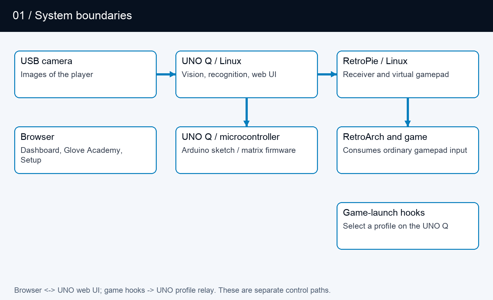
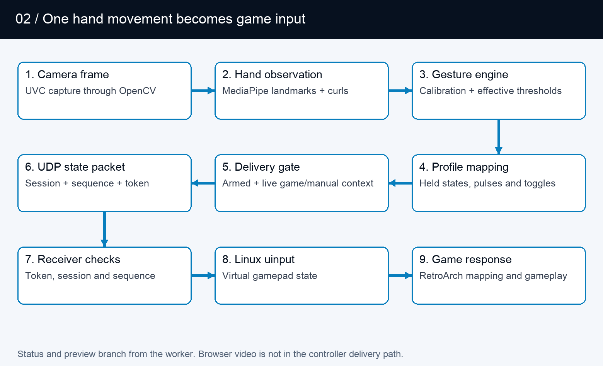
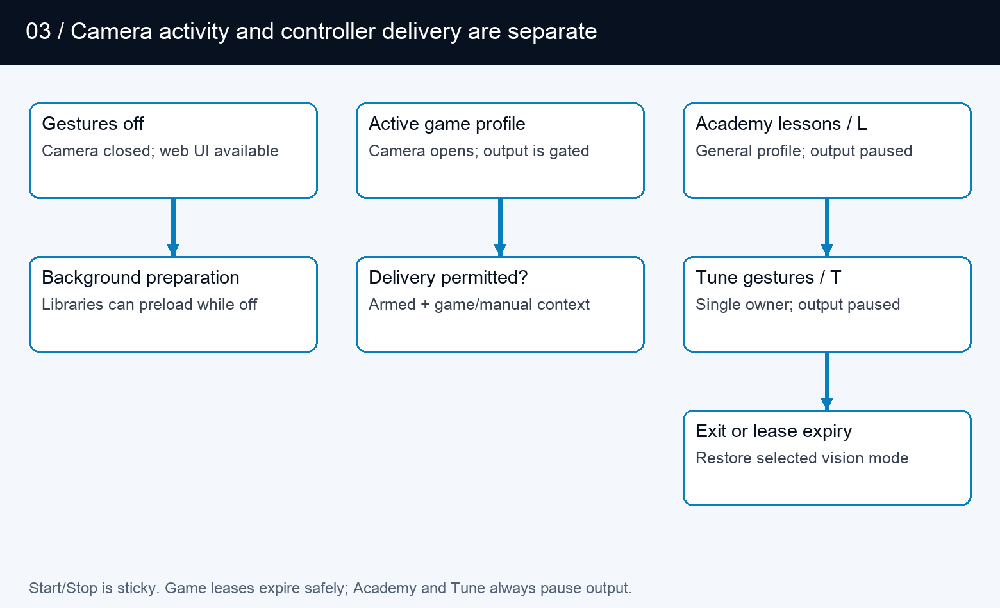
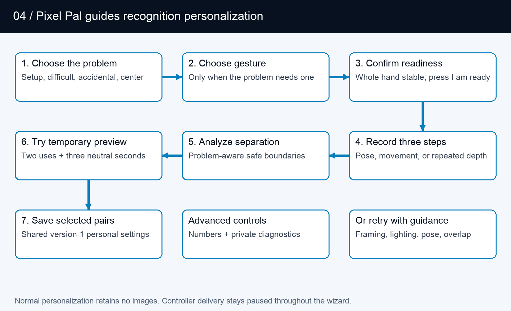
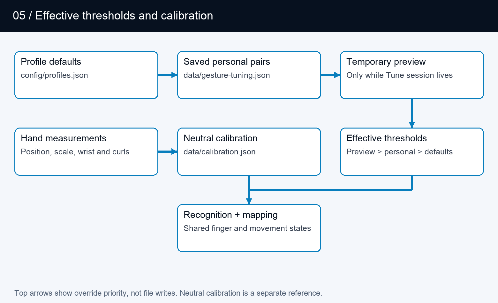
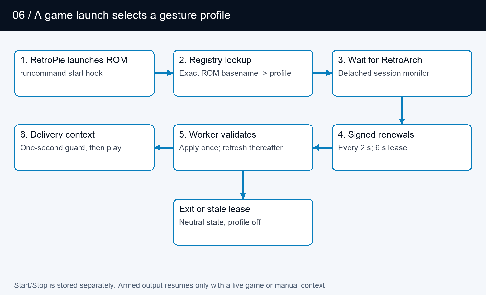
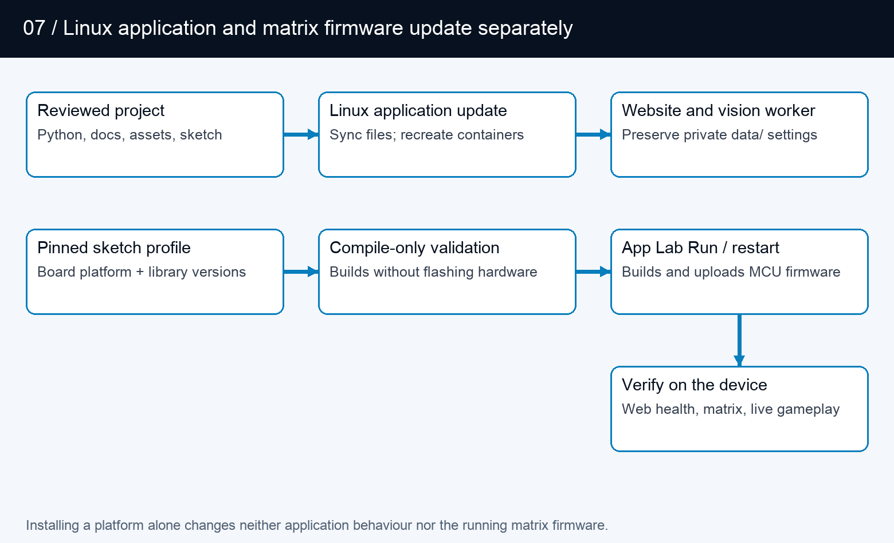

# PowerGlove Vision architecture

A camera-to-controller system for the UNO Q and RetroPie.

This guide describes the implementation reviewed on September 4, 2026, including
three-step tuning, optional personal hand setup, shared gameplay thresholds, the
matching Glove Academy/Tune matrix animations, and the verified Arduino sketch build.
It is a map of current behaviour, not a proposed redesign or a hardware test report.

## Read this first

PowerGlove Vision observes a hand on the UNO Q, turns its measurements into
controller states, and sends those states to a virtual gamepad on RetroPie.
The browser configures and explains that process; it is not required in the
per-frame gameplay path. The UNO Q microcontroller drives the status matrix;
Linux performs hand tracking and gesture recognition.

There are three independent questions: which game profile is selected, whether
the camera is running, and whether controller delivery is enabled. Glove Academy can
open the camera while the selected profile is **Gestures off**. Glove Academy and Tune
both pause game input. A healthy web page does not by itself establish that the
camera, receiver, or game is working.

| Read about | Section |
| --- | --- |
| Machines and processes | [System boundaries](#system-boundaries) |
| A movement reaching a game | [Camera-to-controller flow](#camera-to-controller-flow) |
| Boot, Glove Academy, and Tune | [Runtime modes](#runtime-modes) |
| Personal sensitivity | [Recognition and tuning](#recognition-and-tuning) |
| Game launches and settings | [Profile and configuration flows](#profile-and-configuration-flows) |
| Network and failure handling | [Interfaces and recovery](#interfaces-and-recovery) |
| Firmware and application updates | [Build and deployment](#build-and-deployment) |
| Where to change the code | [Implementation map](#implementation-map) |

## System boundaries

| Boundary | Responsibilities | Does not own |
| --- | --- | --- |
| Browser | Dashboard, Glove Academy, Tune, Setup, Games, Help; live feedback and user commands | Authoritative per-frame recognition or gamepad output |
| UNO Q Linux application | Web server, vision-worker supervision, camera tracking, calibration, thresholds, profile mapping, network sender | RetroArch button consumption |
| UNO Q microcontroller | Arduino sketch, Router Bridge commands, LED matrix animations and pairing display | Camera inference or personal thresholds |
| RetroPie services | Receive controller packets, expose a virtual gamepad, signal game launches, serve paired game-registry edits | Camera processing |
| RetroArch and game | Consume virtual-gamepad input using emulator and game mappings | Glove Academy/Tune feedback |

App Lab starts `python/main.py` in the main application container. This
supervisor runs the website and starts an isolated Python 3.12 vision worker
with the packaged MediaPipe wheel. It polls worker status, updates the matrix,
and retries a worker that stops. The worker's internal HTTP interface is on
loopback port 8089; the public website is on 8088, with secure Setup on 8443.

Two app-owned support containers provide the profile-control UDP relay and
local-hostname resolution. The profile relay publishes port 55356 and forwards
packets to the main service without interpreting or authenticating them.
The resolver connects application requests to host Avahi through private Unix
sockets. These functions are kept separate from camera inference.

## Camera-to-controller flow

  1. The camera layer opens a UVC capture source. OpenCV supplies frames to the tracker.
  2. MediaPipe identifies the hand landmarks. The tracker produces a `HandObservation`: detection, confidence, timestamp, palm position and scale, wrist roll, and normalized finger curls.
  3. The gesture engine compares that observation with the saved neutral calibration and effective thresholds. Directions are relative to the calibrated palm; apparent hand-size change supplies forward/backward movement.
  4. Shared activation/release states and held menu poses feed the selected profile's mapping. The result is a `ControllerState`, including buttons, D-pad, axes, finger values, events, sequence, and tracking/calibration metadata.
  5. The worker sends the state only if controller delivery is enabled and neither practice nor tuning is active.
  6. The sender encodes a bounded JSON datagram with a session identifier and shared token, then sends it to RetroPie over UDP 55355.
  7. The receiver checks protocol, token, and sequence. It creates the real virtual controller when the first accepted packet arrives.
  8. Linux `uinput` exposes the virtual gamepad to RetroArch, which applies its configured input mapping before the game consumes it.

The worker also publishes diagnostic state after inference. Browser video is
encoded at most fifteen times per second. Controller sending occurs before
matrix and browser-preview work, so the browser refresh rate is not the
controller state update rate. `inference_ms` and `send_ms` measure local stages;
neither is an end-to-end camera-to-game latency measurement.

The current transport is ordinary gamepad emulation. Bad Street Brawler maps
Glove Zap to a 180 ms simultaneous Left + Right pulse on each push activation;
its FCEUmm game-specific options allow that combination. The receiver already
transports both directions. This action does not require native glove packets. Preserved finger and
analogue values do not establish native original-Power-Glove support in the
emulator. That remains a separate integration concern.

## Runtime modes

The worker keeps a lightweight control loop alive while vision is idle.
Libraries can preload in the background without opening the camera. Selecting
an active profile or opening Glove Academy requests camera/tracker initialization.
Slow opens, reads, and cleanup run asynchronously so control requests remain
responsive. The website reports startup and recovery rather than treating an
empty first frame as completed initialization.

| Mode | Vision profile and camera | Controller delivery | Matrix |
| --- | --- | --- | --- |
| Gestures off | Camera closed; selected profile off | No gameplay states | Power Glove attract animation |
| Active profile | Selected game profile; camera requested | Only when explicitly enabled | Ready/tracking status and profile display |
| Ordinary Glove Academy | General practice profile; camera requested | Paused | Scanning L |
| Tune gestures | Practice with selected tuning scope and preview | Paused, including after a game-launch request | Scanning T |

Glove Academy preserves the selected game profile while using the general practice
profile for its twelve lessons, including **Glove Zap** and **Pull Back**.
Browser leases support multiple Glove Academy tabs; the last lease ending restores the
selected vision mode. Leases expire after six seconds without refresh. Dashboard
also clears abandoned practice sessions. Ordinary Glove Academy restores its prior
controller intent; Tune requires an explicit start from Dashboard when finished.

Tune has a single owning session. Exiting or losing that session discards its
recordings and preview, but saved values remain. A game launch can change the
selected profile during Tune without allowing game input to escape the delivery
gate. Profile/mode transitions release old controls and refresh sender sessions
where required so old state does not carry into a new mapping.

The L and T render through the same sketch function: a dim letter, bright scan
line, and trailing glow. Eight frames advance every 160 milliseconds. The sketch
also handles other status, profile, and pairing indications; matrix activity is
feedback about state, not evidence of successful game delivery.

## Recognition and tuning

Finger curls use the strongest measured joint bend. The four fingers include
the base knuckle; the thumb uses its two outer joints. The tracker prefers
MediaPipe world landmarks, with an image-coordinate fallback. Recognition is
threshold-based; personal setup does not retrain the MediaPipe model.

A held action has two cutoffs. Crossing **Activation** starts it; returning below
the lower **Release** value stops it. This avoids flicker near one cutoff.
Finger controls, direction/roll states, Glove Zap, Pull Back, and movement-based
mappings use these states. Profile-specific pulses and toggles still determine
what the game receives. An indicator remaining active is therefore not a promise
of a continuously held game button.

V-sign and thumbs-up also require the correct extended/curled fingers and the
existing deliberate hold (normally about 0.7 seconds), then issue a short menu
pulse. Live pose feedback uses the same finger checks. Personal pairs supply the
closed-finger activation and extended-finger release boundaries; untouched
fingers use the existing menu defaults. A confirmed lesson can remain complete
after its brief controller pulse has ended.

| Tuning scope | First recording | Middle recording | Final recording |
| --- | --- | --- | --- |
| Set up my hand | Comfortable open hand | Gentle fist, thumb curled outside fingers | Comfortable open hand |
| Finger/menu pose | Comfortable open hand | Selected gesture held steadily | Comfortable open hand |
| Glove Zap | Open hand at starting distance | Push toward camera and hold | Return to starting distance |
| Pull Back | Open hand at starting distance | Move away from camera and hold | Return to starting distance |
| Direction or wrist roll | Starting position and wrist angle | Selected movement held steadily | Return to starting position and angle |

Each recording lasts three seconds. Comfortable open means fingers and thumb
gently extended, wrist straight, hand centered, and camera distance consistent.
The interface replaces the ambiguous instruction to relax with an explicit pose.
Easy controls need no tuning; directions, wrist rolls, and other combinations
remain available under **More adjustments**.

Each step needs at least twelve accepted samples. The manager accepts calibrated,
detected hands with confidence at least 0.7, rejects repeated frames and
non-finite measurements, and caps samples per recording. Tracking gaps contribute
no samples; too few samples require a retry. Neutral calibration changes invalidate
recordings and previews.

For each adjusted component, analysis compares the 95th percentile of both
open/rest phases with the 10th percentile of the performed phase. It requires a
gap of at least 0.08. Activation sits 65% into that gap and release 30% into it.
An overlap error names the component and leaves no automatic suggestion.

Hand setup observes both states for all five fingers. Individual gesture tuning
can run without it. Fingers extended throughout retain their existing settings;
extended-only samples cannot establish a curled boundary. Automatic suggestions
now check all required fingers against the candidate configuration using the
same pose checks as recognition. At least 90% of accepted samples must match the
complete pose simultaneously. The opening and release phases must also show all
selected fingers extended in at least 90% of samples. A failure names the finger
and phase; no suggestion is retained. Strong curls cannot compensate for fingers
that should be extended. Thumbs-up checks a straight thumb and four curled
fingers; it does not impose an upward screen direction. Manual threshold edits
validate range and scope, not recorded pose quality. Live testing is still needed.

**Analyze and preview** temporarily applies a suggestion. **Save for all profiles**
atomically merges selected pairs into saved settings. **Discard / record again**
clears unsaved work. **Restore defaults** removes saved overrides for the selected
components; hand setup resets all five finger components. There is no saved
camera recording from this process.

## Profile and configuration flows

Effective settings are resolved component by component: shipped profile defaults,
then saved personal overrides, then temporary Tune preview. The gesture engine
receives the resulting configuration during frame processing, so saved values
also apply when controlling a game. Adjusting a finger changes other gestures
that use that finger; it does not change the button assignments in a game profile.

| Data | Owner and lifetime | Purpose |
| --- | --- | --- |
| `config/profiles.json` | Shipped project source | Profile defaults and recognition parameters |
| `data/gesture-tuning.json` | UNO Q, persistent | Global personal activation/release pairs; version-1 format |
| `data/calibration.json` | UNO Q, persistent | Neutral palm position, apparent scale, and wrist angle |
| `data/device.json` | UNO Q, private persistent settings | Destination, selected settings, pairing-related configuration |
| Tuning samples, preview, leases | Worker memory only | Temporary measurement and ownership state |
| `config/games.json` | Shipped default registry | Exact ROM-name mappings copied to the RetroPie installation |
| RetroPie registry and launcher settings | RetroPie, persistent | Active game-to-profile mappings and UNO destination |
| `data/models/hand_landmarker.task` | UNO Q, verified cache | Reusable pretrained hand-landmark model |

Neutral calibration is distinct from hand setup. It centers position, depth,
and roll; hand setup establishes finger thresholds. The app reuses valid neutral
calibration across Glove Academy, profile changes, camera reconnects, and worker restarts.
Recalibrate after moving the camera or changing playing position. Ordinary
updates preserve `data/` rather than replacing it with example configuration.

At game launch, the RetroPie hook looks up the exact ROM basename and sends a
signed profile request to UNO UDP 55356. The app-owned relay forwards the bytes
to the worker. The worker authenticates the request and handles the profile
transition; the acknowledgement travels back through the relay. The relay has
no shared token and cannot declare a profile applied. Game-end hooks request the
configured end-of-game behaviour. Unsupported or unregistered games do not gain
a mapping merely because their filenames resemble a registered title.

Setup's Games editor uses a separate path: browser to UNO web API, then the paired
UNO proxy to the RetroPie Games service on TCP 55358. Challenge/HMAC exchanges
protect registry operations; revision checks prevent stale edits and atomic
replacement preserves a previous valid copy. Saving a registry mapping affects
the next launch; it does not rewrite the running game's mapping immediately.

## Interfaces and recovery

| Interface | Direction | Contract |
| --- | --- | --- |
| HTTP 8088 | Browser to UNO Q | Pages, live status/video, ordinary settings and commands |
| HTTPS 8443 | Browser to UNO Q | Secure Setup and pairing workflow |
| HTTP 8089, loopback | Supervisor/web proxy to worker | Internal status, frame and control requests |
| UDP 55355 | UNO Q to RetroPie | Controller states, shared token, session and sequence |
| UDP 55356 | RetroPie to UNO relay to worker | Signed profile requests and acknowledgements |
| TCP 55357 | Pairing participants | Temporary one-time-code pairing service |
| TCP 55358 | UNO Q to RetroPie | Paired game-registry service |
| Private Unix sockets | App resolver to host Avahi | Local hostname resolution |
| Router Bridge RPC | Linux supervisor to microcontroller | Matrix status/profile/pairing commands |

The LAN is a trust boundary. Controller JSON includes a shared token and is not
encrypted or protected by the profile protocol's message HMAC. Do not describe
all links as equivalent secure channels. Pairing and registry exchange have their
own protections; browser mutations use the existing request-header and Origin
checks. See the [Security policy](SECURITY.md) for the full trust model.

| Failure or transition | Implemented response | Interpretation |
| --- | --- | --- |
| Hand tracking lost | Engine clears held states after its loss delay | Stops stale recognized actions; camera recovery is separate |
| Controller packets stop | Receiver releases controls on socket timeout, default 250 ms | A receive timeout, not a measured end-to-end acknowledgement |
| Hostname or UDP send failure | Sender reports error and throttles retries | Vision and local practice can continue |
| Camera open/read failure | Worker reports starting/error and retries asynchronously | Healthy website can coexist with unavailable vision |
| Worker exits | Supervisor reports failure and retries | Temporary in-memory Tune state is lost |
| Tune browser disappears | Six-second lease expires | Preview and recordings discarded; saved pairs retained |
| Calibration changes | Current Tune recordings/preview invalidated | Record new measurements against the new reference |
| Shutdown requested | Web action writes fixed request; host systemd helper requests halt | The tested UNO Q can restart; not proof that power is safe to remove |

A successful UDP send means the local networking call succeeded. It does not
prove the receiver applied a state or the game accepted it. Diagnose in stages:
hand detected, measured values, recognized/held action, delivery gate, sender
error, receiver/gamepad state, then emulator/game mapping.

## Build and deployment

The versioned `install-uno-q.sh` and `install-retropie.sh` entry points download
matching packages and call the shared host installer. The UNO route uses App
Lab CLI to build/upload the sketch and start the app; it installs both startup
and shutdown helpers. The RetroPie route installs the receiver and launch
integration, then checks emulator and registered-game configuration.

There are two deployable parts. Python, website, documentation, assets, and
service support run on Linux. The **Arduino sketch** is the microcontroller source
code; its compiled and installed version is the **matrix firmware**. That firmware
drives the LED matrix and handles Router Bridge commands.
The Wi-Fi deployment script synchronizes Linux application files and recreates
containers; it does not upload matrix firmware. A documentation-only sync can serve new
Markdown and PDFs without restarting the application, provided Python route
registration has not changed.

The Arduino sketch currently depends on the Arduino Zephyr platform **1.0.0**
for `arduino:zephyr:unoq`. Zephyr is the current platform dependency, rather than
the name of the PowerGlove component. The build configuration also pins
Arduino_RouterBridge **0.4.3**, Arduino_RPClite **0.3.0**, ArxContainer **0.7.0**,
ArxTypeTraits **0.3.2**, DebugLog **0.8.4**, and MsgPack **0.4.2**. The verified
platform supplies Arduino_LED_Matrix **0.1.3**. Retain the complete project
`sketch/sketch.yaml` when synchronizing with App Lab.

Installing that platform makes build tools available. Compile-only validation
builds against it but does not flash hardware. App Lab **Run**, or its supported
app-restart command, compiles the Arduino sketch and uploads the matrix firmware. Back up the installed source
and firmware cache, verify compilation, upload, then check application health,
bridge response, physical matrix appearance, and actual controls. Keep private
settings intact. Detailed commands are in the [Installation Guide](CONFIGURATION_REFERENCE.md#build-and-install-matrix-firmware).

Documentation has an editable Markdown source, generated diagrams, built-in Help
rendering, and a PDF edition. `scripts/build-architecture-diagrams.py` regenerates
these seven figures. `scripts/build-docs-pdf.py` generates the PDF set. The Help
and package allowlists explicitly include this architecture guide. The local
quick reference remains excluded from public deployment.

## Implementation map

Paths below are relative to the project root. This map identifies responsibility;
it does not claim every path has been independently security-audited.

| Responsibility | Start reading here |
| --- | --- |
| Supervisor, worker launch, matrix ownership | `python/main.py` |
| Camera lifecycle and frame-to-send loop | `src/powerglove_vision/vision_app.py` |
| Capture selection and landmark measurements | `src/powerglove_vision/camera.py`, `tracker.py` |
| Observation/state data objects | `src/powerglove_vision/model.py` |
| Calibration, thresholds, held gestures, mappings | `src/powerglove_vision/gesture.py` |
| Recording, suggestions, previews, persistence | `src/powerglove_vision/tuning.py` |
| Browser pages and public request handling | `src/powerglove_vision/control_server.py` |
| Worker requests, status, practice leases | `src/powerglove_vision/debug_server.py` |
| Controller packets and virtual gamepad | `src/powerglove_vision/transport.py`, `receiver.py` |
| Profile requests, launch hooks, UDP relay | `src/powerglove_vision/profile_control.py`, `retropie_hook.py`, `scripts/profile-relay.py` |
| Paired Games editing | `src/powerglove_vision/game_registry.py` |
| Pairing and hostname resolution | `src/powerglove_vision/pairing.py`, `python/ssh_pair.py`, `src/powerglove_vision/resolver.py` |
| Matrix translation and firmware | `src/powerglove_vision/matrix.py`, `sketch/sketch.ino` |
| App services and installation | `app.yaml`, `bricks/local/`, `scripts/setup-machine.py` |
| Help and printable guides | `src/powerglove_vision/help_content.py`, `scripts/build-docs-pdf.py` |

## Validation boundaries

Code inspection establishes the flows described here. The prior work also
compiled the Arduino sketch and deployed the matrix firmware, checked application health and
bridge responses, and verified saved configuration preservation. Those checks
are different from visually observing the physical matrix or validating real
hands in a running game.

Before releasing recognition changes, exercise optional hand setup and individual
tuning without setup; V-sign and thumbs-up with different curl ranges; incorrect
extended fingers; incomplete releases; tracking loss; insufficient/overlapping
samples; calibration changes; preview expiry; persistence; and reset. Confirm
that feedback agrees with recognition and output remains paused throughout
Glove Academy/Tune. Complete live camera and gameplay tests before describing a reduced
recording count as validated for other users.

### Matrix during startup

The Arduino sketch shows an hourglass before its blocking Router Bridge setup.
A dedicated display task owns subsequent framebuffer writes and keeps startup
feedback moving independently of Linux and Python initialization. The main
sketch task registers the bridge endpoints; those endpoints update requested
status/profile values, and the display task renders them. If the display-task
stack allocation fails, the first hourglass stays visible during setup and the
normal sketch loop takes over rendering afterward. This task currently uses the
Zephyr API supplied by the Arduino sketch platform.

Python requests loading before importing the web controls, then forwards normal
worker status. The hourglass indicates activity, not measured completion. It
does not replace the protected system boot display. The optional host user
service `powerglove-early-start.service` releases the installed sketch earlier
using the loader release flag, after checking the selected app and sketch
samples. It never resets, halts, or flashes the sketch. This brings the existing
hourglass forward while App Lab continues starting. Failure falls back to normal
App Lab startup; the cold-boot trial was confirmed on the physical board.
