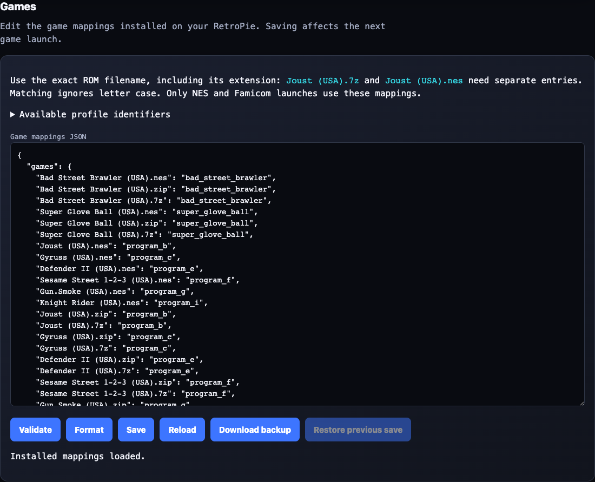
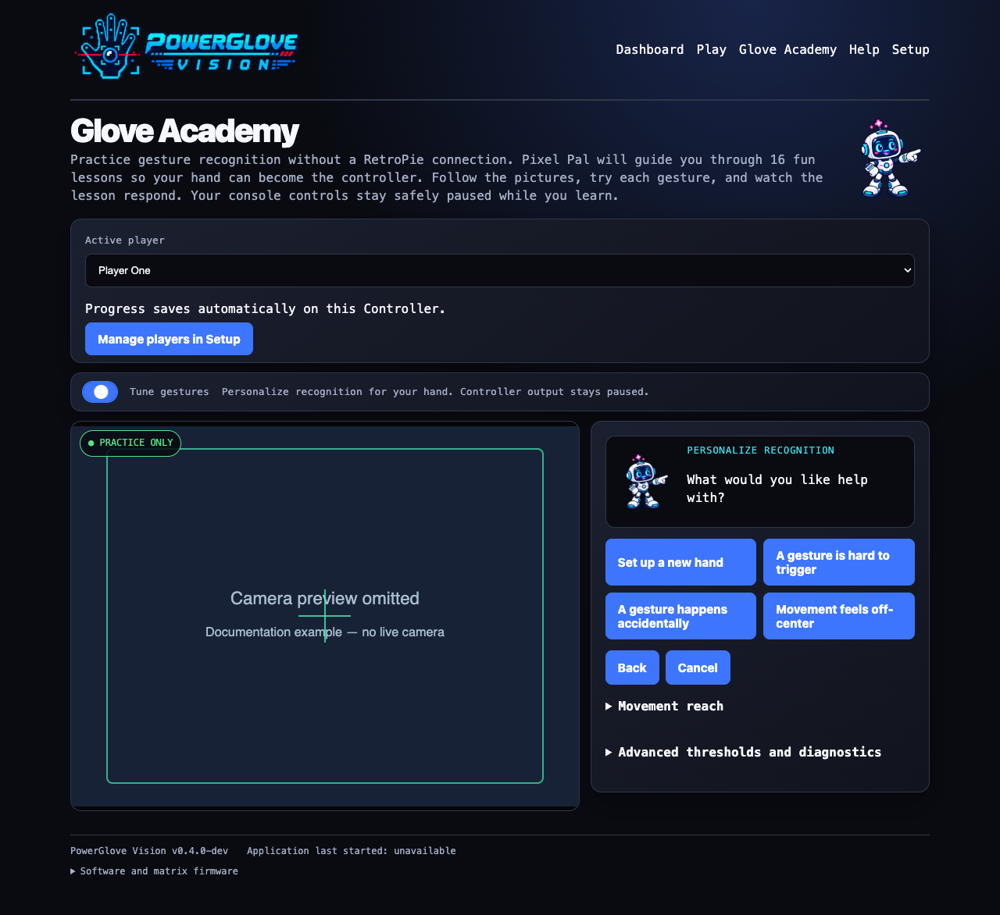

# PowerGlove Vision Configuration Reference

Use this reference to find a setting, change a game mapping, tune a gesture,
or look up a command. Each section identifies the active file and explains
what its values mean.

Use the [installation guide](INSTALL_README.md) for the initial deployment and
pairing procedure. Return here when you need to change a host, camera, game,
gesture threshold, or network setting.

> **KEEP THE TOKEN PRIVATE**  PowerGlove Vision uses one shared token to
> authenticate controller packets and profile changes. Never paste it into an
> issue, screenshot, command line, public backup, or Git commit.

## The three places configuration lives

PowerGlove Vision runs on two computers. A repository template is not always the
file the running system reads.

| Location | What it controls | Preferred way to change it |
| --- | --- | --- |
| UNO Q Setup page | Console address, controller port, startup profile, camera, and pairing token | Browser Setup page |
| UNO Q application files | Gesture sensitivity and advanced runtime defaults | Edit only when tuning is required |
| RetroPie `/etc/powerglove/` | UNO Q address, per-game profile selection, and receiver token | Protected files on RetroPie |

The examples under the repository's `config/` directory are installation
templates. Editing them does not change an already installed system. The active
copies are identified in each section below.

In commands and examples, replace these placeholders:

| Placeholder | Replace with |
| --- | --- |
| `UNO-Q-NAME.local` | Your UNO Q hostname or reserved IP address |
| `RETROPIE-NAME.local` | Your RetroPie hostname or reserved IP address |
| `/home/arduino/ArduinoApps/powerglove-vision` | Required directory for the supported UNO Q installer and shutdown helper; do not substitute a different path |

## Find the setting or command you need

| Task | Section |
| --- | --- |
| Install and pair both machines | [Installation Guide](INSTALL_README.md) |
| Change the camera or startup profile | [UNO Q settings](#uno-q-settings) |
| Repair pairing or token permissions | [Pairing and token management](#pairing-and-token-management) |
| Change the UNO Q destination on RetroPie | [RetroPie connection settings](#retropie-connection-settings) |
| Make a game select a profile | [Register games and select profiles](#register-games-and-select-profiles) |
| Adjust gesture sensitivity | [Tune gesture sensitivity](#tune-gesture-sensitivity) |
| Understand an option or command | [Command-line reference](#command-line-reference) |

## UNO Q settings

Open the ordinary Setup page at:

```text
http://UNO-Q-NAME.local:8088/setup
```

Pairing uses the secure Setup page instead:

```text
https://UNO-Q-NAME.local:8443/setup
```

The secure page uses a locally generated certificate. During pairing, compare
the certificate fingerprint shown by the browser with the identifier shown on
the UNO Q matrix before entering the one-time PIN.

### Settings shown in the browser

| Setting | Default | Meaning and recommendation |
| --- | --- | --- |
| Console hostname or IP | Empty (not configured) | Set your RetroPie hostname (`RETROPIE-NAME.local` in examples) or a reserved LAN address and pair through Connection before starting controls. Glove Academy and local settings work without a destination. Existing saved destinations are preserved. |
| Controller port | `55355` | UNO Q to RetroPie controller-state port. Leave it at the default unless both ends are changed. |
| Startup profile | `bad_street_brawler` | Profile used before a registered game selects another one. |
| Tracking aid | `none` | `none`, `white`, or `black`. In the current release this is an informational diagnostic label; it does not change MediaPipe tracking. |
| Camera | `auto` | Prefer `auto`. Use a number from `0` through `99` only when automatic selection chooses the wrong capture device. |
| Generate a new token | Off | Rotates the shared secret. This immediately breaks the existing pairing until RetroPie is paired again. |

Selecting **Save** validates the fields, writes them atomically with private
permissions, and restarts the vision worker using the saved calibration.
Recalibrate only if you have moved the camera, changed your playing position,
or notice unwanted movement while your hand is at rest.

The Dashboard profile selector changes only the current active profile. It does
not rewrite `device.json` or change the Setup page's startup profile. RetroPie
may replace a Dashboard selection when a game starts or ends.

### Vision startup and timing

The worker preloads OpenCV and MediaPipe on its background vision thread as
soon as its control server is available. Preloading imports the libraries;
it does not open the camera, create a hand tracker, or process images. The
website and profile controls remain responsive while imports run. A failed
preload is logged; a later activation retries loading and reports any error.

If **Gestures off** is selected at startup, the camera stays closed until you
select an active profile or open Glove Academy. An active startup profile requests
capture automatically after preloading. Controller delivery still starts stopped.

Activation waits for any unfinished preload, verifies the saved model, opens
and configures the camera, waits for a usable frame, and creates the tracker.
Dashboard and Glove Academy show **Starting camera and gesture tracking** until vision
is active. The elapsed time covers startup work, not only the physical camera.
**Calibrate** stays disabled until initialization finishes.

Switching between active profiles reuses the camera and tracker. **Gestures off**
releases both, while imported libraries remain in memory. An application restart,
including a worker restart after saving Setup settings, starts preloading again.

<!-- PAGEBREAK -->

Measurements on the cabinet's UNO Q with a Razer Kiyo Pro on September 4, 2026:

| Measurement | Observed time |
| --- | --- |
| First activation after reboot, before background preloading | 7.67 seconds |
| OpenCV background preload after a later reboot | 0.94 seconds |
| MediaPipe background preload after that reboot | 5.94 seconds |
| First activation after that preload completed | 1.21 seconds |

These were separate reboot tests on this cabinet, not guaranteed timings. The
change moves library loading earlier; it does not eliminate that work. Selecting
a profile immediately after application startup can still wait for preloading.
An earlier reported 13-14 second delay was not reproduced in the instrumented tests.

To inspect startup stages on the UNO Q:

```sh
docker logs --since 10m powerglove-vision-main-1 2>&1 | grep 'Vision startup:'
```

The default installation uses this container name; use `docker ps` to find it
if your App Lab installation uses another name. Logs include background import
times, model verification/recovery, camera discovery/open/settings, the first
camera frame, tracker construction, first inference, and time to active worker
status. Preparation and activation totals include earlier stages; do not add
them to the individual durations. Dashboard polling adds a small delay before
it displays the new status. Compare entries from the same activation.

If the camera is unavailable, check `lsusb` and `/dev/v4l/by-id/` on the UNO Q.
The built-in `qcom-venus-encoder` and `qcom-venus-decoder` video nodes are not
webcams. A camera missing from the USB device list needs its connection checked;
preloading cannot resolve that condition.

### Glove Academy, calibration, and live readings

Glove Academy is the renamed Learn section. Existing `/learn` bookmarks still
work. The matrix continues to show **L** for lessons and **T** for tuning.
Older screenshots may still show the former Learn label.

Glove Academy starts the camera even when **Gestures off** is selected and uses Program H
for practice. It pauses controller delivery and restores the selected profile
when you leave. With several Glove Academy tabs open, practice remains active until the
last tab closes or its lease expires. A six-second lease timeout handles an
unexpected browser close. Loading Dashboard also clears a stale session;
reload Glove Academy if you want to begin practice again.

The twelve lessons include A (index curl), B (thumb curl), Glove Zap (forward
push), Pull Back, Start, and Select. Completing every lesson earns Glove Master; skipped
lessons must be revisited. **Start again** clears session progress. The practice
indicators do not change a game's gesture mapping.

| Reading or control | Meaning |
| --- | --- |
| Finger curl | Glove Academy shows values from 0 to 1; Dashboard uses a compact 0-to-3 display. Default ordinary curl actions engage at 0.50 and release below 0.35; saved personal pairs override these values. |
| V sign | Without personal adjustments, index and middle curl must be below 0.28; ring and little curl must exceed 0.42. Hold for about 0.7 seconds to send Start. |
| Thumbs-up | Without personal adjustments, thumb curl must be below 0.32 and all four finger curls above 0.42. Hold for about 0.7 seconds to send Select. |
| Live hand measurements | Shows curl values, thresholds, enlarged landmarks, and forward or backward movement relative to the calibrated hand size. |
| Calibrate | Replaces the saved resting reference. The button turns red while sampling, then blue with a brief completion message. |
| `inference_ms` and `send_ms` | Tracking calculation and local send time; neither measures the full delay from camera movement to game response. |

Finger recognition uses the strongest joint bend, including the base knuckle;
a middle-knuckle bend alone can qualify. Thumb recognition uses the stronger
of its two outer joints. MediaPipe 3D world landmarks are preferred. The fallback
uses normalized depth with image aspect-ratio correction; palm movement still
uses image coordinates. The legacy Arduino landmark bridge keeps its 2D
interpretation because its depth units differ.

Glove Academy and gameplay share held finger and movement states. Glove Zap and Pull Back
remain recognized until movement falls below their respective release thresholds, and a confirmed menu pose
still satisfies its lesson after the short controller pulse ends. The browser
preview is capped at 15 fps; status updates follow each tracking calculation.

The app reuses its saved resting reference across Glove Academy, gameplay, profile
changes, and restarts. It calibrates automatically only when that reference is
missing or invalid. Use **Calibrate** after moving the camera or changing your
playing position. Keep your palm near the resting position when practising
finger curls so unintended movement does not obscure the finger readings.
See [Saved neutral-hand calibration](#saved-neutral-hand-calibration) for storage
and recovery details.

**Start controller** and **Stop controller** affect live delivery only. After
an application or system restart, delivery remains stopped until you start it.

### Active UNO Q device file

The Setup page maintains this private file inside the application:

```text
/home/arduino/ArduinoApps/powerglove-vision/data/device.json
```

A typical device configuration file contains the following fields:

```json
{
  "receiver": "RETROPIE-NAME.local",
  "port": 55355,
  "token": "private-random-value-created-by-the-application",
  "profile": "bad_street_brawler",
  "glove_color": "none",
  "camera": "auto"
}
```

Use the Setup page for routine changes. If you must edit the JSON directly,
stop the application first, keep the token unchanged, validate the file, and
restore mode `0600`. JSON does not allow comments or trailing commas.

```sh
python3 -m json.tool data/device.json >/dev/null
chmod 0600 data/device.json
```

Deleting `device.json` causes PowerGlove Vision to create a new token and
first-run defaults. You must then pair RetroPie again.

### Camera selection

`auto` searches stable `/dev/v4l/by-id/` capture-device links first, ignores
known codec-only video nodes, and then considers ordinary `/dev/video*` capture
devices. This is the most reliable choice when USB enumeration changes after a
reboot.

Use an explicit camera number only for troubleshooting. For example, `0`
selects `/dev/video0`, but Linux may assign that number to a different device
after hardware is reconnected. Keep the camera on a powered USB hub when the UNO Q cannot supply
stable power by itself.

### Supported startup profiles

The valid startup profile identifiers are:

```text
off
bad_street_brawler
super_glove_ball
program_a  program_b  program_c  program_d  program_e
program_f  program_g  program_h  program_i
```

The startup profile does not assign a profile to a ROM. Per-game selection is
controlled by the RetroPie game registry described below.

## Pairing and token management

Both machines must hold the same token:

| Machine | Active private file |
| --- | --- |
| UNO Q | Application `data/device.json`, in the `token` field |
| RetroPie | `/etc/powerglove/token` |

Use one-time-code pairing whenever possible:

```sh
sudo /opt/powerglove/bin/powerglove-pair
```

Leave that command running on RetroPie, then complete pairing at
`https://UNO-Q-NAME.local:8443/setup`. The code is single use and expires after
two minutes. Password pairing is also available when RetroPie accepts SSH
password login; the password is used for one encrypted operation and is not
stored.

The RetroPie token must contain at least 16 characters and should remain owned
by `root`, readable by the `input` group, and inaccessible to other users:

```sh
sudo chown root:input /etc/powerglove/token
sudo chmod 0640 /etc/powerglove/token
```

### Recover without browser pairing

Use this fallback only when neither browser pairing method works. Both machines
must already have the software installed.

  1. In App Lab, open the active application's private `data/device.json` and locate its `token` value.
  2. On RetroPie, run `sudo nano /etc/powerglove/token`. Replace the file contents with that same value on one line, without quotation marks. Do not enter it as a shell command.
  3. Save with Ctrl+O, confirm the filename, and exit with Ctrl+X. Apply the ownership and permission commands above.
  4. Run `sudo systemctl restart powerglove-receiver.service`, then test controller delivery from Dashboard. Clear the token from your clipboard and close the private file afterward.

If you generate a new token in Setup, pair the devices again immediately.
Do not transfer the new token through a command-line argument; process listings
and shell history can expose it.

## RetroPie connection settings

The active launcher file is:

```text
/etc/powerglove/launcher.json
```

It tells the runcommand hooks where to send profile changes when a game starts
or exits.

```json
{
  "uno_q": "UNO-Q-NAME.local",
  "port": 55356,
  "token_file": "/etc/powerglove/token",
  "registry": "/etc/powerglove/games.json",
  "timeout": 0.4
}
```

| Field | Meaning |
| --- | --- |
| `uno_q` | UNO Q hostname or reserved address reachable from RetroPie. |
| `port` | RetroPie to UNO Q profile-control port. This is `55356`, not the controller-state port. |
| `token_file` | Protected shared-token file. Keep the token out of this JSON file. |
| `registry` | Active ROM-to-profile mapping. |
| `timeout` | Seconds to wait for each acknowledgement. The hook retries up to three times and never prevents a game from launching. |

Validate changes before launching a game:

```sh
python3 -m json.tool /etc/powerglove/launcher.json >/dev/null
```

Use a `.local` hostname when multicast DNS is reliable on your LAN. A reserved
DHCP address is a useful fallback. Do not use an address that may later be
assigned to another device.

## Register games and select profiles

### Edit mappings in Games



Games is a section of **Setup**, below pairing; it is not a separate navigation tab.

  1. Open **Setup → Games** in the UNO Q website. Both machines must be online and paired. The page reads the registry used by the installed RetroPie launch hook.
  2. Select **Download backup** to keep a copy of the last verified installed registry on your computer.
  3. Edit the JSON, adding the exact ROM filename and a supported profile identifier inside `games`. Expand **Available profile identifiers** for the choices. Preserve your existing entries.
  4. Select **Validate**. It checks JSON syntax, supported profiles, and duplicate filenames, including names that differ only by letter case. **Format** tidies the JSON without saving it.
  5. Select **Save**. Wait for confirmation that RetroPie saved the file and the UNO Q read it back successfully.
  6. Launch or restart the game and confirm its profile on Dashboard.

Saving does not change the current game's profile. **Restore previous save** swaps
in the last valid version. **Reload** discards your draft after confirmation. If
another editor changed the installed registry, saving is refused; download or copy
your draft before reloading. Connection failures leave the draft in the browser.
Leaving or refreshing the page can discard unsaved work.

The Games section needs the `powerglove-games.service` installed by the current
RetroPie setup workflow. If it reports an unavailable service, update the RetroPie
installation, check pairing, and ensure TCP `55358` is reachable from the UNO Q.
Games does not require an SSH password after pairing.

### Registry format

The active game registry is:

```text
/etc/powerglove/games.json
```

PowerGlove Vision matches the exact ROM basename, including its extension,
without regard to letter case. Directory names are ignored. Automatic profile
selection currently applies only when RetroPie reports the system as `nes` or
`famicom`; other systems turn gesture control off.

```json
{
  "games": {
    "Bad Street Brawler (USA).nes": "bad_street_brawler",
    "Super Glove Ball (USA).zip": "super_glove_ball",
    "Joust (USA).nes": "program_b"
  }
}
```

Add the exact filename shown in EmulationStation. Zipped and 7-Zip copies need
their own entries because `.nes`, `.zip`, and `.7z` are different basenames.

| Included game | Profile |
| --- | --- |
| Bad Street Brawler | `bad_street_brawler` |
| Super Glove Ball | `super_glove_ball` |
| Joust | `program_b` |
| Gyruss | `program_c` |
| Defender II | `program_e` |
| Sesame Street 1-2-3 | `program_f` |
| Gun Smoke | `program_g` |
| Knight Rider | `program_i` |

The table above is the complete set of games recognized automatically by the
shipped registry. Programs A, D, and H are fully implemented profiles rather
than omitted games: `program_a` is a pinball control scheme, `program_d` reverses
all four directions for challenge or accessibility use, and `program_h` provides
general-purpose movement with pulsed buttons. They deliberately have no default
ROM assignment.

Any appropriate NES or Famicom ROM can use one of those profiles after you add
its exact basename to the `games` object. Every profile value must be one of the
supported identifiers; an unknown value invalidates the registry.

```sh
sudo python3 -m json.tool /etc/powerglove/games.json >/dev/null
```

Test profile communication independently of a game:

```sh
sudo /opt/powerglove/bin/powerglove-profile \
  --uno-q UNO-Q-NAME.local \
  --token-file /etc/powerglove/token \
  --profile program_b
```

Use `--profile off` to stop gesture output. A successful request prints an
acknowledgement and starts the matrix glove attract animation. In this healthy
idle state the camera and MediaPipe tracker are closed, while the website and
authenticated profile listener remain available.

### Check a queued profile change

The launch helper reports **profile queued** when the UNO Q has authenticated
and queued the request. Dashboard shows the applied profile and ROM name once
the worker processes it. Camera startup can take longer than the acknowledgement;
an acknowledgement does not mean that the camera is ready or that controller
delivery is enabled.

App Lab's `local:profile_control` brick publishes UDP `55356` through a small
relay to the worker. The relay holds no pairing token and forwards signed
packets unchanged. Both this brick and `local:avahi_resolver` must be present
in `app.yaml`, so the services return when App Lab regenerates its containers.
The setup and Wi-Fi update helpers also add their includes to existing Compose
configuration. On the UNO Q, check the published port with:

```sh
docker port powerglove-vision-profile-relay-1 55356/udp
```

Expect a host binding for port `55356`. If it is missing, update the application
and rerun UNO Q setup. On RetroPie, compare the game's actual filename, including
`.nes`, `.zip`, or `.7z`, with `/etc/powerglove/games.json`. These are separate
exact entries. Updating the template does not overwrite an installed registry;
add missing names while preserving your custom mappings.

## Tune gesture sensitivity

Tuning is optional: adjust only controls that are difficult or trigger accidentally.
The selector features hand setup, V-sign, thumbs-up, finger curls, Glove Zap, and
Pull Back. Directions, wrist rolls, closed hand, and menu guard are under **More
adjustments**. Try neutral calibration first if basic directions feel wrong.

For **Glove Zap**, record starting position → push toward camera and hold → return
to the starting position and distance. For **Pull Back**, record starting position
→ pull away and hold → return to the starting position and distance. Keep your
hand comfortably open and palm facing the camera. Each recording lasts three
seconds. Forward push and pull-back have independent thresholds; hand setup does
not calibrate them. For directions and wrist rolls, likewise return to your
starting position, distance, and wrist orientation for the final recording.

Use **Glove Academy → Tune gestures** to adjust sensitivity. You do not need to edit
`config/profiles.json`; it remains the supplied defaults for each profile.

  1. Show your whole hand in the camera and wait for tracking. Calibrate your comfortable resting position if necessary.
  2. Switch on **Tune gestures** and select a gesture, or choose **Set up my hand** for optional calibration of all five fingers. Instructions and action buttons stay beside the camera; the Activation and Release table sits beneath the camera. Directions, finger curls, wrist rolls, push/pull, and compound gestures are available.
  3. Select **Record open hand** with fingers and thumb gently extended, wrist straight, and hand centered at a consistent camera distance. Do not stretch or spread forcefully. Each recording lasts three seconds.
  4. Record the selected gesture, then open your hand again and record it: three recordings total. For **Set up my hand**, the middle step is a gentle fist with your thumb curled outside your fingers.
  5. Select **Analyze and preview**. The app uses clear, fresh camera measurements to suggest activation and release values. If resting and performed measurements overlap, repeat the recordings with a clearer gesture and a complete release.
  6. Try the temporary preview. Live finger feedback shows which required fingers are extended, curled, or not yet matching the pose. You may adjust the numeric values and select **Preview adjustments** before deciding whether to save.
  7. Select **Save for all profiles** to keep the adjustment. **Discard / record again** removes unsaved changes. **Restore defaults** removes saved adjustments for the selected gesture's components.



The camera imagery is blurred in this reference screenshot. On a wide screen,
instructions and buttons sit beside the camera; on a narrow screen, they appear
first. The matrix shows a scanning **T** while tuning and a matching scanning **L** in ordinary practice.

Activation is the point where a gesture begins; release is the lower point where
it stops. Separate values prevent rapid on/off flickering. Gameplay movement mappings use these same held states, including wrist steering, push, pull-back, and braking; game-specific button assignments and pulses still apply. Directions and fingers
can be adjusted independently. Compound gestures share component thresholds, so
changing a finger also affects other gestures that use it. Suggested menu-pose
adjustments tune the closed fingers; already extended fingers retain their existing
settings from hand setup or existing personal/default values. Button assignments and menu hold timing
remain unchanged.

Hand setup learns open and curled thresholds for all five fingers. Individual tuning can be used without setup; it only learns new thresholds for fingers observed both open and curled. Fingers extended throughout retain hand-setup thresholds or existing settings. Feedback uses the same V-sign and thumbs-up checks as recognition. Hand setup reset restores all five finger components; individual reset restores only the selected components.

Only adjusted components override all game profiles. Untuned components retain
their profile's supplied values. Personal adjustments are saved atomically in
`data/gesture-tuning.json` and survive application restarts and normal updates.
No images or recordings are saved. Existing version-1 files remain compatible;
hand setup adds ordinary finger pairs rather than a new file format. The versioned format is:

```json
{
  "version": 1,
  "thresholds": {
    "index": {"on": 0.6, "off": 0.4}
  }
}
```

Each pair must contain finite numbers with `0 <= off < on`. Finger and pull
activation cannot exceed `1`; wrist rotation cannot exceed `2`; movement and push
cannot exceed `4`. These are normalized measurements, not distances in centimetres.

Tuning pauses controller delivery. A game launch may update the selected game but
cannot interrupt tuning or send game input. Leaving Tune discards its preview;
a disconnected browser's session expires after six seconds. Return to Dashboard
and explicitly start controller delivery when ready to play. **Recalibrate neutral**
changes the resting reference separately and invalidates any current recordings.

### Supplied profile defaults

The following fields describe the shipped `config/profiles.json`. They remain
useful for understanding the defaults; personal tuning is managed through Glove Academy.

### Threshold fields

| Field | What it measures | Effect of lowering the value |
| --- | --- | --- |
| `move_on` | Palm displacement from center, normalized by palm size | Movement activates sooner |
| `move_off` | Palm displacement at which active movement releases | Movement stays active farther back toward center |
| `curl_on` | Normalized finger curl, where `0` is straight and `1` is tightly curled | Curl actions activate with less bend |
| `curl_off` | Curl amount at which an active curl releases | Curl stays active until the finger is straighter |
| `roll_on` | Wrist rotation from the centred angle | Roll actions activate with less rotation |
| `roll_off` | Rotation at which active roll releases | Roll stays active closer to neutral |
| `push_on` | Relative increase in apparent hand size from center | Push actions activate with less forward movement |
| `push_off` | Depth change at which an active push releases | Push stays active closer to the centred depth |
| `pulse_hz` | Repetition rate for profiles that pulse an action | Repeated actions become slower |
| `loss_release_ms` | Tracking-loss delay before all controls release | Controls release sooner after the hand disappears |

For each gesture, keep the `_off` value lower than its `_on` value. The gap is
hysteresis: it prevents a value near the activation point from rapidly turning
on and off. A very large gap can make the control feel sticky.

The supplied defaults are:

```json
{
  "move_on": 0.38,
  "move_off": 0.24,
  "curl_on": 0.50,
  "curl_off": 0.35,
  "roll_on": 0.58,
  "roll_off": 0.40,
  "push_on": 0.34,
  "push_off": 0.18,
  "pulse_hz": 7.0,
  "loss_release_ms": 120
}
```

The `super_glove_ball` profile uses movement activation and release thresholds
of `0.32` and `0.20`, making movement more responsive. Its wrist-roll thresholds
are `0.70` and `0.50`, its pulse rate is `8.0` Hz, and its push thresholds are
slightly higher than the defaults. Profiles A through I use `program_defaults` unless an
exact profile object such as `program_b` is added.

When adjusting numeric values in Tune, change one pair at a time in steps of approximately `0.02` to `0.05`, then test
from the same camera position. Useful adjustments include:

  - Lower `move_on` if directional movement requires too much travel.
  - Raise `move_off` if a direction remains held after returning toward center.
  - Raise an `_on` value when an action triggers unintentionally.
  - Increase `pulse_hz` when a repeating action is too slow.
  - Keep `loss_release_ms` short enough to release safely but long enough to tolerate a few missed camera frames.

Saved personal tuning applies without reopening the camera. The saved neutral
calibration is reused; recalibrate only if your physical setup has changed or
your resting hand position produces unwanted movement. Gesture-to-button assignments are implemented by each profile in
the application; threshold changes adjust sensitivity but do not remap buttons.

## RetroPie receiver and virtual controller

The receiver verifies authenticated UDP packets and creates a Linux `uinput`
gamepad named `PowerGlove Vision`. Its installed service is:

```text
/etc/systemd/system/powerglove-receiver.service
```

The supplied service listens on all local interfaces at UDP port `55355`, reads
`/etc/powerglove/token`, and releases held controls when a socket receive times out after 250 milliseconds.
This is a receive timeout, rather than a separate timer for the last valid packet. If you change the controller port in UNO Q Setup, add
the same `--port` value to the service's `ExecStart`, then reload and restart:

```sh
sudo systemctl daemon-reload
sudo systemctl restart powerglove-receiver.service
```

The companion `powerglove-receiver.timer` starts the receiver 45 seconds after
boot. This lets EmulationStation finish its initial controller scan first. Keep
the timer enabled and the service itself disabled for boot activation. Starting
the receiver too early can cause frontend pauses and conflicts with other USB
devices, such as a BitPixel display.

```sh
systemctl is-enabled powerglove-receiver.timer
systemctl is-enabled powerglove-receiver.service
sudo systemctl status powerglove-receiver.service
sudo journalctl -u powerglove-receiver.service -n 100 --no-pager
```

The virtual gamepad appears only after the first authenticated controller
packet. On the UNO Q, select **Start controller** and show a centred hand before
deciding that the device is missing.

### RetroArch autoconfiguration

Install the supplied mapping at:

```text
/opt/retropie/configs/all/retroarch/autoconfig/PowerGlove Vision.cfg
```

It matches the virtual device name plus vendor and product IDs `1:1`, uses the
`udev` input driver, and maps D-pad directions, A, B, Start, Select, and four
axes to a standard RetroPad. It does not configure an I-PAC, 8BitDo controller,
or any other physical controller.

If RetroArch has a hand-written override for this device, remove or reconcile
that override before diagnosing the supplied autoconfiguration.

## UNO Q shutdown helper

The standard installation includes the host shutdown helper so Dashboard and
Setup can halt Linux cleanly. It consists of two systemd units and one
boot-time readiness rule:

| Repository file | Installed path | Purpose |
| --- | --- | --- |
| `uno-q/powerglove-system-shutdown.path` | `/etc/systemd/system/powerglove-system-shutdown.path` | Watches for one fixed shutdown request in the application's private data directory |
| `uno-q/powerglove-system-shutdown.service` | `/etc/systemd/system/powerglove-system-shutdown.service` | Removes that request and asks systemd to halt Linux cleanly |
| `uno-q/powerglove-system-shutdown.conf` | `/etc/tmpfiles.d/powerglove-system-shutdown.conf` | Recreates the unprivileged readiness marker at boot or after application replacement |

Install them with `scripts/install-uno-q-shutdown-helper.sh`. The installer also
creates the private `data/.shutdown-enabled` marker that allows the web UI to
offer the action. The tmpfiles rule restores that marker at boot. The
application cannot use this mechanism to execute an arbitrary privileged
command; it can only create the fixed request after an explicit confirmation.

Do not change the request path in only one component. The web application, path
unit, service, and marker must continue to agree. After installation, confirm
that `powerglove-system-shutdown.path` is enabled and active.

## Network ports and trust boundary

Keep PowerGlove Vision on a trusted home or cabinet LAN. Do not forward these
ports through a router or expose them directly to the Internet.

| Port | Direction | Purpose |
| --- | --- | --- |
| UDP `55355` | UNO Q to RetroPie | Authenticated live controller state |
| UDP `55356` | RetroPie to UNO Q | Authenticated game-profile requests and acknowledgements |
| TCP `8088` | Browser to UNO Q | Dashboard, Help, Glove Academy, and ordinary Setup UI, including Games |
| TCP `8443` | Browser to UNO Q | TLS Setup and pairing workflow |
| TCP `55358` | UNO Q to RetroPie | Paired game registry reads, saves, and restoration |
| TCP `55357` | UNO Q to RetroPie | Temporary one-time-code pairing helper |

The two UDP ports serve different purposes despite their similar numbers. The
`port` in UNO Q `device.json` is normally `55355`; the `port` in RetroPie
`launcher.json` is normally `55356`.

The ordinary dashboard is reachable by other devices on the LAN. Pairing and
shutdown require additional protections, but the project assumes that the LAN
itself is trusted. Review [SECURITY.md](SECURITY.md) before using a shared,
guest, school, or public network.

## UNO Q matrix artwork

The built-in display is a 13-by-8 monochrome blue LED matrix with eight
brightness levels. Treat it as a very small dot-matrix display in the spirit of
a pinball DMD or monochrome BitPixel display, rather than as a miniature screen.
The sketch encodes status, pairing, profile identifiers, and the gestures-idle
Power Glove attract sequence. Glove Academy and Tune share a dim letter, bright scan line,
and trailing glow: eight frames at 160 milliseconds each (a 1.28-second cycle).

Matrix artwork should use broad motion, recognizable silhouettes, and strong
separation between the subject and its brightest effect. A moving spark needs a
dim body underneath it, a medium halo, and a full-bright core. Pulses should
emphasize an outline instead of illuminating every pixel at maximum brightness,
which erases the shape on the physical display. Transitional objects need to
cross several columns and remain visible for more than one frame; isolated
one-pixel changes are easily lost to persistence and viewing angle.

Always judge animation timing and grayscale on the physical UNO Q. A source
grid or browser mock-up is useful for finding malformed frames, but it cannot
reproduce LED bloom, exposure, or perceived persistence. A short video covering
several complete loops is the preferred review artifact for later refinements.

## Files most users should not edit

| File or directory | Purpose |
| --- | --- |
| `app.yaml` | Arduino App Lab application metadata and exposed ports |
| `sketch/sketch.yaml` | UNO Q sketch platform and pinned Arduino library dependencies |
| `pyproject.toml` | Python package metadata, supported interpreter range, and optional dependencies |
| `python/worker-wheels/` | Platform-specific MediaPipe worker dependency supplied by the App Lab installation ZIP |
| `data/models/hand_landmarker.task` | Checksum-verified cached model, installed from the bundle when vision is first activated |
| `data/uv-cache/` and `data/uv-python/` | Generated private worker runtime and package cache |
| `.cache/app-compose.yaml` | App Lab generated container configuration |
| `data/.shutdown-enabled` | Readiness marker installed by the fixed-purpose shutdown helper included in standard setup |
| `output/pdf/` | Generated PDF editions; public editions are served by Help, while the cabinet quick reference remains private |

Changing manifests can prevent App Lab from starting the application. Generated
files and private runtime caches should not be committed or added to an App
Lab installation ZIP. The installation ZIP is built as:

```text
output/app-lab/PowerGlove-Vision-Uno-Q.zip
```

The installation ZIP includes the verified model at `models/hand_landmarker.task`, its Apache 2.0 license, and third-party notices. It excludes private `data/`,
caches, tests, Git metadata, and the cabinet-specific quick-reference PDF. It
includes only the allowlisted public PDF editions used by Help. When an active profile first needs vision, the application installs the bundled Google Hand Landmarker model into its private cache and verifies its SHA-256 checksum. A download is attempted only if the bundle is absent.
The model stays unopened while **Gestures off** is selected.

### Automated quality and package verification

Maintainers use `.github/workflows/quality.yml` for pull requests, pushes to
`main` and `dev`, and manual runs. The workflow tests the project on supported Python versions, checks Python and
shell syntax, validates JSON, audits source and documentation, rebuilds and
inspects the PDF set, and verifies the App Lab installation ZIP. The workflow has
read-only repository permissions and uses no deployment credentials.

Ordinary installers do not need to edit this workflow. If you fork the project,
keep live UNO Q credentials and cabinet deployment out of hosted CI; deployment
should remain an explicit action from a trusted machine.

## Back up and update safely

Back up custom configuration before replacing an installation:

| Item | Why it matters |
| --- | --- |
| UNO Q `data/calibration.json` | Preserves your neutral hand position, size, and wrist angle; recalibrate if the physical setup changes |
| UNO Q `data/device.json` | Contains device settings and the private token |
| UNO Q `config/profiles.json` | Contains any custom sensitivity values |
| RetroPie `/etc/powerglove/games.json` | Contains local ROM mappings |
| RetroPie `/etc/powerglove/launcher.json` | Contains local host and path settings |
| RetroPie `/etc/powerglove/token` | Contains the matching private token |
| RetroArch `PowerGlove Vision.cfg` | Contains any deliberate local mapping changes |

Store token-bearing backups privately with restricted permissions. The supplied
Wi-Fi deployment script preserves the UNO Q `data/` directory. The App Lab
installation ZIP never contains your token or private model cache; it includes the unmodified public model.

After an update, confirm that the active files under `/etc/powerglove/` still
contain your local hostnames and ROM names. Updating repository templates does
not automatically migrate active configuration.

## Troubleshooting by symptom

| Symptom | Configuration checks |
| --- | --- |
| Dashboard works but no virtual controller appears | Start the controller, show a centred hand, verify the receiver service and shared token, then check UDP `55355`. |
| Controller appears but a game uses the wrong gestures | Confirm the system is `nes` or `famicom` and the exact ROM basename exists in `/etc/powerglove/games.json`. |
| Game launches slowly while UNO Q is offline | Confirm `timeout` remains near `0.4`; the hook retries but must never block game launch indefinitely. |
| Profile command is not acknowledged | Check the UNO Q name, UDP `55356`, pairing token, and the UNO Q application status. |
| Gestures off shows a blinking X | Update PowerGlove Vision; Gestures off should show the glove attract animation and must not open the camera. |
| Camera disappears after reboot | Check `lsusb` and `/dev/v4l/by-id/`, reconnect the camera or hub if absent, and keep Camera set to `auto` unless selecting a specific device. See [startup diagnostics](#vision-startup-and-timing). |
| First activation is slow | Allow background preloading to finish and inspect the startup stage logs before attributing the delay to the camera. |
| Movement triggers too late | Center again first; if repeatable, lower `move_on` slightly for the active profile. |
| Direction remains stuck | Raise `move_off` slightly, keep it below `move_on`, and verify tracking-loss release. |
| Pairing suddenly fails after a Setup change | A rotated token invalidates the old pairing; run the pairing flow again. |
| EmulationStation pauses or another USB device behaves unexpectedly at boot | Verify receiver startup is controlled by the 45-second timer and the service is not independently enabled at boot. |

## Configuration file catalog

| Repository file | Active or installed copy | Used by |
| --- | --- | --- |
| `config/device.example.json` | UNO Q application `data/device.json` | Vision supervisor and Setup UI |
| `config/profiles.json` | UNO Q application `config/profiles.json` | Gesture engine |
| `config/games.json` | RetroPie `/etc/powerglove/games.json` | Launch hook and profile selector |
| `config/launcher.example.json` | RetroPie `/etc/powerglove/launcher.json` | RetroPie launch and exit hooks |
| `retropie/retroarch/PowerGlove Vision.cfg` | RetroArch autoconfig directory | RetroArch input system |
| `retropie/powerglove-receiver.service` | `/etc/systemd/system/` | Privileged virtual-controller receiver |
| `retropie/powerglove-games.service` | `/etc/systemd/system/` | Paired Games editor service on RetroPie |
| `data/gesture-tuning.json` (runtime only) | UNO Q application `data/gesture-tuning.json` | Global personal threshold overlays |
| `retropie/powerglove-receiver.timer` | `/etc/systemd/system/` | Delayed boot activation |
| `uno-q/powerglove-system-shutdown.path` | `/etc/systemd/system/` | Fixed shutdown request watcher |
| `uno-q/powerglove-system-shutdown.service` | `/etc/systemd/system/` | Fixed clean-shutdown action |
| `uno-q/powerglove-system-shutdown.conf` | `/etc/tmpfiles.d/` | Boot-time shutdown readiness marker |
| `.github/workflows/quality.yml` | GitHub Actions | Automated tests and release verification |
| `app.yaml` | UNO Q application root | App Lab |
| `sketch/sketch.yaml` | UNO Q application sketch directory | Arduino build system |
| `pyproject.toml` | Repository or deployed application root | Python packaging and tests |

When a change goes wrong, restore the last known-good active file rather than
copying every repository template over the installation. Validate JSON, restart
only the affected service or application, and test packet delivery before
changing controller mappings.

## Local hostname resolution inside App Lab

If the console name fails, use **Test console name** in Connection, then follow
[hostname troubleshooting](INSTALL_README.md#faq-what-if-the-console-name-cannot-be-resolved).
A router-reserved IPv4 address is a fallback, not a setup requirement.

Both machine installers install `avahi-daemon` and `libnss-mdns` and enable Avahi at boot. The UNO Q host dependency supports native hostname lookups; it does not replace the app-owned resolver used inside the container. Setup check mode verifies the dependency and Avahi service, and the UNO Q check tests the configured destination inside the app.

The app-owned `local:avahi_resolver` brick survives App Lab container regeneration.
It mounts `/run/avahi-daemon` read-only in a separate unprivileged service and
exposes only IPv4 `.local` queries through `data/.avahi-resolver.sock`. It has
no network interface or published port. The app prefers this private socket;
the direct host socket remains a compatibility fallback. Both sockets are
runtime files, not configuration to back up or distribute.

All gameplay and pairing lookups use this resolver. Answers expire after five
seconds, so DHCP changes do not require editing an address. Ordinary DNS names
use the system resolver. Generic container `getent` is not the app's mDNS test;
use Connection's hostname test or the setup command's check mode.

## Known limitation: UNO Q restarts after Shutdown

On the tested UNO Q, a graceful `halt` still leads to an automatic restart,
including when connected directly to a Mac without the powered hub. The helper
requests halt correctly, but remaining stopped is not verified. Do not use loss
of the website or a fixed delay as confirmation that power can safely be removed.
See the installation guide for the investigation status and Arduino guidance.


## Saved neutral-hand calibration

The worker saves its completed neutral reference in `data/calibration.json`. It includes palm position, apparent size, and wrist angle; it is not a personally trained gesture model. Glove Academy, gameplay, profile changes, camera reconnects, and worker restarts reuse this reference. **Calibrate** explicitly replaces it after sampling completes; an interrupted calibration preserves the previous saved reference. Recalibrate after moving your camera or changing your seating position.

On first use, or if the saved file is missing or invalid, the worker samples an initial reference automatically. Hold your hand in a comfortable neutral position, then use **Calibrate** if necessary. A storage failure is reported as `calibration_save_error` in status; the reference remains usable in memory but will not survive a worker restart. The file is local runtime data, not a source or release-package file.

## Command-line reference

Use this section to look up a flag without interrupting the installation steps.
It covers every project command and script, plus the external-command options
used in these guides. Defaults describe this source version, not a guarantee
about a future release. For external tools' other options, use their own help
or manual pages.

An **option** begins with `-` or `--`. A **positional argument** is a value
supplied in a particular place, such as `retropie` after `setup-machine.py`.
Replace example hostnames and file paths with your own. Square brackets in
usage descriptions mean optional; do not type them. Options that take a value
need both the option and its value, such as `--port 55355`.

### Install or inspect a machine

Run `sudo python3 scripts/setup-machine.py MACHINE [OPTIONS]` from the project
directory on the target Linux machine. This is the recommended installer for
both UNO Q and RetroPie. `--check` performs read-only checks; using `sudo`
also lets those checks read protected token files.

| Argument or flag | Default | Meaning |
| --- | --- | --- |
| `MACHINE` | Required | `retropie` or `uno-q`; selects the machine to install or inspect. |
| `--peer HOST` | None | Required for a new RetroPie launcher configuration; supplies the UNO Q hostname or IPv4 address. Existing launcher settings are preserved. On UNO Q, it prints guidance but does not change the saved receiver address. |
| `--check` | Off | Checks the existing installation without installing, restarting, or changing it. |
| `-h`, `--help` | — | Prints usage and exits. |

Exit codes are `0` for success, `1` for an installation/check failure, and `2`
for outstanding user action. Argument errors also use argparse's exit code `2`.
The current check always asks for human gameplay confirmation.

### Run the RetroPie receiver

Use `/opt/powerglove/bin/powerglove-receiver` on RetroPie. Normal operation is
managed by its systemd service. A manual receiver cannot share the same port
with that service: stop the service before a manual diagnostic run, then
restart it afterward. Use `--token-file` rather than placing a token in shell
history.

| Flag | Default | Meaning |
| --- | --- | --- |
| `--listen ADDRESS` | `127.0.0.1` | Local address to bind. `0.0.0.0` accepts packets on all local IPv4 interfaces, as the installed service requires. |
| `--port NUMBER` | `55355` | UDP port for controller packets; must match UNO Q settings. |
| `--token VALUE` | None | Supplies the shared token directly. Use only as an advanced alternative; the value can appear in process arguments. |
| `--token-file PATH` | None | Reads the shared token from a protected file. Supply exactly one of this flag and `--token`. The token must contain at least 16 characters. |
| `--timeout-ms NUMBER` | `250` | Socket receive timeout in milliseconds; a timeout releases held controls. Use a positive value. |
| `--dry-run` | Off | Prints received controls instead of creating a virtual input device. |
| `-h`, `--help` | — | Prints usage and exits. |

Example: inspect packets without sending input to Linux. Run each command on
RetroPie and press Ctrl+C to end the diagnostic receiver before restarting the
service.

```sh
sudo systemctl stop powerglove-receiver.service
sudo /opt/powerglove/bin/powerglove-receiver --listen 0.0.0.0 --token-file /etc/powerglove/token --dry-run
sudo systemctl start powerglove-receiver.service
```

### Start one-time-code pairing

Use `/opt/powerglove/bin/powerglove-pair` on RetroPie with `sudo`. It opens a
temporary TLS server, prints a code, installs the received token, and restarts
the receiver. Complete the browser steps while it is running.

| Flag | Default | Meaning |
| --- | --- | --- |
| `--listen ADDRESS` | `0.0.0.0` | Local IPv4 address for the temporary server. |
| `--port NUMBER` | `55357` | Pairing server TCP port. The browser pairing client uses the standard port; keep the default for that workflow. |
| `--token-file PATH` | `/etc/powerglove/token` | Destination for the paired token; keep it aligned with the receiver's token file. |
| `--timeout SECONDS` | `120` | Lifetime of the pairing server. Use a positive value; the code is single use and attempts are limited. |
| `--receiver-service NAME` | `powerglove-receiver.service` | systemd service to restart after pairing succeeds. |
| `-h`, `--help` | — | Prints usage and exits. |

The command returns `0` after pairing completes or `2` when the pairing window
times out. Other failures are reported as errors.

### Select a profile from RetroPie

Use `/opt/powerglove/bin/powerglove-profile` to test profile selection. It sends
an authenticated request to the UNO Q. This changes the active profile; it
does not change the saved startup profile or turn controller delivery on.

| Flag | Default | Meaning |
| --- | --- | --- |
| `--uno-q HOST` | Required | UNO Q hostname or IPv4 address. |
| `--port NUMBER` | `55356` | UNO Q profile-control UDP port. |
| `--token VALUE` | None | Supplies the token directly; prefer the protected-file option. |
| `--token-file PATH` | None | Reads the token from a file. Supply exactly one token option. |
| `--registry PATH` | `/etc/powerglove/games.json` | Registry used when `--profile` is omitted. |
| `--system NAME` | `nes` | System used for registry selection and request metadata. Automatic selection accepts `nes` or `famicom`. |
| `--rom PATH` | `Manual selection` | ROM path or filename used for registry lookup and displayed game metadata. |
| `--profile NAME` | None | Overrides registry lookup. Accepts `program_a` through `program_i`, `bad_street_brawler`, `super_glove_ball`, or `off`. |
| `--timeout SECONDS` | `0.4` | Wait for each acknowledgement; the sender makes up to three attempts. |
| `-h`, `--help` | — | Prints usage and exits. |

Exit codes are `0` for acceptance, `2` for a timeout, and `3` for rejection.
Acceptance means the request is queued; confirm the applied profile on Dashboard.
Malformed arguments and file errors can also stop the command.

### Run the paired Games service

The RetroPie installer starts this service automatically. Its installed command
is `powerglove-games`; developers can also run `python3 -m powerglove_vision.game_registry`.

| Flag | Default | Purpose |
| --- | --- | --- |
| `--settings` | `/etc/powerglove/launcher.json` | Read the administrator-configured registry and token-file locations. |
| `--listen` | `0.0.0.0` | Bind address for the paired LAN service. |
| `--port` | `55358` | TCP port. The UNO browser proxy uses the standard port. |
| `--help` | Not applicable | Print usage without starting the service. |

The service uses a single request handler with a three-second socket timeout,
64-KiB registry limit, and 64 pending challenges. Challenges expire after fifteen
seconds and can be used once. The previous registry is saved beside the active
file as `games.json.previous` (or the configured filename plus `.previous`).
Installer-generated systemd permissions allow writing to the configured registry
directory. Rerun installation if an administrator changes that directory.

### Forward game-launch events

The installer connects `powerglove-retropie-hook` to RetroPie automatically.
Use its wrapper scripts from existing runcommand hooks; do not run them again
as an extra installation step.

| Argument or flag | Default | Meaning |
| --- | --- | --- |
| `ACTION` | Required | `start` selects a registered game's profile; `end` turns gestures off. |
| `SYSTEM` | Empty | Optional first metadata argument, such as `nes`. |
| `EMULATOR` | Empty | Optional second metadata argument supplied by RetroPie; accepted for compatibility. |
| `ROM` | Empty | Optional third metadata argument; its filename selects the profile. |
| `COMMAND` | Empty | Optional fourth metadata argument; accepted for compatibility. Quote it as one argument. |
| `--settings PATH` | `/etc/powerglove/launcher.json` | Reads destination, token path, registry path, and timeout settings. |
| `-h`, `--help` | — | Prints usage and exits. |

`retropie/runcommand-onstart-powerglove.sh` forwards RetroPie's four positional
arguments. `retropie/runcommand-onend-powerglove.sh` needs none. Neither wrapper
has its own flags. The executables in `retropie/bin/` forward their arguments
to the corresponding Python commands.

### Run the standalone vision tracker

`powerglove-vision` is the advanced camera worker, not the full App Lab website.
Install the package's `vision` dependencies in a compatible Python environment
before using it. Normal UNO Q use should start through App Lab instead.

| Flag | Default | Meaning |
| --- | --- | --- |
| `--receiver HOST` | Required | RetroPie hostname or IPv4 address. An empty string permits local-only tracking but cannot deliver controls. |
| `--port NUMBER` | `55355` | Destination UDP controller port. |
| `--token VALUE` | Required | Shared token. This worker currently has no `--token-file` flag; its token appears in process arguments. |
| `--profile NAME` | `bad_street_brawler` | Initial profile, one of the eleven supported profiles or `off`. |
| `--camera VALUE` | `auto` | Camera selection; use `auto` or a camera index. |
| `--width PIXELS` | `640` | Requested capture width; the camera may negotiate another size. |
| `--height PIXELS` | `480` | Requested capture height. |
| `--fps NUMBER` | `30` | Requested capture rate; not a guarantee of tracking or game frame rate. |
| `--glove-color VALUE` | `none` | `none`, `white`, or `black`; an informational label, not a different recognition model. |
| `--no-mirror` | Off | Disables horizontal image mirroring. |
| `--config PATH` | Project `config/profiles.json`, if present | Alternative gesture-threshold file. Otherwise built-in defaults are used. |
| `--model PATH` | Default verified model | Alternative MediaPipe model. The standard `hand_landmarker.task` filename uses the verified model workflow. |
| `--web-host ADDRESS` | `0.0.0.0` | Address for the worker's diagnostic web server. |
| `--web-port NUMBER` | `8088` | Worker diagnostic port. App Lab overrides this to `8089` on loopback behind its main web server. |
| `--no-matrix` | Off | Disables direct matrix integration. App Lab uses this because its supervisor controls the matrix. |
| `--profile-listen ADDRESS` | `0.0.0.0` | Local IPv4 address for authenticated profile requests. |
| `--profile-port NUMBER` | `55356` | UDP port for profile requests. |
| `--controller-enabled` | Off | Starts sending controller input immediately; omit it for local inspection. |
| `-h`, `--help` | — | Prints usage and exits. |

### Deploy or repair the UNO Q application

Run these scripts from the project checkout on your development computer.
Always supply your own SSH destination; the built-in fallback names the
maintainer's board and is not appropriate for other installations.

| Script or setting | Arguments and defaults | Effect |
| --- | --- | --- |
| `scripts/deploy-uno-q-wifi.sh` | Optional positional `USER@HOST`; `-h` or `--help` | Transfers the Linux application, preserves `data/`, restarts the container, and checks web routes. Does not update RetroPie or flash the matrix sketch. |
| `UNO_Q_SSH_TARGET` | Environment variable; overridden by a positional destination | Sets the SSH destination. Without either setting, deployment falls back to the maintainer's board. |
| `UNO_Q_APP_DIR` | Environment variable; default `/home/arduino/ArduinoApps/powerglove-vision` | Remote deployment directory. Changing it does not change the shutdown helper's fixed path or the machine installer's path requirement. |
| `scripts/install-uno-q-shutdown-helper.sh` | Optional positional `USER@HOST`; `-h` or `--help` | Installs the fixed shutdown watcher, service, and readiness rule. Uses the positional destination, then `UNO_Q_SSH_TARGET`, then the maintainer's fallback. The application directory is fixed. |

Both scripts accept at most one destination. Deployment needs existing SSH
key access; helper installation can prompt for a password through the terminal.

### Build, inspect, or maintain project files

These scripts run from a full development checkout. Scripts marked **no flags**
do not implement `--help`; adding it is not a safe way to inspect them because
they may still perform their normal work.

| Script | Arguments and flags | Result or requirement |
| --- | --- | --- |
| `scripts/build-app-lab-package.sh` | No flags or positional arguments | Builds `output/app-lab/PowerGlove-Vision-Uno-Q.zip`; requires Bash, rsync, zip, and the existing public PDFs. |
| `scripts/verify-app-lab-package.py` | Optional `ARCHIVE` path; `-h`, `--help` | Checks the supplied ZIP or the default ZIP above; prints its SHA-256. Returns `0` on success, `1` on verification failure. |
| `scripts/check-documentation.py` | `--require-pdfs`; `-h`, `--help` | Checks Markdown, links, and coverage. The optional flag also inspects the PDF set and needs `pypdf`. Returns `0` on success, `1` on failure. |
| `scripts/check-source-docs.py` | No flags or positional arguments | Checks source headers and docstrings; returns `0` on success or `1` on failure. |
| `scripts/build-docs-pdf.py` | No flags or positional arguments | Rebuilds all registered PDF editions; requires ReportLab. Use only when ready to regenerate the PDFs. |
| `scripts/build-gesture-crops.py` | No flags or positional arguments | Regenerates action illustrations from the gesture sheets; requires Pillow. |
| `scripts/fetch-runtime-assets.sh` | No flags or positional arguments | Installs and verifies the bundled model into project `data/models/`; downloads only if absent. Requires Python 3, plus curl for fallback downloads. |
| `scripts/configure-uno-q-mdns.py` | Required positional path to the generated Compose file; no flags | Internal installer/deployment helper that edits that file. Prefer the supported setup command. |
| `scripts/profile-relay.py` | No flags or positional arguments | Internal unprivileged UDP relay; publishes port 55356 and forwards to the worker, with bounded packet size, outstanding requests, and timeouts. |
| `scripts/avahi-resolver-service.py` | No flags or positional arguments | Internal service started by the resolver brick; opens its fixed Unix socket. |
| `python/main.py` | No flags or positional arguments | App Lab entry point; reads `data/device.json` and supervises the worker. |
| `python/ssh_pair.py` | No command-line flags | Internal password-pairing helper; receives its request through standard input. Use secure Setup instead. |

### Understand the system commands in these guides

The table explains the subcommands and flags shown in the documentation.
Defaults and additional flags for these external programs depend on their
installed versions; use `man TOOL` or that tool's `--help` for its full manual.

| Command or syntax | Meaning of the options used here |
| --- | --- |
| `git clone --branch dev URL` | Downloads a repository and checks out `dev`. A final directory argument chooses the destination folder. |
| `git branch --show-current` | Prints the checked-out branch name. |
| `git status --short` | Shows a compact list of local changes. |
| `git pull --ff-only` | Updates only if Git can fast-forward; refuses an automatic merge when histories have diverged. |
| `cd PATH`, `cd ~`, `pwd` | Changes directory, opens your home directory, or prints the current directory. |
| `command -v NAME` | Prints where the shell finds a command; no path means it is unavailable. |
| `sudo COMMAND` | Runs a command with administrator privileges. Enter your account password only at the terminal prompt. |
| `apt update`; `apt install -y PACKAGES` | Refreshes package information, then installs packages. `-y` accepts package-manager confirmation prompts. |
| `python3 -m MODULE` | Runs a Python module. Used with `venv`, `pip`, `unittest`, `json.tool`, and `compileall`. |
| `python3 -m venv DIRECTORY` | Creates an isolated Python environment at that directory. |
| `. .venv/bin/activate` | Activates that environment in the current shell. The initial dot is a shell command. |
| `pip install -e PATH` | Installs a source checkout in editable mode. `[vision]` and `[receiver]` request optional dependency groups. |
| `pip install -U PACKAGE`; `--upgrade` | Upgrades the named package; the two options have the same meaning. |
| `unittest discover -s tests -v` | Finds tests in `tests` (`-s`) and prints each test's result (`-v`). |
| `compileall -q DIRECTORIES` | Checks/compiles Python files; `-q` reduces routine output. |
| `json.tool FILE` | Parses and formats JSON; a parse error means the example or configuration is invalid. |
| `PYTHONPATH=src COMMAND` | Sets the import path for that command only, allowing it to use the local `src/` tree. |
| `ssh-keygen -t ed25519` | Creates an SSH key pair using the Ed25519 algorithm (`-t`). Follow the prompts without overwriting an existing key. |
| `cat FILE` | Prints a text file. In key setup, print only the `.pub` public key. |
| `ssh USER@HOST` | Opens a remote terminal. `exit` closes that session. |
| `ssh -o BatchMode=yes USER@HOST COMMAND` | Runs a remote command without interactive password prompts; useful for checking key access. `-o` supplies an SSH setting. |
| `ssh -t USER@HOST COMMAND` | Allocates a remote terminal, allowing an interactive remote prompt. |
| `docker port CONTAINER 55356/udp` | Shows the host binding for the container's UDP profile port. This command does not change the container. |
| `systemctl status NAME` | Displays a service or timer's state. Press `q` if it opens a pager. |
| `systemctl start`, `stop`, `restart NAME` | Starts, stops, or restarts the named unit now. |
| `systemctl enable`, `disable NAME` | Enables or disables activation at boot. `--now` also starts or stops it immediately. |
| `systemctl is-enabled`, `is-active NAME` | Checks boot enablement or current activity. |
| `systemctl daemon-reload` | Reloads unit definitions after service files change. |
| `systemctl --no-block halt` | Requests a halt and returns without waiting. This is the helper's action, not a health check. |
| `journalctl -u NAME -n 100 --no-pager` | Shows logs for a unit (`-u`), limits output to the last 100 entries (`-n`), and avoids a pager. |
| `systemd-tmpfiles --create FILE` | Applies creation rules from the named file, such as the readiness-marker rule. |
| `grep -A8 -B2 PATTERN FILE` | Shows matching lines with eight following lines (`-A`) and two preceding lines (`-B`). |
| `curl -sS URL` | Fetches a URL quietly (`-s`) while still showing errors (`-S`). |
| `ls -l PATH` | Lists files with permissions and ownership. A trailing directory slash refers to its contents. |
| `install -d -m MODE PATH` | Creates a directory (`-d`) with the specified permissions (`-m`). Without `-d`, `install` copies a file; `-o` sets its owner and `-g` its group. |
| `chmod MODE PATH`; `chown USER:GROUP PATH` | Changes permissions or ownership. Modes used here: `0600` owner only, `0640` owner read/write and group read, `0644` public read with owner write, `0700` private directory, `0755` publicly traversable directory or executable. |
| `rm FILE`; `rm -f FILE` | Deletes a file; `-f` suppresses prompts and ignores a missing file. Check the path before use. |
| `nano FILE` | Opens a text editor. Save with Ctrl+O, confirm the name, and exit with Ctrl+X. |
| `modprobe uinput` | Loads the Linux virtual-input kernel module. |
| `tee FILE` | Writes its input to a file as well as the terminal. Used with `sudo` for a protected destination. |
| `printf '%s\n' VALUE` | Prints a value followed by a newline. |
| `ping HOST` | Tests whether a host replies to network echo requests; press Ctrl+C to stop. It does not test the application. |
| `hostname`; `hostname -I` | Prints the host's name, or its interface addresses with `-I`. |
| `bash -n FILE`; `sh -n FILE` | Checks shell syntax without running the file. |
| `> /dev/null` | Discards normal output while leaving errors visible. |
| Pipe operator | Sends the first command's output into the second command. The vertical bar is shell syntax. |
| `\` at the end of a command line | Continues the same command on the next line. |
| `"$1"` through `"$4"` | Quoted positional arguments forwarded by RetroPie's wrapper scripts. |
| `for …; do …; done` | Repeats the enclosed commands for each value. |
| `[ -r FILE ]` | Tests whether a file is readable. `continue` skips the current loop item. |
| `${device##*/}` | Extracts the last component of a path in the camera-inspection loop. |

Commands shown inside a source script may use additional internal options.
Those are implementation details, not extra arguments accepted by the wrapper.

### Tuning measurements and interface contract

Each three-second step needs at least twelve accepted measurements. Sampling
requires a calibrated, detected hand with confidence at least 0.7; duplicate
frames and non-finite measurements are excluded. Missing or low-confidence
tracking does not contribute samples. Insufficient samples require retrying the
step. Changing neutral calibration clears recordings and preview values.

Suggestions use the 95th percentile of the two open/rest recordings and the 10th
percentile of the performed recording. The gap must be at least 0.08; activation
is placed 65% into that gap and release 30% into it. An overlap error identifies
the affected component, and no suggestion is retained. Fully return to the
starting pose and distance before recording the final step.

For V-sign and thumbs-up, extended-only fingers retain existing thresholds;
these samples cannot establish their curled boundary. Personal activation values
check curled fingers and personal release values check extended fingers. Without
personal settings, the legacy menu cutoffs in the table above apply. Live feedback
and actual pose recognition use the same checks, with the existing deliberate
hold retained. Before accepting an automatic suggestion, the app applies the
candidate thresholds to all required fingers in the recordings. At least 90% of
accepted samples must match the complete gesture together; the first and final
recordings must likewise show all selected fingers extended. This allows limited
tracking noise without letting a strong curl compensate for a bent extended
finger. A failed check identifies the finger and phase and clears the preview.

V-sign requires extended index/middle and curled ring/pinky; thumbs-up requires
an extended thumb and four curled fingers. Thumb extension measures straightness,
not direction toward the top of the image. Individual tuning keeps extended-only
thresholds; use Set up my hand if comfortable extension needs adjustment. Preview
and live gameplay testing still matter, and manual numerical edits remain a
separate path rather than an automatically verified recording.

The status response's `tuning` object reports `mode` (`hand_setup` or `gesture`),
`gesture`, `total_phases` (3), `completed_phases`, and `finger_feedback`. Each finger
entry contains `expected` (`extended` or `curled`), `matches`, `value`, and
`threshold`. `saved`, `effective`, and `preview` distinguish persisted values,
currently used pairs, and temporary adjustments. The six-second browser lease
expires temporary recordings and previews; it does not delete saved thresholds.
Manual preview/save validates numerical ranges and component membership, but
cannot prove that a hand pose was performed correctly.

### Verified sketch dependencies

`sketch/sketch.yaml` pins Arduino Zephyr **1.0.0** for `arduino:zephyr:unoq`,
Arduino_RouterBridge **0.4.3**, Arduino_RPClite **0.3.0**, ArxContainer **0.7.0**,
ArxTypeTraits **0.3.2**, DebugLog **0.8.4**, and MsgPack **0.4.2**. Keep this complete
configuration synchronized with the installed app. Platform installation,
compile-only validation, and firmware upload are separate operations; see
[Build and install matrix firmware](INSTALL_README.md#build-and-install-matrix-firmware).

## Bad Street Brawler Glove Zap

The dedicated `bad_street_brawler` profile translates each forward-push activation
into simultaneous Left + Right for 180 milliseconds. It suppresses other D-pad
directions and A/B during that pulse. Holding the push does not repeat it; cross
the saved push Release threshold before activating again. Menu poses, tracking
loss, and recalibration cancel the pulse. Other game profiles are unchanged.
The game, rather than the gesture engine, enforces its once-per-round allowance.

FCEUmm normally removes opposing directions. For this game, set
`fceumm_up_down_allowed = "enabled"` in its game-specific options file. On the
cabinet this is `/opt/retropie/configs/all/retroarch/config/FCEUmm/Bad Street Brawler (USA).opt`.
The filename omits the ROM/archive extension. Preserve any existing game options;
when creating the file, start from the current FCEUmm options to avoid changing
unrelated sound, video, or input settings. Leave the global value unchanged.

In RetroArch, the equivalent workflow is to load the game, open Quick Menu's
Core Options, allow opposing directions, and save a Game Options file. Verify
that the game-specific file is loaded on the next launch. The existing receiver
and PowerGlove gamepad mapping already carry separate Left and Right buttons;
no R2/extra-trigger binding is needed. Disable the option for this game or remove
its new options file to undo that part of the change.

The secret Left + Right attack is documented by the runner in
[Speed Demos Archive](https://speeddemosarchive.com/BadStreetBrawler.html).
[FCEUmm's input code](https://github.com/libretro/libretro-fceumm/blob/master/src/drivers/libretro/libretro.c)
shows the opposing-direction filter. Headless startup can verify options loading;
confirm the attack, normal movement, and once-per-round behaviour in live play.


### Repeatable RetroPie check and setup

The installer copies `scripts/configure-bsb-zap.py` and installs the
`powerglove-bsb-zap` command. For an existing installation, copy the helper into
`/opt/powerglove-src/scripts/` and its matching wrapper from `retropie/bin/` into
`/opt/powerglove/bin/`. This is a separate, explicit game setup step; the main
installer does not change game options automatically.

Run on RetroPie, using the exact ROM/archive path installed on your system:

```sh
/opt/powerglove/bin/powerglove-bsb-zap --check \
  --rom "/home/pi/RetroPie/roms/nes/Bad Street Brawler (USA).7z"
```

To make the change, exit any running RetroArch game first:

```sh
sudo /opt/powerglove/bin/powerglove-bsb-zap --apply \
  --rom "/home/pi/RetroPie/roms/nes/Bad Street Brawler (USA).7z"
```

Without `--apply`, the command is read-only. Exit code 0 means the checked
configuration is ready; 2 means action is required. The helper checks the ROM,
installed RetroArch and FCEUmm files, NES default and current/legacy per-game
emulator selections, and explicit disabling of automatic game options. If
FCEUmm is missing, install `lr-fceumm` through RetroPie Setup. If another core is
selected, choose `lr-fceumm` for this ROM in the launch menu. The helper does not
install emulators or change emulator selections.

Existing game options are preserved. A new file copies the first available
options set in game, content-folder, core, then global order; only FCEUmm entries
are copied from the global file. Only `fceumm_up_down_allowed` is changed. Updates
are atomic, preserve existing file ownership/permissions, and create a
`powerglove-bsb-backup-*` directory beside the options file with `RESTORE.txt`.
Follow that file to restore the previous options or remove a newly created file.
Running the helper again when enabled makes no changes or extra backups.

The default layout is `/opt/retropie`. `--prefix` supports a different installation
root, and `--options-dir` specifies a different FCEUmm options directory. Custom
core-option path redirects are rejected for manual review. This checks standard
RetroPie files; it does not launch the core, resolve arbitrary custom launch
scripts/includes, or prove the game loaded the option. Relaunch Bad Street Brawler,
confirm its game-specific options are loaded, then test Glove Zap and normal
movement. [RetroArch documents game options as complete option sets](https://docs.libretro.com/guides/overrides/),
which is why the helper preserves the inherited settings instead of writing only
one option.
