# Play with PowerGlove Vision

This guide provides eight game-specific play cards and explains how to use
the nine reusable programs. It shows you which gestures to make, what controls
they produce, and how to try them with other games in your library.

Find your game below, check its profile, and try the first-round exercise.
If the system is not installed yet, start with the [Installation Guide](INSTALL_README.md).

## Get ready to play

Select a profile on Dashboard, or open Glove Academy for practice. If you see
**Starting camera and gesture tracking**, wait for the camera view to appear.
Starting straight after a reboot can take longer. Wait until the camera view
appears and **Calibrate** becomes available before continuing.

  1. Stand where the camera can see your whole hand with a little room on every side.
  2. Open your hand and face your palm toward the camera. On first use, or if your camera or playing position has changed, select **Calibrate**. Otherwise reuse your saved resting position, which the app treats as the centre of movement.
  3. Wait for tracking to settle, then select **Start controller**.
  4. Move your whole hand away from center for directions. Return to center to stop.
  5. Make one gesture at a time. Clean poses beat frantic motion.


### Check the selected game

| Matrix code | See it | Selected game |
| --- | --- | --- |
| **BS** | 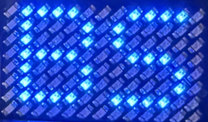 | Bad Street Brawler |
| **GB** | 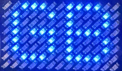 | Super Glove Ball |

Confirm the profile on Dashboard and select **Start controller** when ready.
At game launch, controls pause for six seconds so hand movement cannot operate
RetroPie's runcommand screen. They resume automatically once the launch guard
ends; you do not need to select **Start controller** again.

### The two gestures that work everywhere

| Gesture | See it | Result |
| --- | --- | --- |
| Briefly show a V sign |  | Start or pause |
| Briefly show a thumbs-up with the other fingers closed |  | Select |

The menu poses suppress A/B attacks while they form. Some profiles can still
produce directional or auxiliary output from wrist, depth, or finger gestures;
keep your hand near its calibrated resting position while using menu poses. If a game
needs Select and a direction at exactly the same time, use the physical
controller for that combination. Recalibrate if your resting hand position produces unwanted movement.

The small pictures in each game card are pose reminders. Paired arrows show the
available movement or wrist-roll directions; paired pictures show a combined
gesture.

**Comfort tip:** If the character moves while your hand is resting, recalibrate
in that position. Keep movements small enough to repeat comfortably.

<!-- PAGEBREAK -->

## Your gesture reference

Practice one movement at a time. Your selected profile decides what each
gesture does in the game; the play cards below show the mapping.

| Gesture | See it | Try it |
| --- | --- | --- |
| Move left | 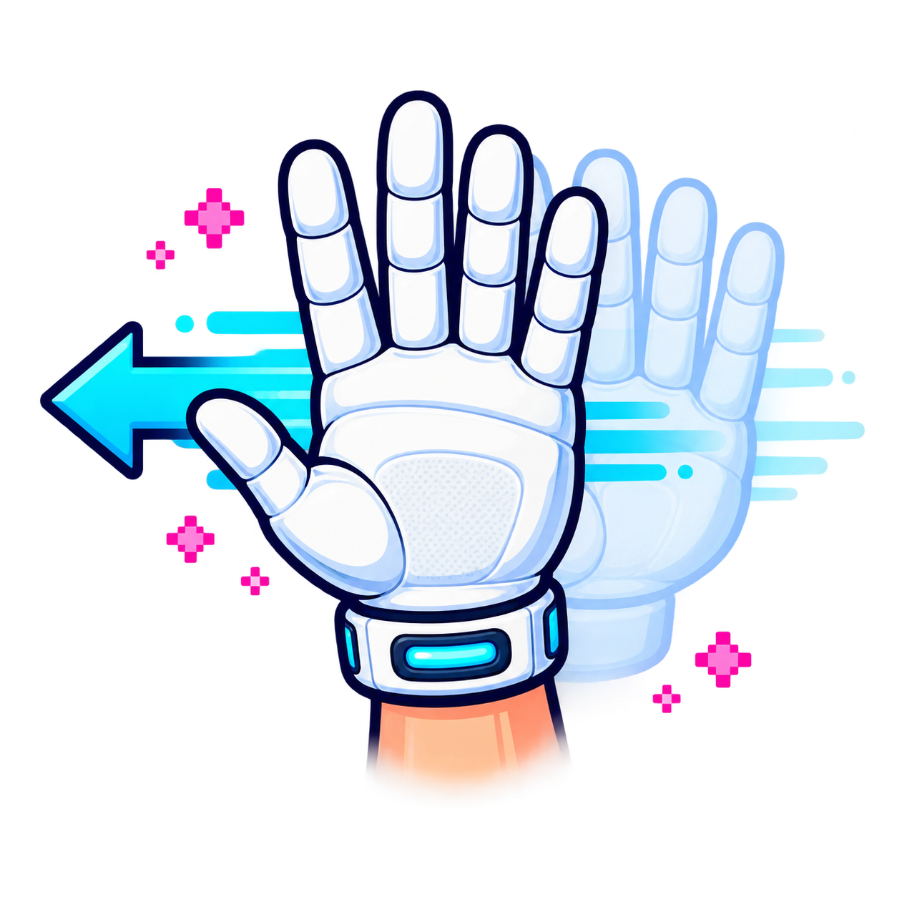 | Slide your whole hand left. |
| Move right | 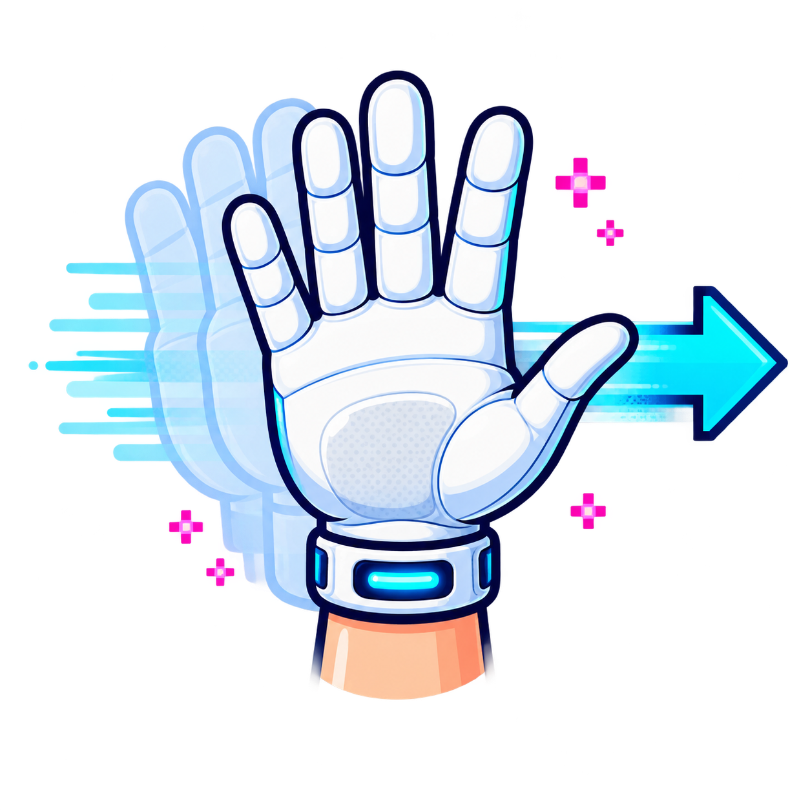 | Slide your whole hand right. |
| Move up | 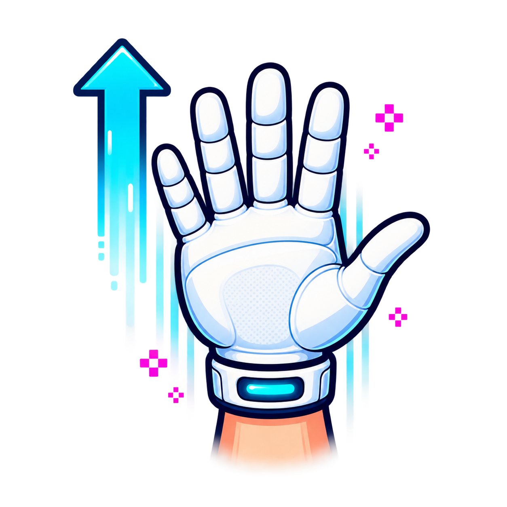 | Raise your whole hand. |
| Move down |  | Lower your whole hand. |
| Curl index finger |  | Bend your index finger toward your palm. |
| Curl thumb |  | Fold your thumb across your palm. |
| V sign |  | Briefly show the pose to Start or pause. |
| Thumbs-up |  | Close the other fingers and briefly show the pose for Select. |
| Roll wrist left | 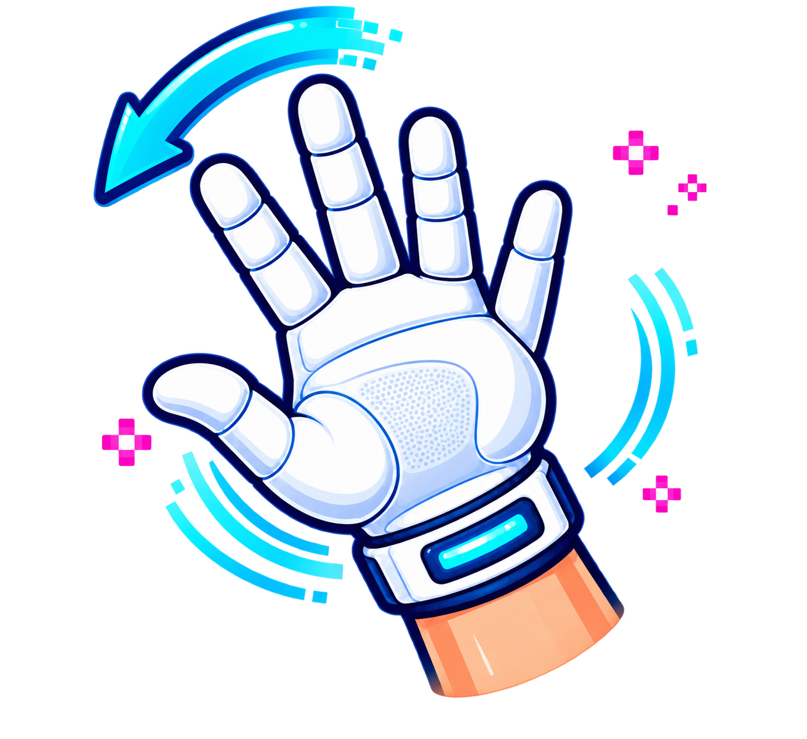 | Tilt your hand left at the wrist. |
| Roll wrist right | 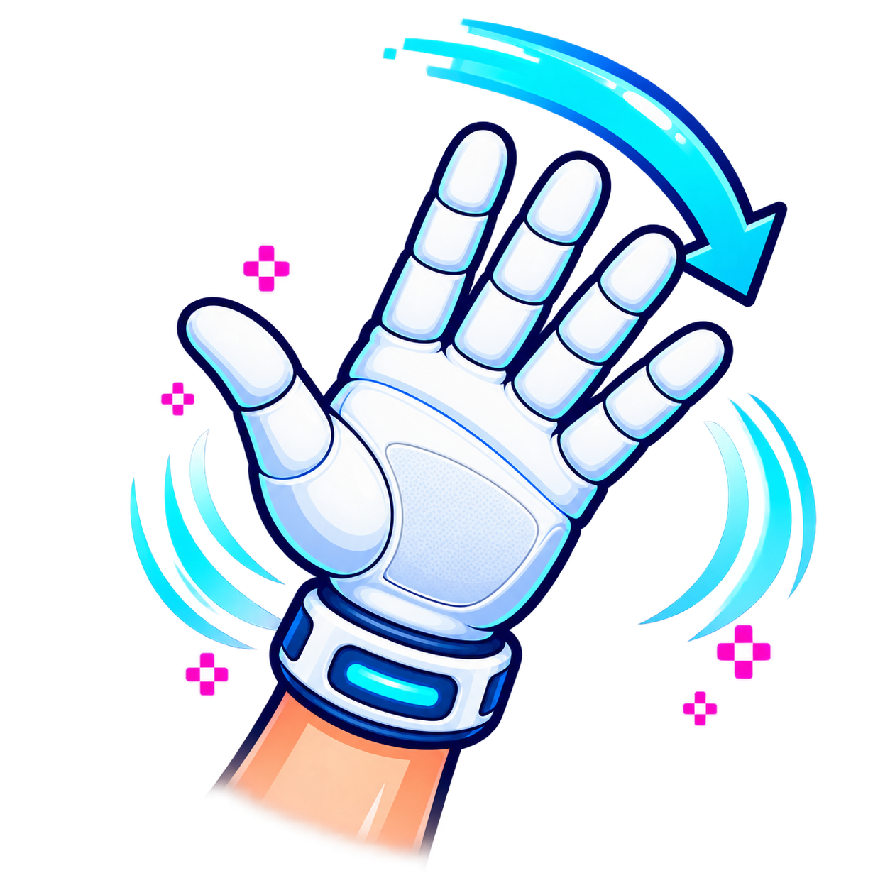 | Tilt your hand right at the wrist. |
| Push toward camera |  | Move your hand closer to the camera. |
| Pull away from camera |  | Move your hand farther from the camera. |

The glove is an illustration: PowerGlove Vision tracks your bare hand.

<!-- PAGEBREAK -->

## Bad Street Brawler

| Profile | Matrix code | See it |
| --- | --- | --- |
| `bad_street_brawler` | **BS** |  |

**Your mission:** Guide Duke Davis through each stage, discover that stage's
three fighting moves at the practice bag, and clear the street before time or
vitality runs out.

| Do this | See it | Duke does this |
| --- | --- | --- |
| Move hand left / right |  | Walk left / right |
| Raise / lower hand |  | Jump / crouch |
| Curl thumb |  | Pulsed B move |
| Curl middle finger |  | A+B force move |
| Roll wrist left / right |  | A plus that direction |
| Push toward camera |  | Glove Zap |

**Play smart:** The available force moves change with each stage. Test the
thumb curl, middle-finger curl, and wrist rolls on the punching bag before
leaving practice. Push toward the camera to trigger Glove Zap, then return to
your starting distance before another attempt. The game controls its
once-per-round availability. If Zap does not work, check the
[game-specific setup](CONFIGURATION_REFERENCE.md#bad-street-brawler-glove-zap).

**First round:**

  1. At the practice bag, try a thumb curl, a middle-finger curl, and a wrist roll separately.
  2. Notice which move each gesture produces in this stage.
  3. Enter the street and use one familiar move before adding combinations.

<!-- PAGEBREAK -->

## Super Glove Ball

| Profile | Matrix code | See it |
| --- | --- | --- |
| `super_glove_ball` | **GB** |  |

**Your mission:** Control the Robo-Glove, keep the energy ball in play, break a
complete wall of tiles, and follow the revealed arrows through the maze.

| Do this | See it | Controller result |
| --- | --- | --- |
| Move whole hand |  | FCEUmm: held digital steering. Native core: absolute continuous X/Y. |
| Curl index finger |  | FCEUmm: A, move the glove into the room. Native finger/action encoding is not yet implemented. |
| Curl thumb |  | FCEUmm: B, punch, grab, or launch a new ball. Native finger/action encoding is not yet implemented. |
| Hold V sign |  | Start / pause; native Start is confirmed. |
| Hold thumbs-up |  | FCEUmm: Select, doorway or Robo-Bullet action. Native Select remains unconfirmed. |

**Play smart:** Pick one wall and finish it. When its arrow appears, use Select
to take the exit. The separately named native Nestopia core has passed exact-ROM
detection, native Start, continuous X/Y, four-direction activation/release, and
safe-neutral tests. The same-ROM comparison confirms FCEUmm remains a pure
standard-joypad session. Use FCEUmm for complete actions while native finger and
remaining button fields are still being established.

**First round:**

  1. Move the glove across the room with small hand movements.
  2. Try the index and thumb actions separately so you can recognize their effects.
  3. Keep the ball in play, then aim to clear one wall.

<!-- PAGEBREAK -->

## Joust

| Profile | Matrix code | See it |
| --- | --- | --- |
| `program_b` | **B** |  |

**Your mission:** Ride the ostrich, strike enemy riders from above, collect
their eggs before they hatch, and stay clear of the lava.

| Do this | See it | Result |
| --- | --- | --- |
| Move hand left / right |  | Steer left / right |
| Curl index or middle finger |  | Pulsed A: steady flap |
| Curl thumb |  | B: faster flap |
| Hold V sign |  | Start / pause |
| Hold thumbs-up |  | Select game mode |

**Play smart:** Height wins jousts. Use the faster thumb flap to climb, then the
pulsed finger flap to hold position. Sweep up eggs quickly; every ignored egg is
an enemy preparing a return engagement.

**First round:**

  1. Curl your index finger to practise a steady flap.
  2. Move left and right while keeping your height.
  3. Approach one rider from above, then collect the egg.

<!-- PAGEBREAK -->

## Gyruss

| Profile | Matrix code | See it |
| --- | --- | --- |
| `program_c` | **C** |  |

**Your mission:** Circle the tunnel, destroy incoming formations, survive the
warp zones, and fight from planet to planet toward the Sun.

| Do this | See it | Result |
| --- | --- | --- |
| Roll wrist left / right |  | Orbit counter-clockwise / clockwise |
| Keep index finger straight |  | Continuous A fire |
| Pull hand away from camera |  | B bomb |
| Hold V sign |  | Start / pause |
| Hold thumbs-up |  | Select control mode |

**Before launching:** Choose **Attack Control B** at the title screen. This
profile expects left/right rotation rather than eight-direction movement.

**First round:**

  1. Select Attack Control B at the title screen.
  2. Keep your index straight and practise small wrist rolls in both directions.
  3. Clear one formation before trying the pull-back bomb.

<!-- PAGEBREAK -->

## Defender II

| Profile | Matrix code | See it |
| --- | --- | --- |
| `program_e` | **E** |  |

**Your mission:** Patrol the planet, destroy alien raiders, and rescue the
humanoids before abductors carry them away and turn them into mutants.

| Do this | See it | Result |
| --- | --- | --- |
| Move whole hand |  | Fly up, down, left, or right |
| Curl thumb |  | A: fire |
| Roll wrist either way |  | B: smart bomb |
| Curl ring finger |  | Rapid left/right evasive thrash |
| Hold V sign |  | Start / pause |

**Play smart:** Watch the scanner as much as the ship. Intercept abductors early;
if one lifts a humanoid, shoot the alien and catch the falling person. Wrist
rolls trigger the smart-bomb action, so make them deliberate.

**First round:**

  1. Fly a short circuit with your wrist level.
  2. Curl your thumb to fire while moving.
  3. Track one abductor on the scanner; save deliberate wrist rolls for smart bombs.

<!-- PAGEBREAK -->

## Sesame Street 1-2-3

The same game may appear in your library as **Sesame Street 123**. The registry
includes both filename spellings, with `.nes`, `.zip`, and `.7z` extensions.

| Profile | Matrix code | See it |
| --- | --- | --- |
| `program_f` | **F** |  |

**Your mission:** Play the counting activities by giving the game a simple,
physical Yes or No answer.

| Do this | See it | Result |
| --- | --- | --- |
| Move an open hand in any direction |  | A: Yes |
| Close every finger into a fist |  | B: No |
| Hold V sign |  | Start / pause |
| Hold thumbs-up |  | Select |

**Play smart:** Directional output is intentionally disabled in this profile.
Make the open-hand answer broad and obvious; make the fist complete. Return to a
relaxed open hand between questions so one answer does not run into the next.

**First round:**

  1. Count the objects before making a gesture.
  2. Move an open hand from the resting position for Yes, or close all fingers for No.
  3. Return to a relaxed hand at the centre before the next question.

<!-- PAGEBREAK -->

## Gun Smoke

| Profile | Matrix code | See it |
| --- | --- | --- |
| `program_g` | **G** |  |

**Your mission:** Walk the scrolling frontier, defeat the bandits, find or buy
each wanted poster, and collect the bounty by beating the stage boss.

| Do this | See it | Result |
| --- | --- | --- |
| Move whole hand |  | Walk in that direction |
| Curl index finger |  | A: shoot diagonally right |
| Push toward camera |  | B: shoot diagonally left |
| Curl index while pushing | 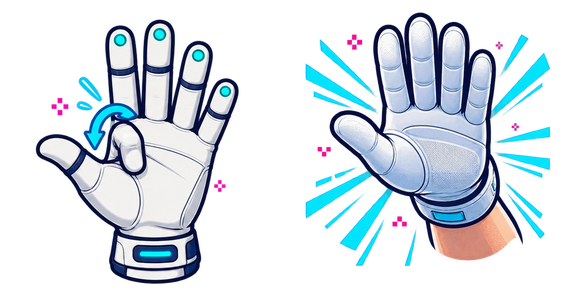 | A+B: shoot straight ahead |
| Curl thumb and ring finger | 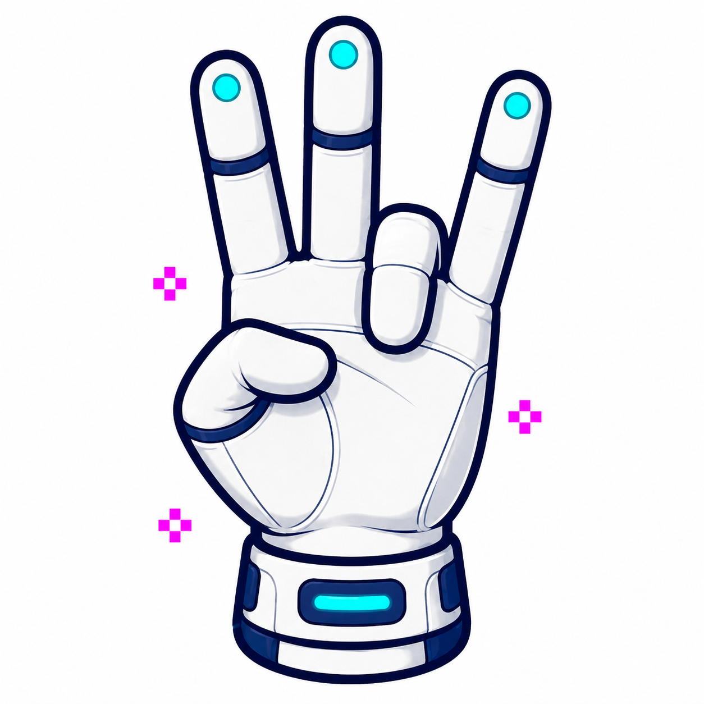 | Suppress D-pad and A/B output |

**Play smart:** A stage keeps looping until you obtain its wanted poster. Keep
your palm level while walking; wrist roll can add a left/right movement command.
Use index-plus-push when you need the straight-ahead shot.

**First round:**

  1. Try an index curl for the right shot and a forward push for the left shot.
  2. Combine them to fire straight ahead.
  3. Walk while firing, then look for the wanted poster.

<!-- PAGEBREAK -->

## Knight Rider

| Profile | Matrix code | See it |
| --- | --- | --- |
| `program_i` | **I** |  |

**Your mission:** Drive KITT from city to city, avoid roadside hazards, destroy
the criminals ahead, and reach each destination before the timer expires.

| Do this | See it | Result |
| --- | --- | --- |
| Roll wrist left / right |  | Steer left / right |
| Curl index finger |  | Accelerate |
| Lower hand |  | Brake |
| Push toward camera |  | Accelerate plus turbo boost |
| Curl thumb |  | Fire weapons |

**Play smart:** Keep the wrist near center on straight roads; large steering
rolls are for real turns. Keep your index finger curled for normal speed and reserve the
forward push for a clean burst when the road opens.

**First round:**

  1. Curl your index finger to accelerate and make small wrist rolls to steer.
  2. Lower your hand to practise braking.
  3. Use a forward push for turbo only when the road ahead is clear.

<!-- PAGEBREAK -->

## Take PowerGlove Vision off-script

You can use the included profiles with games beyond the eight listed in this
guide. Programs A–I send ordinary NES controller inputs, so try matching their
gestures to games with similar controls. Programs A, D, and H have no default
ROM assignment and are useful starting points for these experiments.

### Start with A, D, and H

| Program | See it | Try it with | Know before playing |
| --- | --- | --- | --- |
| **A - Pinball** |  | Pinball and games driven by two independent actions | Index curl is A, thumb curl is Up, wrist tilt is B, and pulling back toggles combined flippers. Ordinary directional movement is disabled. |
| **D - Mirror world** |  | A game you already know well, a party challenge, or an inverted-direction accessibility experiment | Every direction is reversed. Thumb and index provide A and B. Expect your muscle memory to complain loudly. |
| **H - General play** |  | Two-button platform, maze, puzzle, and action games | Hand movement supplies the D-pad. Index and thumb pulse A and B, so games that require a long held button may be a poor fit. |

Try Program H first for general play, or Program A for pinball controls.
Program D turns a familiar game into a new coordination challenge without
changing the ROM or emulator.

### Try a combination

  1. Launch the NES or Famicom game normally. An unregistered game safely turns gesture output off instead of inheriting the previous game's controls.
  2. Open the UNO Q **Dashboard** and choose **A: Pinball**, **D: Challenge**, **H: General**, or another Program A-I profile from **Active profile**.
  3. Use **Calibrate** if your resting hand position produces unwanted movement or your physical setup has changed. Hold a relaxed open hand still at your intended center and distance while 24 clear observations are collected, then select **Start controller** and return to the game. The same stance should produce a closely comparable—but not numerically identical—reference.
  4. Test movement, both action gestures, Start, and Select before committing to a long session. Stop the controller immediately if a gesture remains active.

The selection is temporary. Starting or ending a game sends a new command
that changes the profile or turns gestures off.

### Keep a discovery

Add the game's exact ROM basename, including `.nes`, `.zip`, or `.7z`, to the
`games` object in `/etc/powerglove/games.json` on RetroPie. Keep the existing
entries and assign the profile that worked:

```json
{
  "games": {
    "YOUR EXACT GAME FILENAME.nes": "program_h"
  }
}
```

Restart the game after saving. The launch hook will then select that profile
automatically and the UNO Q matrix will show its letter. Automatic selection is
currently limited to NES and Famicom; other systems deliberately turn gesture
control off until their mappings and launch behaviour are validated.

Do not stop at A, D, and H. Try B when rhythmic button pulses suit the action,
C when wrist rotation can replace horizontal movement, F for simple Yes/No
choices, or I when steering and throttle are the heart of the game. Match the
profile to the game's mechanics, not to the title printed on the cartridge.

> **GLOVE LAB RULE**  A strange pairing that is controllable, repeatable, and
> fun is a successful experiment. Record the exact ROM filename and profile so
> somebody else can reproduce it.

For every Program A–I gesture, see the illustrated
[Programs A–I manual](bad-street-brawler-programs.md). For registry validation
and manual profile commands, see the
[Configuration Reference](CONFIGURATION_REFERENCE.md).

## Sources, artwork, and fair play

The profile descriptions are checked against the project's implemented gesture
engine and tests. Game objectives and original control intent were summarized
from the following historical instruction sources:

  - [Mattel Power Glove instructions and Programs A-I](https://home.hiwaay.net/~lkseitz/cvg/power_glove.shtml)
  - [Bad Street Brawler NES instruction transcription](https://www.world-of-nintendo.com/manuals/nes/bad_street_brawler.shtml)
  - [Super Glove Ball NES instruction manual](https://www.digitpress.com/library/manuals/nes/Super%20Glove%20Ball.pdf)
  - [Joust NES instruction transcription](https://www.world-of-nintendo.com/manuals/nes/joust.shtml)
  - [Gyruss NES instruction transcription](https://www.world-of-nintendo.com/manuals/nes/gyruss.shtml)
  - [Defender II NES instruction transcription](https://www.world-of-nintendo.com/manuals/nes/defender_2.shtml)
  - [Gun Smoke NES gameplay reference](https://strategywiki.org/wiki/Gun.Smoke_%28NES%29/Gameplay)
  - [Knight Rider NES instruction manual](https://www.retrogames.cz/manualy/NES/Knight_Rider_-_NES_-_Manual.pdf)

The gesture drawings are original PowerGlove Vision project illustrations made
for this guide. They deliberately avoid game screenshots, box art, characters,
and publisher logos.

PowerGlove Vision is an independent MIT-licensed hobbyist project by Iain
Bennett. Nintendo, NES, Power Glove, and all game titles and marks belong to
their respective owners. No ROM images or original game artwork are distributed.


### Reading the camera overlay

The camera overlay labels the detected hand as **Right** or **Left**. The
number beside the label indicates how confident the tracker is in that
identification. To see the controls produced by your gestures, check the
D-pad, button, and axis readings on Dashboard.

Glove Academy uses the same saved resting-position reference as gameplay. It helps
you practise gestures but does not train or save a personal recognition model.

## Make the controls fit your hand

Tuning is optional: adjust only controls that are difficult or trigger accidentally.
The selector features hand setup, V-sign, thumbs-up, finger curls, Glove Zap, and
Pull Back. Directions, wrist rolls, closed hand, and menu guard are under **More
adjustments**. Try neutral calibration first if basic directions feel wrong.

For **Glove Zap**, record starting position → push toward camera and hold → return
to the starting position and distance. For **Pull Back**, record starting position
→ pull away and hold → return to the starting position and distance. Keep your
hand comfortably open and palm facing the camera. Each recording lasts three
seconds. Forward push and pull-back have independent thresholds; hand setup does
not calibrate them. For directions and wrist rolls, likewise return to your
starting position, distance, and wrist orientation for the final recording.

If a gesture needs too much movement or fires accidentally, open **Glove Academy** and
switch on **Tune gestures**. Record open hand → gesture → open hand, three seconds each. Keep your open hand comfortable, fingers and thumb gently extended, wrist straight, centered at a consistent distance. Optionally choose **Set up my hand** first and use a gentle fist with the thumb outside for the middle step. Live feedback identifies fingers that do not yet match the gesture. Preview the suggested thresholds before choosing
**Save for all profiles**. Your games keep their button assignments; the selected
gesture becomes easier or harder to activate everywhere it is used.


The threshold table is below the camera; recording instructions are beside it.
The matrix shows a scanning **T** during tuning, matching Glove Academy’s scanning **L**,
and controller delivery stays paused.
Camera imagery in this screenshot is blurred for privacy.

| Mode | See it | Controller output |
| --- | --- | --- |
| Glove Academy lessons | 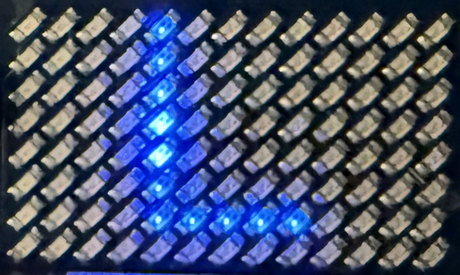 | Paused while you practice |
| Tune gestures | 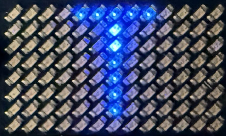 | Paused while you record or preview thresholds |

See the [Matrix display guide](MATRIX_GUIDE.md) for all startup and profile displays.

For a different automatic profile, open **Setup → Games**, edit the exact ROM filename's
mapping, validate, and save. Restart the game to use the new mapping. The
[configuration reference](CONFIGURATION_REFERENCE.md) explains both workflows.


### Check the result in a game

Ordinary Glove Academy includes sixteen lessons. Alongside **Glove Zap** and
**Pull Back**, it teaches roll left, roll right, close hand, and **Menu guard**.
Menu guard means curling the thumb and ring finger while the other three fingers
remain extended; it suppresses controls while you reposition. Saved tuning values
drive gameplay recognition globally, while each game profile only decides button
assignments, pulses, and toggles.

Tune one difficult gesture without repeating hand setup. Follow the live finger
feedback and preview before saving. **Discard / record again** clears unsaved work;
**Restore defaults** resets the selected components, or all five fingers for hand
setup. Start controller delivery from Dashboard when ready.

Automatic tuning requires at least 90% of clear samples to match the complete
pose and identifies any finger that needs a retry. V-sign requires straight
index/middle and curled ring/pinky fingers; thumbs-up requires a straight thumb
and four curled fingers. No strong finger can compensate for a failed finger.

Menu guard has priority over the V-sign and cancels a pending Start press. Its
pinky must be clearly extended, while the V-sign's pinky must be clearly curled;
the space between those thresholds deliberately recognizes neither pose. Menu
guard also suppresses Start and Select while active, so repositioning cannot
accidentally open or pause a game menu.
