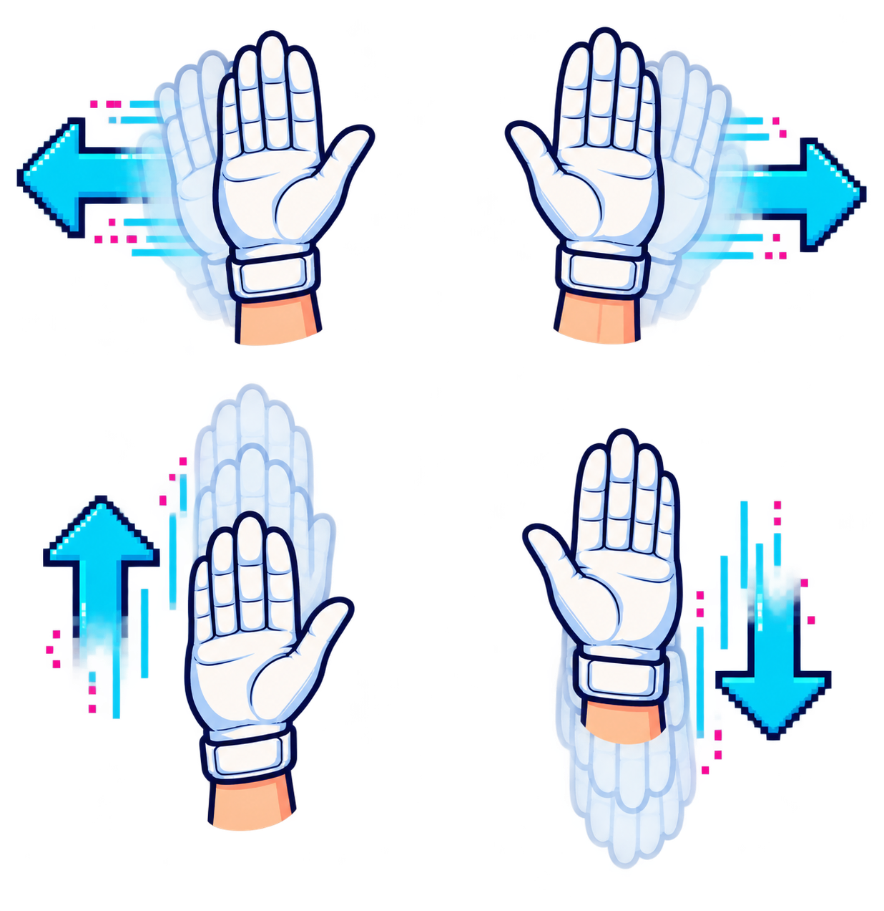
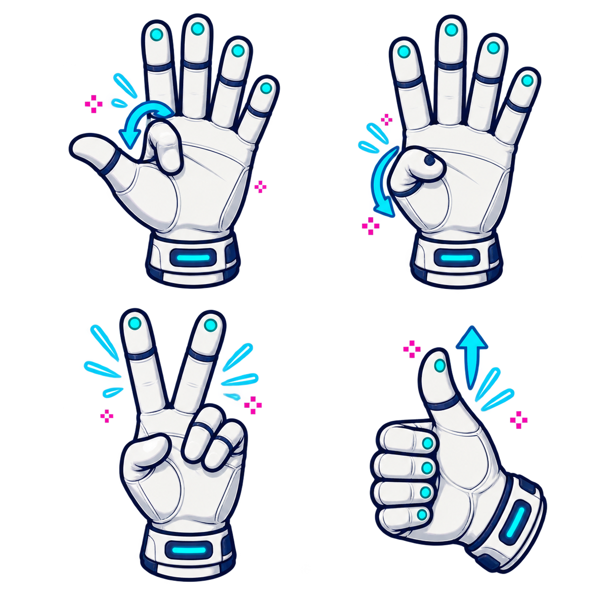
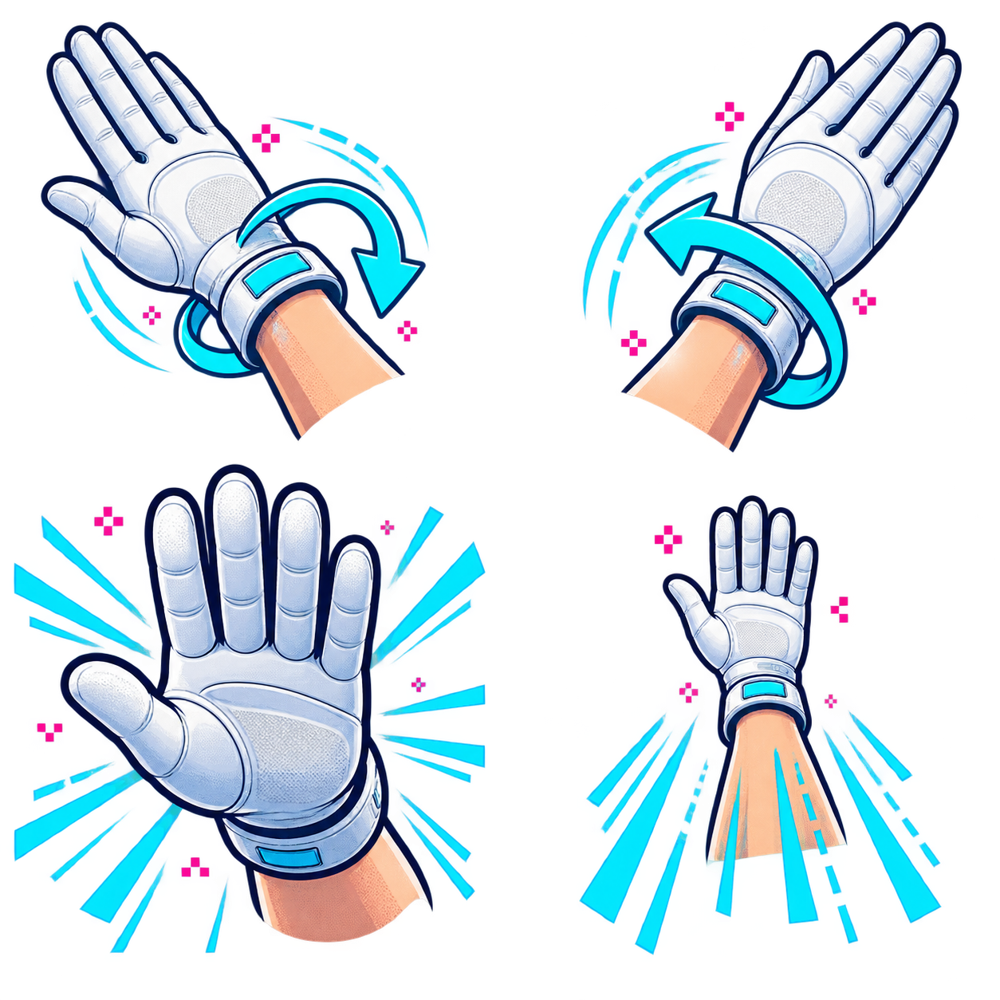

  

# Play with PowerGlove Vision

**Eight games. Eight one-page play cards. One gloriously impractical way to play.**

## Before you throw your first virtual punch

1. Stand where the camera can see your whole hand with a little room on every side.
2. Open your hand, face your palm toward the camera, and select **Center hand**.
3. Wait for tracking to settle, then select **Start controller**.
4. Move your whole hand away from center for directions. Return to center to stop.
5. Make one gesture at a time. Clean poses beat frantic motion.

### The two gestures that work everywhere

| Gesture | Result |
| --- | --- |
| Hold a V sign for about 0.7 seconds | Start or pause |
| Hold a thumbs-up with the other fingers closed for about 0.7 seconds | Select |

The menu poses briefly suppress movement and attacks while they form. If a game
needs Select and a direction at exactly the same time, use the physical
controller for that combination. Re-center whenever neutral begins to drift.

> **GLOVE LAW #1**  If the character moves while your hand is centered, stop and
> re-center. Do not teach your arm to compensate for a bad neutral position.

<!-- PAGEBREAK -->

## Bad Street Brawler

**Profile:** `bad_street_brawler` / matrix code `BS`

**Your mission:** Guide Duke Davis through each stage, discover that stage's
three fighting moves at the practice bag, and clear the street before time or
vitality runs out.

| Do this | Duke does this |
| --- | --- |
| Move hand left / right | Walk left / right |
| Raise / lower hand | Jump / crouch |
| Curl thumb | Pulsed B move |
| Curl middle finger | A+B force move |
| Roll wrist left / right | A plus that direction |
| Push toward camera | Glove Zap auxiliary event |

**Play smart:** The available force moves change by stage. Test thumb, middle
finger, and wrist rolls on the punching bag before leaving practice. The Glove
Zap signal is preserved, but the ordinary `lr-nestopia` controller path cannot
unlock the cartridge's native glove-only zap yet.

> **ONE-LINE PLAN**  Learn the three moves, protect your vitality, and do not
> pick a fight with every little old lady carrying a handbag.

<!-- PAGEBREAK -->

## Super Glove Ball

**Profile:** `super_glove_ball` / matrix code `GB`

**Your mission:** Control the Robo-Glove, keep the energy ball in play, break a
complete wall of tiles, and follow the revealed arrows through the maze.

| Do this | Controller result |
| --- | --- |
| Move whole hand | Steer the Robo-Glove with the D-pad fallback |
| Curl index finger | A: move the glove into the room |
| Curl thumb | B: punch, grab, or launch a new ball |
| Hold V sign | Start / pause |
| Hold thumbs-up | Select: doorway or Robo-Bullet action |

**Play smart:** Pick one wall and finish it. When its arrow appears, use Select
to take the exit. The current profile also preserves analogue hand position,
depth, wrist roll, and individual finger values for future native glove support.

> **ONE-LINE PLAN**  Think Breakout inside a room-sized maze: meet the ball,
> aim the rebound, and make an exit.

<!-- PAGEBREAK -->

## Joust

**Profile:** `program_b` / matrix code `B`

**Your mission:** Ride the ostrich, strike enemy riders from above, collect
their eggs before they hatch, and stay clear of the lava.

| Do this | Result |
| --- | --- |
| Move hand left / right | Steer left / right |
| Curl index or middle finger | Pulsed A: steady flap |
| Curl thumb | B: faster flap |
| Hold V sign | Start / pause |
| Hold thumbs-up | Select game mode |

**Play smart:** Height wins jousts. Use the faster thumb flap to climb, then the
pulsed finger flap to hold position. Sweep up eggs quickly; every ignored egg is
an enemy preparing a return engagement.

> **ONE-LINE PLAN**  Get above them, touch lances, grab the egg, repeat.

<!-- PAGEBREAK -->

## Gyruss

**Profile:** `program_c` / matrix code `C`

**Your mission:** Circle the tunnel, destroy incoming formations, survive the
warp zones, and fight from planet to planet toward the Sun.

| Do this | Result |
| --- | --- |
| Roll wrist left / right | Orbit counter-clockwise / clockwise |
| Keep index finger straight | Continuous A fire |
| Pull hand away from camera | B bomb |
| Hold V sign | Start / pause |
| Hold thumbs-up | Select control mode |

**Before launching:** Choose **Attack Control B** at the title screen. This
profile expects left/right rotation rather than eight-direction movement.

> **ONE-LINE PLAN**  Keep the index straight, rotate into open space, and save
> the pull-back bomb for the formation that owns the whole tunnel.

<!-- PAGEBREAK -->

## Defender II

**Profile:** `program_e` / matrix code `E`

**Your mission:** Patrol the planet, destroy alien raiders, and rescue the
humanoids before abductors carry them away and turn them into mutants.

| Do this | Result |
| --- | --- |
| Move whole hand | Fly up, down, left, or right |
| Curl thumb | A: fire |
| Roll wrist either way | B: smart bomb |
| Curl ring finger | Rapid left/right evasive thrash |
| Hold V sign | Start / pause |

**Play smart:** Watch the scanner as much as the ship. Intercept abductors early;
if one lifts a humanoid, shoot the alien and catch the falling person. Wrist
rolls spend the action mapped to the smart bomb, so make them deliberate.

> **ONE-LINE PLAN**  Scan, intercept, fire, rescue - then turn around fast.

<!-- PAGEBREAK -->

## Sesame Street 1-2-3

**Profile:** `program_f` / matrix code `F`

**Your mission:** Play the counting activities by giving the game a simple,
physical Yes or No answer.

| Do this | Result |
| --- | --- |
| Move an open hand in any direction | A: Yes |
| Close every finger into a fist | B: No |
| Hold V sign | Start / pause |
| Hold thumbs-up | Select |

**Play smart:** Directional output is intentionally disabled in this profile.
Make the open-hand answer broad and obvious; make the fist complete. Return to a
relaxed open hand between questions so one answer does not run into the next.

> **ONE-LINE PLAN**  Count carefully, answer clearly, and let the dramatic fist
> handle every emphatic No.

<!-- PAGEBREAK -->

## Gun.Smoke

**Profile:** `program_g` / matrix code `G`

**Your mission:** Walk the scrolling frontier, defeat the bandits, find or buy
each wanted poster, and collect the bounty by beating the stage boss.

| Do this | Result |
| --- | --- |
| Move whole hand | Walk in that direction |
| Curl index finger | A: shoot diagonally right |
| Push toward camera | B: shoot diagonally left |
| Curl index while pushing | A+B: shoot straight ahead |
| Curl thumb and ring finger | Suppress all action for menus |

**Play smart:** A stage keeps looping until you obtain its wanted poster. Keep
your palm level while walking; wrist roll can add a left/right movement command.
Use index-plus-push when you need the straight-ahead shot.

> **ONE-LINE PLAN**  Find the poster, build an A+B rhythm, and keep moving.

<!-- PAGEBREAK -->

## Knight Rider

**Profile:** `program_i` / matrix code `I`

**Your mission:** Drive KITT from city to city, avoid roadside hazards, destroy
the criminals ahead, and reach each destination before the timer expires.

| Do this | Result |
| --- | --- |
| Roll wrist left / right | Steer left / right |
| Curl index finger | Accelerate |
| Lower hand | Brake |
| Push toward camera | Accelerate plus turbo boost |
| Curl thumb | Fire weapons |

**Play smart:** Keep the wrist near center on straight roads; large steering
rolls are for real turns. Hold index curl for normal speed and reserve the
forward push for a clean burst when the road opens.

> **ONE-LINE PLAN**  Index down, eyes forward, small steering corrections -
> then push for turbo when KITT has room to run.

<!-- PAGEBREAK -->

## Sources, artwork, and fair play

The profile descriptions are checked against the project's implemented gesture
engine and tests. Game objectives and original control intent were summarized
from the following historical instruction sources:

- [Mattel Power Glove instructions and Programs A-I](https://home.hiwaay.net/~lkseitz/cvg/power_glove.shtml)
- [Bad Street Brawler NES instruction transcription](https://www.world-of-nintendo.com/manuals/nes/bad_street_brawler.shtml)
- [Super Glove Ball NES instruction manual](https://www.digitpress.com/library/manuals/nes/Super%20Glove%20Ball.pdf)
- [Joust NES instruction transcription](https://www.world-of-nintendo.com/manuals/nes/joust.shtml)
- [Gyruss NES instruction transcription](https://www.world-of-nintendo.com/manuals/nes/gyruss.shtml)
- [Defender II NES instruction transcription](https://www.world-of-nintendo.com/manuals/nes/defender_2.shtml)
- [Gun.Smoke NES gameplay reference](https://strategywiki.org/wiki/Gun.Smoke_%28NES%29/Gameplay)
- [Knight Rider NES instruction manual](https://www.retrogames.cz/manualy/NES/Knight_Rider_-_NES_-_Manual.pdf)

The gesture drawings are original PowerGlove Vision project illustrations made
for this guide. They deliberately avoid game screenshots, box art, characters,
and publisher logos.

PowerGlove Vision is an independent MIT-licensed hobbyist project by Iain
Bennett. Nintendo, NES, Power Glove, and all game titles and marks belong to
their respective owners. No ROM images or original game artwork are distributed.
