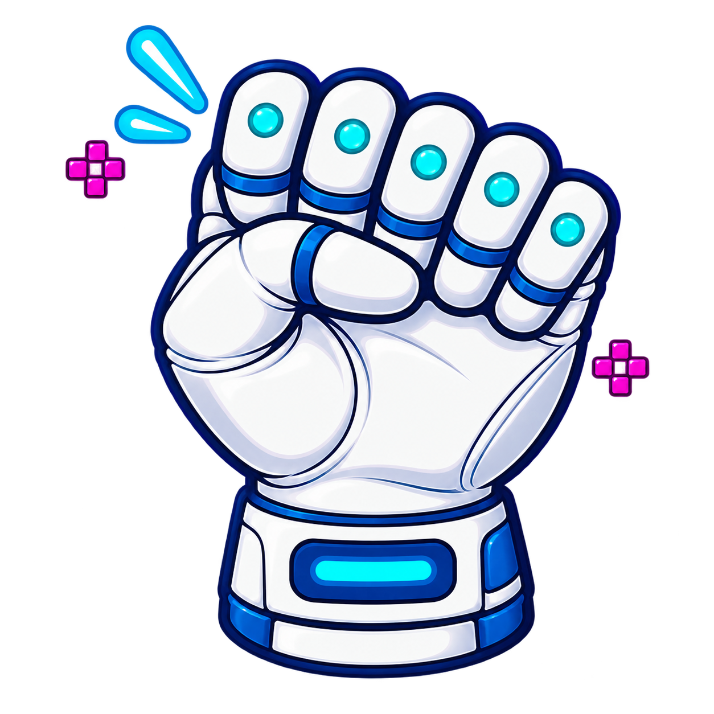
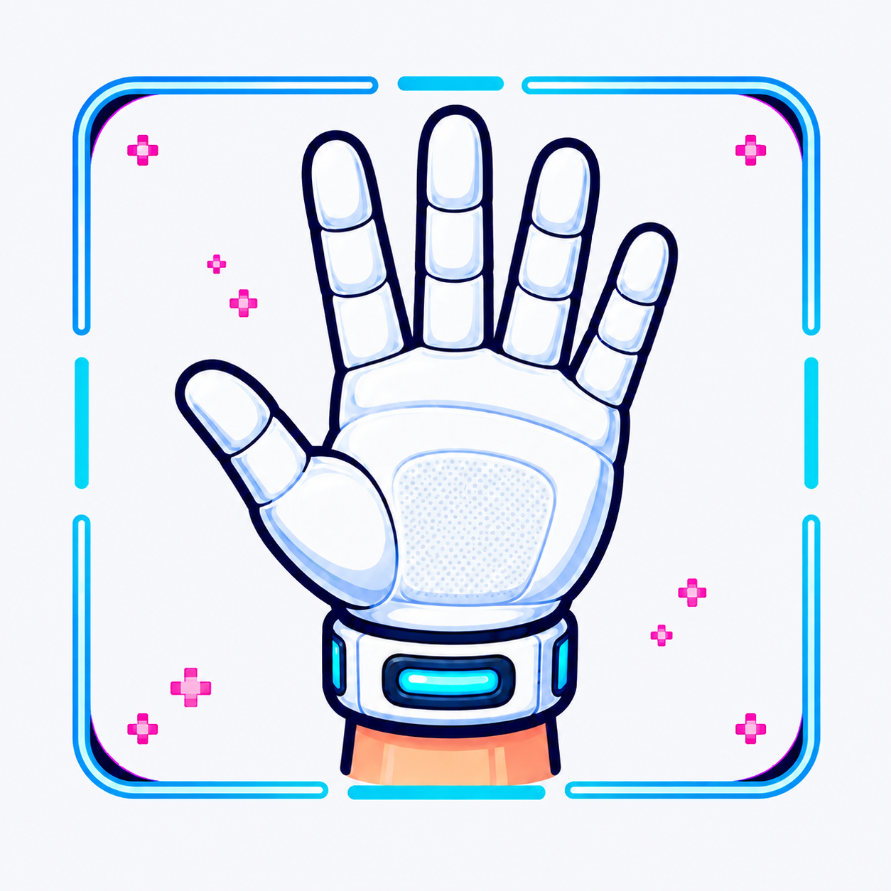
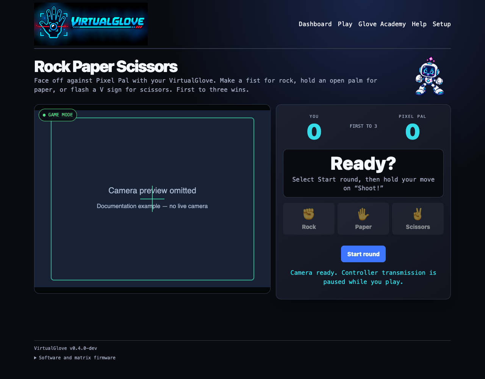
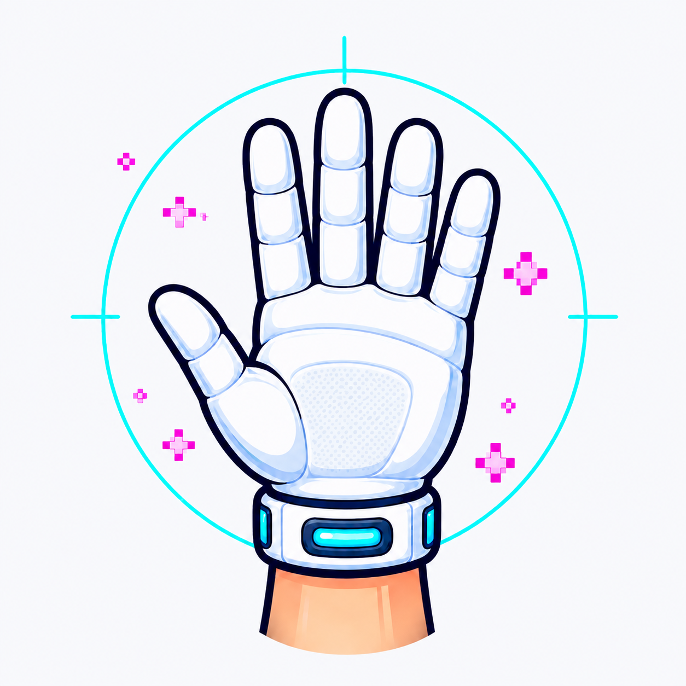
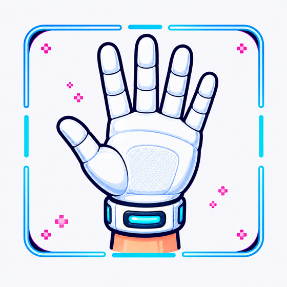
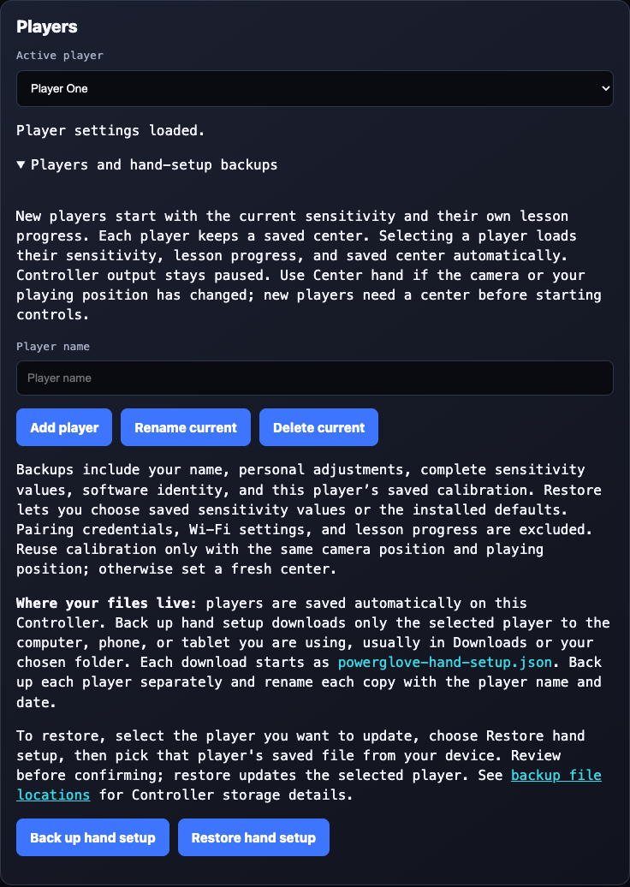

# Play with PowerGlove Vision

The **PowerGlove Vision Controller (Arduino UNO Q)** watches your hand and sends
the recognized controls to RetroPie.

This guide provides eight game-specific play cards and explains how to use
the nine reusable programs. It shows you which gestures to make, what controls
they produce, and how to try them with other games in your library.

Find your game below, check its profile, and try the first-round exercise.
If the system is not installed yet, start with the [Installation Guide](INSTALL_README.md).

## Play Rock Paper Scissors locally

Open **Play** at `http://UNO-Q-NAME.local:8088/play` for a first-to-three match
against Pixel Pal. This local game uses the Controller camera and pauses cabinet
input while the page is open, so RetroPie does not need to be connected.

| Your move | Make this pose | See it |
| --- | --- | --- |
| Rock | Close all five fingers into a comfortable fist. |  |
| Paper | Face an open, relaxed palm toward the camera. |  |
| Scissors | Extend the index and middle fingers in a V sign. |  |

Select **Start round**, follow the countdown, and hold the pose after **Shoot!**
until its button is highlighted. The first player to win three rounds takes the
match. Mouse and touch buttons remain available if the camera is unavailable.

## Get ready to play

Choose your player in **Active player** so practice and sensitivity changes belong
to you. Select a profile on Dashboard and wait for the camera view. Starting
straight after a reboot can take longer.

1. Stand where the camera can see your whole hand, with room to move on every side.
2. Face a relaxed open palm toward the camera. On first use, or after moving the camera or changing your playing position, select **Center hand** and hold still until it finishes. Otherwise use your saved resting position.
3. Select **Start controller** when ready. If the tracker is reconnecting, Start remains pending until it can be delivered; **Stop controller** cancels that request.
4. Launch a registered game and allow its short startup pause to finish. Check the selected profile on Dashboard against the play card below; the card also shows its matrix display.
5. Try one gesture at a time. Return to your resting position between attempts. In standard movement profiles this stops directional input; Nestopia (PowerGlove) follows your hand's position continuously.

**Start controller** stays armed across Controller restarts, but sends controls
only while a registered game or a manually selected Dashboard profile is active.
Exiting the game or losing its session releases controls. **Stop controller**
keeps delivery stopped until you explicitly start it again. Use it before
repositioning yourself or the camera.

### Read the camera view

The overlay labels the detected hand **Right** or **Left** and shows the tracker's
confidence. Dashboard's D-pad, button, and axis readings show the controls your
hand produces. Keep your whole hand visible and use small, comfortable movements.
If your resting hand causes unwanted movement, recalibrate in that position.

> **Pixel Pal's Extra-Digit Hunt:** Some glove illustrations have five fingers
> plus a thumb. Count every six-digit hand once per appearance, including
> repeated artwork. Pixel Pal reveals the answer at the back of this guide.

## Practise with Glove Academy

Open **Glove Academy** from the main navigation to practise with Pixel Pal.
Cabinet controller output pauses while you learn. The sixteen lessons cover
showing your hand, finding your resting position, four movement directions,
index and thumb curls, Start and Select poses, forward and backward movement,
wrist rolls, a closed hand, and Menu guard.

Complete all sixteen lessons to earn **Glove Master**. The award replaces the
lesson card. Progress is saved for the selected player across browsers and
restarts; **Start again** clears that player's saved lesson progress and returns
to the lessons. It does not clear their hand settings.

Glove Academy practises recognition, not each game's button assignments.
Use the gesture reference next, then your game's play card. For a difficult
pose, see [Make the controls fit your hand](#make-the-controls-fit-your-hand).

<!-- PAGEBREAK -->

## Your gesture reference

Practice one movement at a time in **Glove Academy**. Your selected profile
decides what each gesture does in a game; the play cards below show the mapping.
This reference also includes game-specific finger poses and combinations beyond
the sixteen Academy lessons. The glove is an illustration: the Controller
tracks your bare hand.

### Resting position and movement

| Gesture | See it | Try it |
| --- | --- | --- |
| Show an open hand |  | Open your fingers comfortably and keep your whole palm visible. |
| Find your resting position |  | Hold a relaxed open hand at your saved centre and distance. |
| Move left |  | Slide your whole hand left. |
| Move right |  | Slide your whole hand right. |
| Move up |  | Raise your whole hand. |
| Move down |  | Lower your whole hand. |

### Wrist and depth movements

| Gesture | See it | Try it |
| --- | --- | --- |
| Roll wrist left |  | Tilt your hand left at the wrist. |
| Roll wrist right |  | Tilt your hand right at the wrist. |
| Push toward camera |  | Push deliberately, then return. Holding your hand nearby does not trigger a new Glove Zap. |
| Pull away from camera |  | Pull away deliberately, then return. Holding your hand far away does not trigger a new Pull Back. |

<!-- PAGEBREAK -->

### Finger and hand poses

| Gesture | See it | Try it |
| --- | --- | --- |
| Curl index finger |  | Bend your index finger toward your palm. |
| Curl thumb |  | Fold your thumb across your palm. |
| Curl middle finger |  | Bend your middle finger toward your palm; used in Bad Street Brawler and Joust. |
| Curl ring finger |  | Bend your ring finger toward your palm; used in Defender II. |
| Close your hand |  | Curl your thumb and all four fingers into a comfortable fist. |
| Keep index straight |  | Keep your index finger extended for Gyruss fire. |
| Point index |  | Extend index and curl middle, ring, and pinky for the native Super Glove Ball Robo-Bullet. |

### Menu poses

| Gesture | See it | Try it |
| --- | --- | --- |
| V sign |  | Extend index and middle, curl ring and pinky, and hold steadily for about half a second for Start or pause. |
| Thumbs-up |  | Extend your thumb, close all four fingers, and hold until Select is recognized. |
| Menu guard |  | Curl thumb and ring only; keep index, middle, and pinky extended. |

Start and Select send controller inputs; their effect depends on the game.
The V sign and thumbs-up suppress A/B actions while forming, but some profiles
can still produce movement. Keep your hand near its resting position. Use a
physical controller if a game requires Select and a direction together.

Menu guard suppresses D-pad, A/B, Start, and Select, and cancels a pending Start
press. It does **not** freeze native continuous hand positioning. For a dependable
pause in all controller delivery while you reposition, use **Stop controller**.

<!-- PAGEBREAK -->

## Bad Street Brawler

| Profile | See it |
| --- | --- |
| `bad_street_brawler` |  |

**Your mission:** Guide Duke Davis through each stage, discover that stage's
three fighting moves at the practice bag, and clear the street before time or
vitality runs out.

| Do this | See it | Duke does this |
| --- | --- | --- |
| Move hand left / right |  | Walk left / right |
| Raise / lower hand |  | Jump / crouch |
| Curl thumb |  | Pulsed B move |
| Curl middle finger |  | A+B force move |
| Roll wrist left / right |  | A plus that direction |
| Push toward camera |  | Glove Zap |

**Play smart:** The available force moves change with each stage. Test the
thumb curl, middle-finger curl, and wrist rolls on the punching bag before
leaving practice. Push toward the camera to trigger Glove Zap, then return to
your starting distance before another attempt. The game controls its
once-per-round availability. If Zap does not work, check the
[game-specific setup](CONFIGURATION_REFERENCE.md#bad-street-brawler-glove-zap).

**First round:**

1. At the practice bag, try a thumb curl, a middle-finger curl, and a wrist roll separately.
2. Notice which move each gesture produces in this stage.
3. Enter the street and use one familiar move before adding combinations.

<!-- PAGEBREAK -->

## Super Glove Ball

| Profile | See it |
| --- | --- |
| `super_glove_ball` |  |

**Your mission:** Control the Robo-Glove, keep the energy ball in play, break a
complete wall of tiles, and follow the revealed arrows through the maze.

**Nestopia (PowerGlove)** means the custom `lr-nestopia-powerglove` core.
Use the controls below for your selected emulator; FCEUmm is the fallback.
The V sign sends Start in both modes.

| Do this | See it | Controller result |
| --- | --- | --- |
| Move whole hand |  | FCEUmm: held digital steering. Nestopia (PowerGlove): continuous hand positioning. |
| Curl index finger |  | FCEUmm: A, move the glove into the room. |
| Curl thumb |  | FCEUmm: B, punch, grab, or launch a new ball. |
| Open hand |  | Nestopia (PowerGlove): release or throw a held ball. |
| Close hand |  | Nestopia (PowerGlove): grab or catch the ball. |
| Point index; curl middle, ring, and pinky |  | Nestopia (PowerGlove): fire a Robo-Bullet. |
| Close hand and push forward |   | Nestopia (PowerGlove): Power Punch. |

**Play smart:** Pick one wall and finish it, then follow the revealed arrow.
With FCEUmm, use Select to take the exit. Do not rely on Select in
Nestopia (PowerGlove); that action remains unconfirmed. Continuous native
movement is playable, although noticeable latency remains. The
[native compatibility record](super-glove-ball-native.md) contains the test
evidence and current limitations.

**First round:**

1. Move the Robo-Glove across the room with small hand movements.
2. With **Nestopia (PowerGlove)**, practise closing to grab and opening to release. Try index-point fire and a fist-plus-forward Power Punch separately.
3. With **FCEUmm**, try the index-curl A action and thumb-curl B action separately.

<!-- PAGEBREAK -->

## Joust

| Profile | See it |
| --- | --- |
| `program_b` |  |

**Your mission:** Ride the ostrich, strike enemy riders from above, collect
their eggs before they hatch, and stay clear of the lava.

| Do this | See it | Result |
| --- | --- | --- |
| Move hand left / right |  | Steer left / right |
| Curl index or middle finger |  | Pulsed A: steady flap |
| Curl thumb |  | B: faster flap |
| Hold thumbs-up |  | Select game mode |

**Play smart:** Height wins jousts. Use the faster thumb flap to climb, then the
pulsed finger flap to hold position. Sweep up eggs quickly; every ignored egg is
an enemy preparing a return engagement.

**First round:**

1. Curl your index finger to practise a steady flap.
2. Move left and right while keeping your height.
3. Approach one rider from above, then collect the egg.

<!-- PAGEBREAK -->

## Gyruss

| Profile | See it |
| --- | --- |
| `program_c` |  |

**Your mission:** Circle the tunnel, destroy incoming formations, survive the
warp zones, and fight from planet to planet toward the Sun.

| Do this | See it | Result |
| --- | --- | --- |
| Roll wrist left / right |  | Orbit counter-clockwise / clockwise |
| Keep index finger straight |  | Continuous A fire |
| Pull hand away from camera |  | B bomb |
| Hold thumbs-up |  | Select control mode |

**Before launching:** Choose **Attack Control B** at the title screen. This
profile expects left/right rotation rather than eight-direction movement.

**First round:**

1. Select Attack Control B at the title screen.
2. Keep your index straight and practise small wrist rolls in both directions.
3. Clear one formation before trying the pull-back bomb.

<!-- PAGEBREAK -->

## Defender II

| Profile | See it |
| --- | --- |
| `program_e` |  |

**Your mission:** Patrol the planet, destroy alien raiders, and rescue the
humanoids before abductors carry them away and turn them into mutants.

| Do this | See it | Result |
| --- | --- | --- |
| Move whole hand |  | Fly up, down, left, or right |
| Curl thumb |  | A: fire |
| Roll wrist either way |  | B: smart bomb |
| Curl ring finger |  | Rapid left/right evasive thrash |

**Play smart:** Watch the scanner as much as the ship. Intercept abductors early;
if one lifts a humanoid, shoot the alien and catch the falling person. Wrist
rolls trigger the smart-bomb action, so make them deliberate.

**First round:**

1. Fly a short circuit with your wrist level.
2. Curl your thumb to fire while moving.
3. Track one abductor on the scanner; save deliberate wrist rolls for smart bombs.

<!-- PAGEBREAK -->

## Sesame Street 1-2-3

The same game may appear in your library as **Sesame Street 123**.

| Profile | See it |
| --- | --- |
| `program_f` |  |

**Your mission:** Play the counting activities by giving the game a simple,
physical Yes or No answer.

| Do this | See it | Result |
| --- | --- | --- |
| Move an open hand in any direction |  | A: Yes |
| Close every finger into a fist |  | B: No |

**Play smart:** Directional output is intentionally disabled in this profile.
Make the open-hand answer broad and obvious; make the fist complete. Return to a
relaxed open hand between questions so one answer does not run into the next.

**First round:**

1. Count the objects before making a gesture.
2. Move an open hand from the resting position for Yes, or close all fingers for No.
3. Return to a relaxed hand at the centre before the next question.

<!-- PAGEBREAK -->

## Gun Smoke

| Profile | See it |
| --- | --- |
| `program_g` |  |

**Your mission:** Walk the scrolling frontier, defeat the bandits, find or buy
each wanted poster, and collect the bounty by beating the stage boss.

| Do this | See it | Result |
| --- | --- | --- |
| Move whole hand |  | Walk in that direction |
| Curl index finger |  | A: shoot diagonally right |
| Push toward camera |  | B: shoot diagonally left |
| Curl index while pushing |  | A+B: shoot straight ahead |
| Curl thumb and ring finger |  | Suppress D-pad, A/B, Start, and Select |

**Play smart:** A stage keeps looping until you obtain its wanted poster. Keep
your palm level while walking; wrist roll can add a left/right movement command.
Use index-plus-push when you need the straight-ahead shot.

**First round:**

1. Try an index curl for the right shot and a forward push for the left shot.
2. Combine them to fire straight ahead.
3. Walk while firing, then look for the wanted poster.

<!-- PAGEBREAK -->

## Knight Rider

| Profile | See it |
| --- | --- |
| `program_i` |  |

**Your mission:** Drive KITT from city to city, avoid roadside hazards, destroy
the criminals ahead, and reach each destination before the timer expires.

| Do this | See it | Result |
| --- | --- | --- |
| Roll wrist left / right |  | Steer left / right |
| Curl index finger |  | Accelerate |
| Lower hand |  | Brake |
| Push toward camera |  | Accelerate plus turbo boost |
| Curl thumb |  | Fire weapons |

**Play smart:** Keep the wrist near center on straight roads; large steering
rolls are for real turns. Keep your index finger curled for normal speed and reserve the
forward push for a clean burst when the road opens.

**First round:**

1. Curl your index finger to accelerate and make small wrist rolls to steer.
2. Lower your hand to practise braking.
3. Use a forward push for turbo only when the road ahead is clear.

<!-- PAGEBREAK -->

## Make the controls fit your hand

### Choose a player and save your setup

Choose a player in **Active player** before practising or tuning. Each player keeps
separate sensitivity, lesson progress, and a saved centre. Selecting a player
loads all three automatically and pauses controller output. Use **Center hand**
for players without a saved centre or after moving the camera or changing playing position.

Use **Setup → Players → Players and hand-setup backups → Back up hand setup** to save the player's
name, personal and complete sensitivity, software identity, and calibration.
During restore, choose whether to keep the complete saved sensitivity, including
the defaults used when the backup was made, or just personal adjustments. Reuse
calibration only with the same camera and playing position; otherwise set a fresh
centre. Backups do not include credentials or Academy progress. Version-2 backups
are supported; older version-1 sensitivity-only files are rejected.

Choose each player in turn and select **Back up hand setup** to download a
separate `powerglove-hand-setup.json`. The file is saved by your browser on the
computer, phone, or tablet you are using, usually in **Downloads** or the folder
you choose. Rename each copy with the player name and date, for example
`Iain-hand-setup-2026-09-06.json`, so you can identify it later. To restore, select
the player you want to update, choose **Restore hand setup**, and pick that
player's saved file from your device. Review it before confirming; restore
updates the selected player, rather than adding a new one.

### Tune a difficult gesture

Tuning is optional. In **Glove Academy**, switch on **Tune gestures**. Pixel Pal
helps with a new hand setup, a difficult or accidental gesture, or movement that
feels off-centre. This adjusts recognition thresholds, not a personal camera
model. It does not change the game's button assignments.

1. Choose what you want to improve and follow the framing advice.
2. When your whole hand is tracked clearly, select **I'm ready**.
3. Follow the countdown and prompts. Finger poses use open hand, performed pose, then open hand again. Movement uses your starting position, the motion, then a return. Forward and backward movements are repeated three times.
4. Test the result with two clean activations and releases, then hold neutral for three seconds. Save when the check passes, or retry the indicated pose.

Cabinet output stays paused during practice and tuning. The live camera area is
excluded from these screenshots for privacy. Tune one difficult gesture without
repeating the whole hand setup. Pixel Pal may suggest better framing or lighting;
it does not change camera exposure automatically.

Use the separate **Movement reach** section when native Super Glove Ball needs
more or less physical travel. Left, right, up, and down are normalized distances
from the saved center; smaller values reach the corresponding screen edge sooner.
The summary shows the tracking area's width, height, and aspect ratio. Saving
changes only those four reach spans. **Restore full camera field** returns to the
camera-boundary mapping without changing the center or gesture sensitivity.

Leave **Advanced thresholds and diagnostics** closed unless you need numerical
controls or a diagnostic run. The [Configuration Reference](CONFIGURATION_REFERENCE.md)
explains the threshold checks and targeted restore options.

### Check the result in a game

Return to Dashboard, select **Start controller**, and try the same gesture in a
short game session. Check that it activates reliably and releases when you return
to rest. If another gesture activates accidentally, stop delivery and revisit
that pose in Glove Academy. Saved sensitivity is shared across your selected
player's games; each game profile still decides the resulting actions.

## Understand the matrix display

The matrix shows the active game or practice mode. Each play card includes its
game display; the images below identify Academy and tuning.

| Mode | See it | Controller output |
| --- | --- | --- |
| Glove Academy lessons |  | Paused while you practise |
| Tune gestures |  | Paused while you record or preview thresholds |

For the idle display, choose **Setup → Matrix attract mode**: **On**, **Dim**, or
**Off** with faint connection pixels. This affects only the idle animation, not
game displays, Academy, tuning, or gesture recognition. The setting saves without
restarting tracking. See the [Matrix display guide](MATRIX_GUIDE.md) for connection
pixels, startup animations, and the full display reference.

<!-- PAGEBREAK -->

## Take PowerGlove Vision off-script

You can use the included profiles with games beyond the eight listed in this
guide. Programs A–I send ordinary NES controller inputs, so try matching their
gestures to games with similar controls. Programs A, D, and H have no default
ROM assignment and are useful starting points for these experiments.

### Start with A, D, and H

| Program | See it | Try it with | Know before playing |
| --- | --- | --- | --- |
| **A - Pinball** |  | Pinball and games driven by two independent actions | Index curl is A, thumb curl is Up, wrist tilt is B, and pulling back toggles combined flippers. Ordinary directional movement is disabled. |
| **D - Mirror world** |  | A game you already know well, a party challenge, or an inverted-direction accessibility experiment | Every direction is reversed. Thumb and index provide A and B. Expect your muscle memory to complain loudly. |
| **H - General play** |  | Two-button platform, maze, puzzle, and action games | Hand movement supplies the D-pad. Index and thumb pulse A and B, so games that require a long held button may be a poor fit. |

Try Program H first for general play, or Program A for pinball controls.
Program D turns a familiar game into a new coordination challenge without
changing the ROM or emulator.

### Try a combination

1. Launch the NES or Famicom game normally. An unregistered game safely turns gesture output off instead of inheriting the previous game's controls.
2. Open the PowerGlove Vision Controller **Dashboard** and choose **A: Pinball**, **D: Challenge**, **H: General**, or another Program A-I profile from **Active profile**.
3. Use **Center hand** if your resting hand position produces unwanted movement or your physical setup has changed. Hold a relaxed open hand still at your intended centre and distance until calibration finishes, then select **Start controller** and return to the game.
4. Test movement, both action gestures, Start, and Select before committing to a long session. Stop the controller immediately if a gesture remains active.

The selection is temporary. Starting or ending a game sends a new command
that changes the profile or turns gestures off.

### Keep a discovery

Open **Setup → Games** and map the game's exact ROM filename to the profile
that worked. Include its `.nes`, `.zip`, or `.7z` extension, validate, and save.
Restart the game to use the new mapping. Automatic selection is currently limited
to NES and Famicom; other systems turn gesture control off until their mappings
and launch behaviour are validated.

Do not stop at A, D, and H. Try B when rhythmic button pulses suit the action,
C when wrist rotation can replace horizontal movement, F for simple Yes/No
choices, or I when steering and throttle are the heart of the game. Match the
profile to the game's mechanics, not to the title printed on the cartridge.

> **GLOVE LAB RULE**  A strange pairing that is controllable, repeatable, and
> fun is a successful experiment. Record the exact ROM filename and profile so
> somebody else can reproduce it.

For every Program A–I gesture, see the illustrated
[Programs A–I manual](bad-street-brawler-programs.md). For registry validation
and manual profile commands, see the
[Configuration Reference](CONFIGURATION_REFERENCE.md).

<!-- PAGEBREAK -->

## Sources, artwork, and fair play

The profile descriptions are checked against the project's implemented gesture
engine and tests. Game objectives and original control intent were summarized
from the following historical instruction sources:

- [Mattel Power Glove instructions and Programs A-I](https://home.hiwaay.net/~lkseitz/cvg/power_glove.shtml)
- [Bad Street Brawler NES instruction transcription](https://www.world-of-nintendo.com/manuals/nes/bad_street_brawler.shtml)
- [Super Glove Ball NES instruction manual](https://www.digitpress.com/library/manuals/nes/Super%20Glove%20Ball.pdf)
- [Joust NES instruction transcription](https://www.world-of-nintendo.com/manuals/nes/joust.shtml)
- [Gyruss NES instruction transcription](https://www.world-of-nintendo.com/manuals/nes/gyruss.shtml)
- [Defender II NES instruction transcription](https://www.world-of-nintendo.com/manuals/nes/defender_2.shtml)
- [Gun Smoke NES gameplay reference](https://strategywiki.org/wiki/Gun.Smoke_%28NES%29/Gameplay)
- [Knight Rider NES instruction manual](https://www.retrogames.cz/manualy/NES/Knight_Rider_-_NES_-_Manual.pdf)

The gesture drawings are original PowerGlove Vision project illustrations made
for this guide. They deliberately avoid game screenshots, box art, characters,
and publisher logos.

PowerGlove Vision is an independent MIT-licensed hobbyist project by Iain
Bennett. Nintendo, NES, Power Glove, and all game titles and marks belong to
their respective owners. No ROM images or original game artwork are distributed.

<!-- PAGEBREAK -->

## Pixel Pal's Extra-Digit Hunt answer

**Pixel Pal's answer: 11 six-digit hands.**

They appear once each in the Bad Street Brawler, Joust, Defender II, Sesame
Street 1-2-3, and Gun Smoke play cards; twice in the native Super Glove Ball
gesture table; three times in the gesture reference (middle curl, ring curl,
and closed hand); and once in the
**Start with A, D, and H** table. Every appearance counts, even when the same
artwork returns.
