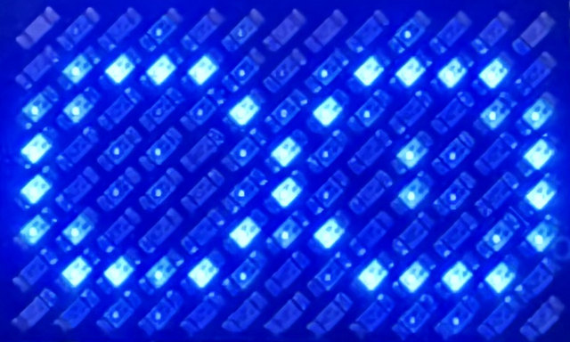
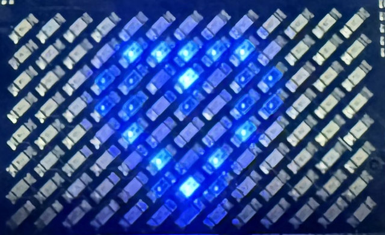
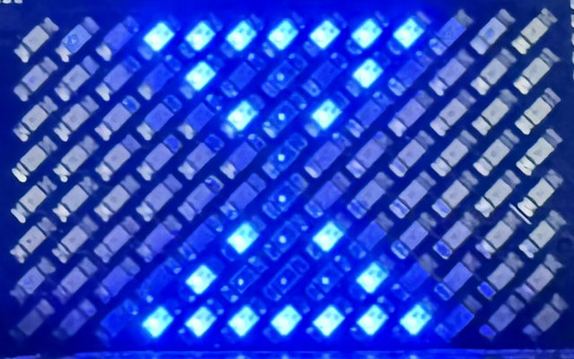
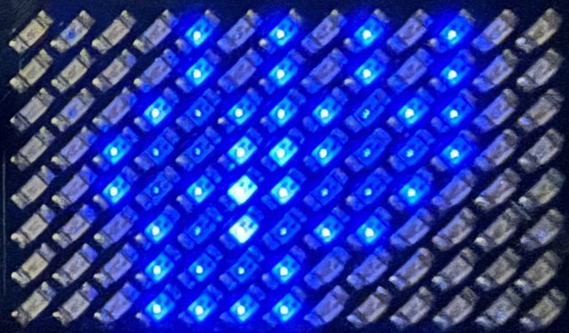
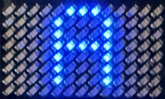
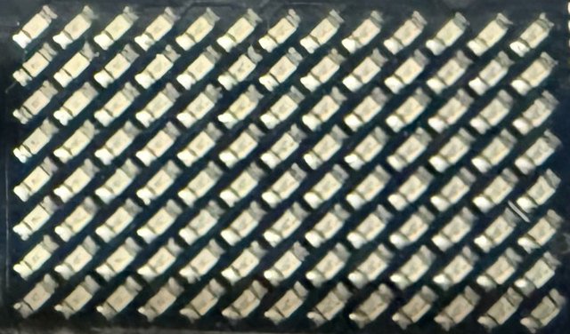
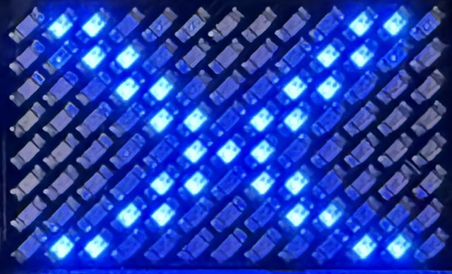

# PowerGlove Vision Installation Guide

Install PowerGlove Vision with one script on your UNO Q and one on RetroPie.
The scripts prepare the software and startup helpers; you finish by pairing the
devices, positioning the camera, and testing a game.

## 1. Prepare your devices

You need a provisioned Arduino UNO Q, a working RetroPie system, a UVC USB camera,
a powered USB hub, and a physical controller for RetroArch setup. Put both devices
on the same trusted local network with internet access. Supply your own games;
no ROMs or BIOS files are included.

For a new UNO Q, use Arduino App Lab to complete board setup and networking.
Record both devices' hostnames. Connect the camera through the powered hub.
You do not need to import PowerGlove Vision through App Lab or build a ZIP on
your computer. The installer builds and uploads the Arduino sketch for you.

Open a terminal on each device, either locally or over SSH. For the UNO Q:

```sh
ssh arduino@UNO-Q-NAME.local
```

Replace the example hostnames with your actual names. Use your normal account;
the scripts request your sudo password when administrator access is needed.
They do not store it. Close games before installing. Leave the devices powered
and connected while installation runs; first setup can take several minutes.

The commands below automatically select the latest published stable release from
GitHub. You do not need to enter a release tag or set shell variables. Run both
installers during the same setup session and compare the reported release names;
if a new release appeared between runs, rerun the older installation.
Development prereleases are available separately in the technical reference.
The latest release must include the installer assets before these commands work.

## 2. Run the UNO Q installer

Run this single line in the UNO Q terminal:

```sh
curl -fLO https://github.com/mathan416/PowerGlove-Vision/releases/latest/download/install-uno-q.sh && bash install-uno-q.sh
```

The script verifies its download, installs the app and sketch, and configures
automatic startup. It includes the early-start hourglass helper and the Shutdown
button's system helper. No separate helper commands are needed. Existing pairing,
calibration, and personal tuning are preserved when updating.

If the script reports a failure, stop and follow its message. If `curl` is missing,
install it with `sudo apt-get install curl ca-certificates`, then retry. The
installer checks compatibility before changing the application.

**Checkpoint:** Open `http://UNO-Q-NAME.local:8088/dashboard` in your browser.
Dashboard should load. With gestures off, a closed camera is normal. Open
**Glove Academy** to check that your camera view and whole hand appear, then
return to Dashboard with controller transmission stopped.

## 3. Run the RetroPie installer

Run this single line in the RetroPie terminal:

```sh
curl -fLO https://github.com/mathan416/PowerGlove-Vision/releases/latest/download/install-retropie.sh && bash install-retropie.sh
```

For a new installation, the script asks for your UNO Q hostname or IP address.
There are no placeholders to replace in the command.

The script installs the receiver, controller mapping, game-launch integration,
and automatic startup. Existing cabinet hooks and controller assignments remain.
It offers missing emulator installation through RetroPie Setup and checks
registered games, including Bad Street Brawler's Glove Zap configuration.

Follow any emulator or game ACTION messages. Missing games do not prevent the
base installation. If asked to launch and exit FCEUmm once, do that and rerun the
installer. If you use another emulator, the installer asks before selecting
FCEUmm for Bad Street Brawler.

**Checkpoint:** The report confirms that receiver startup is configured.
Pairing and live gameplay checks will still be listed as actions.

## 4. Pair the devices

Pairing gives both devices the same private token. Use the recommended
one-time-code method after both installers finish.

  1. On RetroPie, run `sudo /opt/powerglove/bin/powerglove-pair`. Leave the command running; it prints a 20-character code that expires after two minutes.
  2. In your computer's browser, open `https://UNO-Q-NAME.local:8443/setup`. This is the secure Setup page; ordinary HTTP Setup cannot accept pairing credentials.
  3. Enter your RetroPie hostname and its one-time code, then select **Prepare one-time code**.
  4. Read the identifier after `ID` on the UNO Q matrix. Compare it with the beginning of the browser certificate's SHA-256 fingerprint. The locally generated certificate may cause a browser warning; verify the fingerprint before continuing.
  5. If the identifiers match, select the confirmation checkbox, enter the six-digit PIN shown after `PN` on the matrix, and select **Complete pairing**.
  6. On RetroPie, confirm that the helper reports completion and exits. Run `sudo systemctl status powerglove-receiver.service`; the receiver should be active.

If the code expires, restart the RetroPie command and prepare a new attempt.
Never paste the private token into a document, screenshot, or support request.

### Alternative: pair with your RetroPie password

Use this route only if RetroPie accepts SSH password login and your account
can run `sudo` with that password.

  1. Open secure Setup and enter the RetroPie hostname and username.
  2. Select **Prepare password pairing** and compare the matrix `ID` with the browser certificate fingerprint.
  3. If they match, select the confirmation checkbox, enter the matrix PIN and your RetroPie password, and complete pairing.
  4. Confirm that the receiver service is active on RetroPie.

The password is used for one SSH operation and is not stored. If neither
pairing route works, follow the [token-management reference](CONFIGURATION_REFERENCE.md#pairing-and-token-management).


## 5. Calibrate and test a game

  1. On Dashboard, select a profile, wait for the camera, and show your hand. Use **Calibrate** if this is your first session or your resting position produces unwanted movement.
  2. Select **Start controller**. This allows controller packets to reach RetroPie and creates the virtual input device.
  3. On RetroPie, run `grep -A8 -B2 'PowerGlove Vision' /proc/bus/input/devices`. Look for the device name **PowerGlove Vision**. If it is missing, check pairing and the receiver service before changing emulator settings.
  4. Use your physical controller to open RetroArch. Go to **Settings > Input > RetroPad Binds > Port 1 Controls** and select **PowerGlove Vision**. Menu labels can vary with the RetroArch version.
  5. Check the D-pad, A, B, Start, and Select assignments. The installer provides an automatic mapping; adjust bindings only if needed, then save the controller profile or RetroArch configuration.
  6. Test movement and buttons in a game. If your cabinet merges multiple controllers, also configure that merger to accept the virtual device.

**Checkpoint:** A gesture changes the intended control in the running game.
Seeing the device name or a running service alone is not an end-to-end test.
Bad Street Brawler's Glove Zap uses simultaneous Left + Right through the
standard gamepad path. The RetroPie installer checks the game-specific FCEUmm option. Follow any
remaining ACTION message and rerun the installer after resolving it. See [Glove Zap setup](CONFIGURATION_REFERENCE.md#bad-street-brawler-glove-zap).
No extra-trigger assignment or receiver change is required.


## 6. Confirm startup and finish

- Launch a registered game and check the expected profile on Dashboard and the matrix.
- Exit the game and confirm that gestures turn off.
- Reboot both devices normally. Confirm that Dashboard returns and the matrix
  progresses through startup to the selected mode. The early-start helper is
  enabled automatically for this boot.
- Check that your saved tuning and calibration remain available.
- Select **Start controller** when ready and verify movement and buttons in the game.

The installers never reboot or request a shutdown automatically. They check
that the UNO Q shutdown helper is ready. The tested UNO Q restarts after a halt;
a disconnected website or blank matrix is not proof that power can be removed.

## Updates and checks

Updates keep an inventory of installed application files. After the first inventory
is created, unchanged obsolete files are backed up and removed; your own changes
are kept and reported. If an update is interrupted, follow its recovery instructions
before trying again.

To update, repeat the same single-line commands on both machines. Each selects
the latest published stable release. Changed managed files are backed up, and the installer prints their
location. It asks before interrupting an active UNO Q session. Close RetroArch
before updating RetroPie.

For checks only, use the script you already downloaded:

```sh
# On the UNO Q:
bash install-uno-q.sh --check
# On RetroPie:
bash install-retropie.sh --check
```

Checks do not download, install, restart, or change anything. They may request
sudo access to inspect protected settings.

| Report | Meaning |
| --- | --- |
| PASS | The named check succeeded. |
| FAIL | Resolve the problem before proceeding, then rerun the installer or checks. |
| ACTION | Complete the named step, such as pairing, adding games, or checking gameplay. |

A successful technical installation can still report ACTION for the physical
checks. Those checks need you and your cabinet.

For a specific version or a development prerelease, use the
[technical installation reference](CONFIGURATION_REFERENCE.md#versioned-two-script-installation).
It also explains compatibility, package building, backups, and recovery.

## If something does not work

- **Download fails:** confirm that the latest stable release includes installer assets,
  check internet access, and retry. A failed verification installs nothing.
- **Unsupported board software:** complete App Lab provisioning or use a compatible
  project release. Do not bypass the installer's compatibility check.
- **Website does not open:** try the UNO Q's current IP address instead of its
  hostname. Use HTTP on port 8088 and HTTPS on port 8443.
- **Camera missing:** check the powered hub, cable, and camera connection. Open
  Glove Academy and wait for the camera view.
- **No controller in RetroArch:** finish pairing, select Start controller, and
  select PowerGlove Vision for Port 1 using your physical controller.
- **Partial installation:** correct the reported problem and rerun the same
  release. Keep the printed backup location for recovery.

For diagnostic commands or manual repair, use the
[configuration reference](CONFIGURATION_REFERENCE.md#installation-troubleshooting-commands).

## Read the matrix and open the web pages

| Display | See it | Meaning |
| --- | --- | --- |
| Arduino boot logo |  | System startup, before the app display. |
| System heart |  | System startup is progressing. |
| Pulsing hourglass |  | PowerGlove Vision is starting. |
| Animated glove |  | Gestures are off. |
| Scanning `L` |  | Glove Academy practice is active; controller output is paused. |
| Scanning `T` |  | Tune gestures is active; controller output is paused. |
| `A`–`I` |  | The corresponding profile is selected; Program A is shown. |
| `BS` |  | Bad Street Brawler is selected. |
| `GB` |  | Super Glove Ball is selected. |
| Blank matrix |  | No LEDs are illuminated. Check board power and Dashboard; blank does not confirm shutdown. |
| Pulsing profile code |  | A calibrated hand is being tracked. Confirm controller output separately. |
| Blinking X |  | The app has requested an error display. Check Dashboard for the cause. |

See the [Matrix display guide](MATRIX_GUIDE.md) for the complete animations and
startup sequence. An animation does not prove that shutdown has finished.

| Page | Address |
| --- | --- |
| Dashboard | `http://UNO-Q-NAME.local:8088/dashboard` |
| Glove Academy | `http://UNO-Q-NAME.local:8088/learn` |
| Games (lower Setup section) | `http://UNO-Q-NAME.local:8088/setup#games-section` |
| Help and printable manuals | `http://UNO-Q-NAME.local:8088/help` |
| Connection settings | `http://UNO-Q-NAME.local:8088/setup` |
| Secure pairing | `https://UNO-Q-NAME.local:8443/setup` |


Help serves the public manuals, illustrations, and PDFs locally. **This cabinet**
shows addresses derived from your current browser connection and public device
settings. It never displays the token. The standalone Quick Reference is
excluded from the public package; the live cabinet page supplies local details.


## Play Checklist

  1. Power the RetroPie and UNO Q; leave the camera connected to the powered hub.
  2. Open `http://UNO-Q-NAME.local:8088/dashboard`.
  3. Select the active profile on the Dashboard, then confirm the expected profile and a detected hand. The saved startup profile remains on Setup.
  4. On first use, or after changing your camera or playing position, select **Calibrate** while holding a comfortable neutral pose. Otherwise reuse the saved calibration.
  5. Select **Start controller** only when you are ready to play.
  6. Launch the game and confirm its profile code on the matrix.
  7. Select **Stop controller** before adjusting the camera or leaving the cabinet.
  8. Read the shutdown limitation before disconnecting power. **Shutdown** requests a graceful halt, but the tested board restarts; an offline website is not proof that it is safe to unplug.

PowerGlove Vision deliberately boots with controller delivery stopped. Vision
and the dashboard keep running so setup never generates surprise game inputs.
**Shutdown** is different: it halts Linux on the UNO Q. The tested board automatically restarts; remaining halted is not guaranteed.
