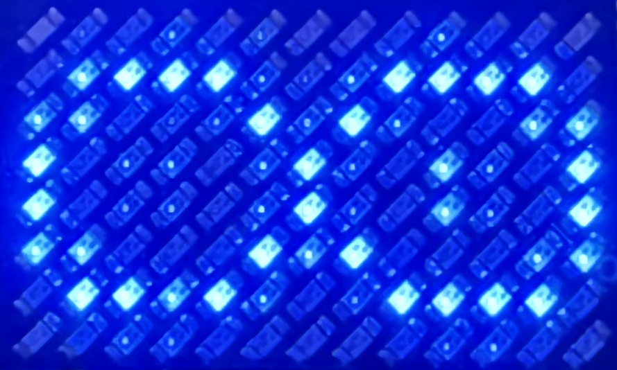
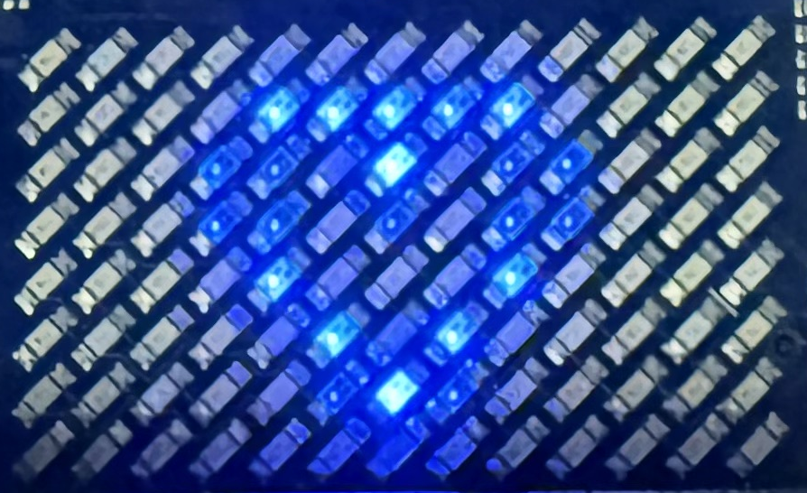
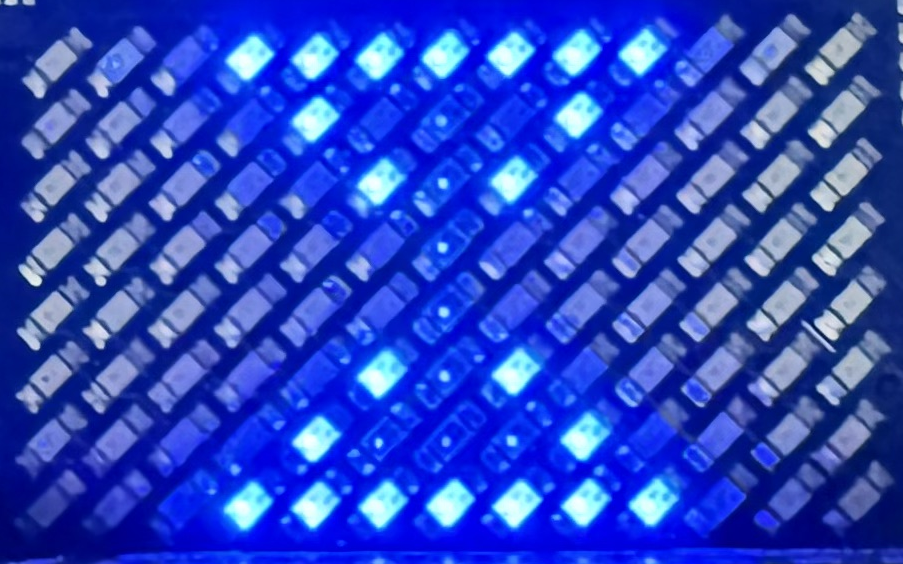
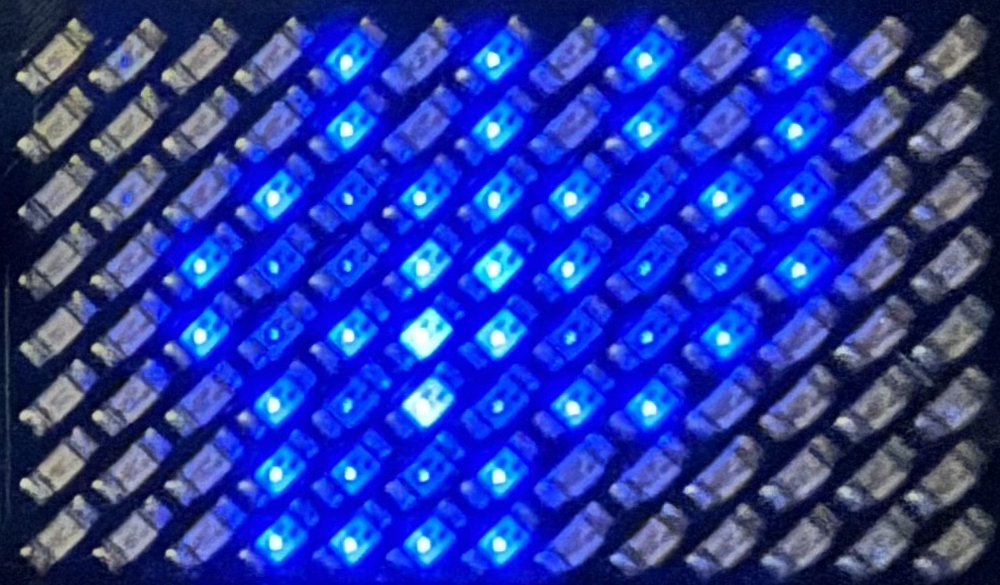
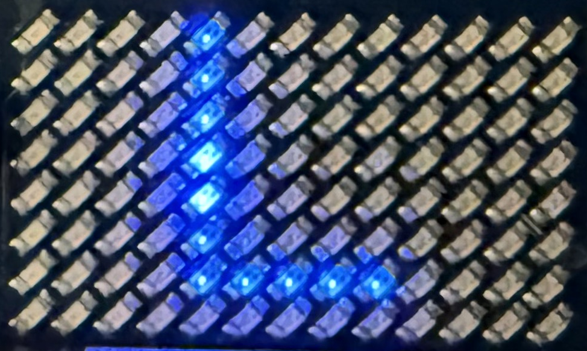
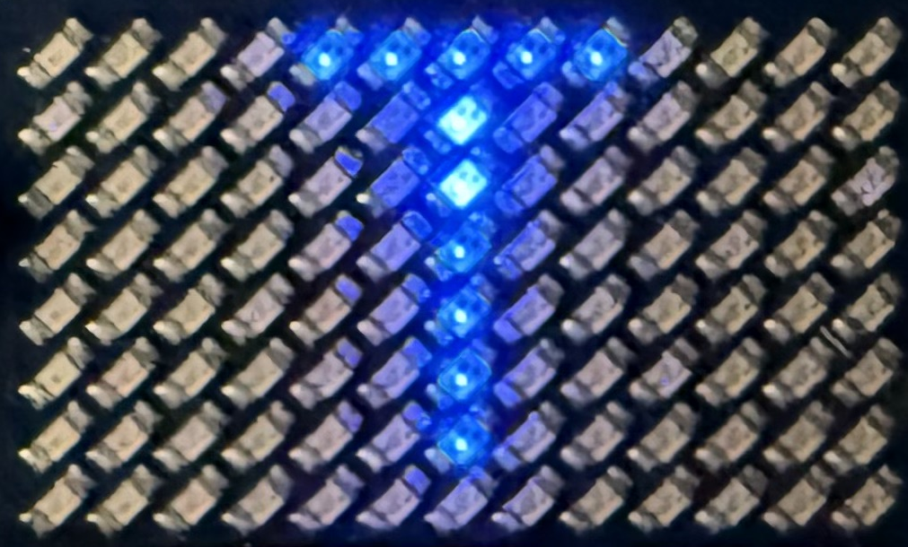
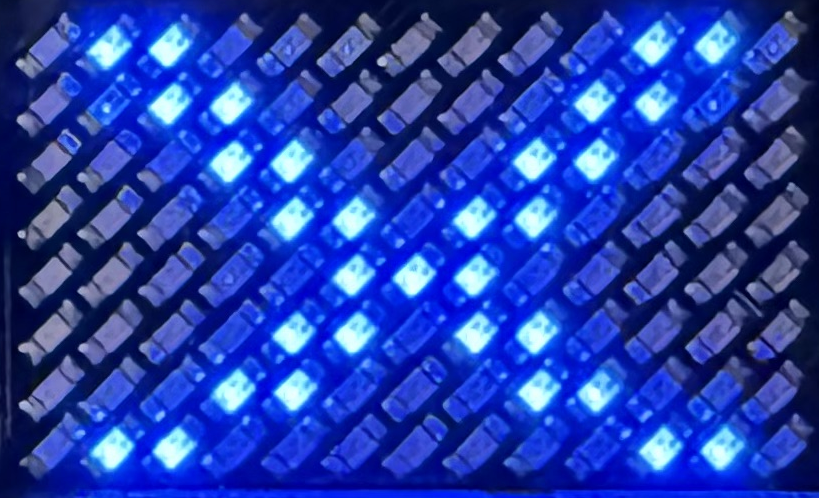
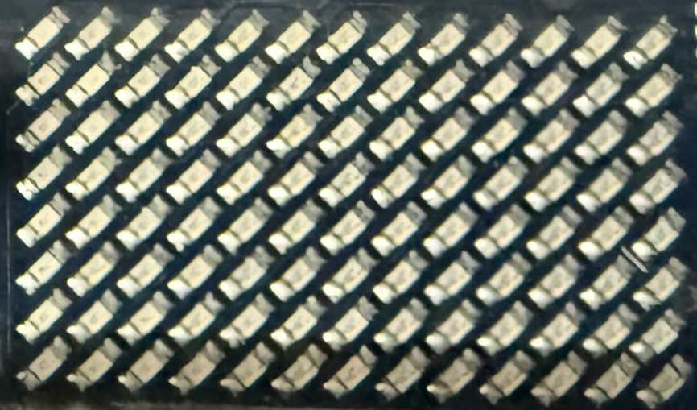
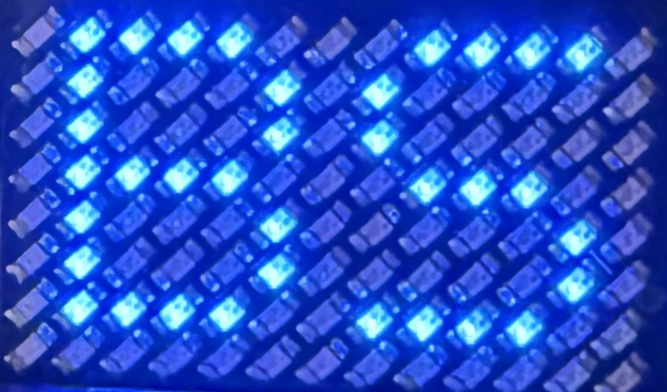
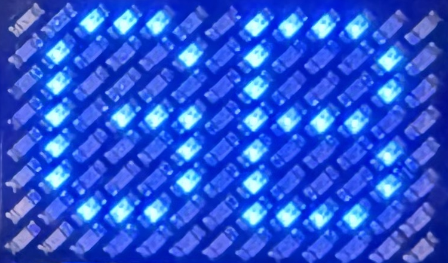

# Matrix display guide

The blue LED matrix on the UNO Q is PowerGlove Vision's status display. It tells
you which mode is active and helps distinguish startup, practice, tracking, and
pairing. It does not show a game's score or confirm that a game accepted a button.

Use the photographs and descriptions below to recognize the display and decide
what to do next.

## Recognize the display

| What you see | See it | What it means | What to do |
| --- | --- | --- | --- |
| Arduino boot logo |  | The UNO Q's system software is starting, before PowerGlove Vision controls the display. | Wait for the app's hourglass or normal display. |
| System heart animation |  | The board is progressing through system startup. | Wait for the app display. |
| Pulsing hourglass |  | PowerGlove Vision is starting. | Allow startup to finish. If it persists, check Dashboard. |
| Glove animation with moving cuff, curling fingers, and a spark |  | Gestures are off; the app is in its idle mode. | Open Glove Academy to practice, or choose a game profile on Dashboard. |
| A large scanning **L** |  | Glove Academy lessons are active. L stands for lessons. | Practice the moves shown in your browser; controller output is paused. |
| A large scanning **T** |  | Gesture tuning is active, including hand setup. | Follow the recording, preview, and save instructions in Glove Academy. Controller output is paused. |
| A steady **A-I**, **BS**, or **GB** |  | A game profile is selected, but a calibrated hand is not currently being reported as tracked. | Show your hand and check tracking/calibration on Dashboard. |
| **A-I**, **BS**, or **GB** gently changing brightness |  | The app reports a detected, calibrated hand for that profile. | Check Dashboard's controller status before playing. This pulse alone does not mean controls are enabled. |
| **ID**, characters, **PN**, and digits repeating | — | Secure pairing is showing the device identity and temporary PIN. | Follow the Connection page; read each group in order. |
| A flashing **X** |  | The app has requested an error display. | Read Dashboard's error message before deciding whether to reconnect the camera or restart. |
| A blank matrix |  | The display has been turned off, the app is stopping, or the board is still starting. It may also have lost power. | Use the browser and board power indicators to distinguish these cases. Blank does not prove shutdown is complete. |

## Startup: logo, hourglass, then your mode

A typical startup with **Gestures off** selected is:

1. The board shows its Arduino boot logo and system heart animation.
2. The hourglass appears while PowerGlove Vision starts.
3. Once startup finishes, the glove animation appears when gestures are off.

With an active startup profile, the later display can instead be its profile
letters. Opening Glove Academy selects **L**; enabling tuning selects **T**.
Wait for the camera view and startup message in your browser before practicing
or playing.

The hourglass means startup is in progress. If it stays on the display, open
Dashboard and check the startup or error message.

## The idle glove show

The glove curls, reopens, and glows while gestures are off. Open Glove Academy
to practice, or choose a game profile on Dashboard when ready to play.

A flashing spark here does **not** mean you performed Glove Zap. This animation
means gestures are off. It is different from selecting a game profile and merely
pressing **Stop controller**: that keeps the camera/profile active and can leave
profile letters visible.

## Glove Academy: L and T

| L: Glove Academy lessons | T: Gesture tuning |
| --- | --- |
|  |  |

**L** means Glove Academy lessons are active. **T** means gesture tuning is
active, including **Set up my hand**, individual adjustments, and previews.
Follow the browser's instructions to practice or complete your recordings.

Both modes pause controller output. After practice, use Dashboard to check the
selected profile and controller state; after tuning, explicitly start controller
delivery when ready to play. A pairing display can temporarily cover either
letter. Tracking details and pose failures remain in the browser rather than
being spelled out on the matrix.

## Game profile letters

| Letters | See it | Selected profile |
| --- | --- | --- |
| **A** through **I** |  | The corresponding reusable Program A-I profile; A is shown |
| **BS** |  | Bad Street Brawler |
| **GB** |  | Super Glove Ball |

For example, **GB** is what you should expect with Super Glove Ball selected.
It stays steady until a calibrated hand is being tracked, then gently pulses. The characters remain the same: the animation does not
identify individual finger curls, movements, or button presses.

The important distinction is **tracking versus delivery**. A pulsing **GB** can
appear while controller output is stopped. Confirm **Start controller** has been
used and Dashboard shows output enabled, then confirm the action in the game.
The matrix does not acknowledge RetroPie receipt or the game's response.

A generic **PG** ready symbol or a small pulsing tracking symbol can appear when
no recognized profile identifier is available. These are fallback displays;
normal named game profiles use their letters. They do not represent extra games
or new gesture commands. If you expected **GB** or **BS**, check the selected
profile on Dashboard.

## Pairing: ID and PN

During secure pairing, the small display presents the information in pieces:

1. **ID** announces the device certificate identity.
2. Seven hexadecimal characters follow in groups of two, with the last character shown alone.
3. **PN** announces the temporary six-digit PIN.
4. Three pairs of digits follow, preserving leading zeroes.
5. The sequence repeats so you can read it again.

Read each pair from left to right and join the groups in the order shown. Do not
mistake **PN** for a game program or use the certificate identity as the PIN.

Follow the Connection page to compare the identifier and enter the PIN. Pairing
information temporarily replaces the usual display. If it expires before you
finish, prepare a new pairing attempt. Check the page for confirmation that
pairing succeeded.

For public photographs, use a clearly marked demonstration sequence or obscure
live pairing digits. Never publish an active PIN or connection credentials. See
[secure pairing](INSTALL_README.md) for the full procedure.

## Errors, pauses, and a blank display

A blinking **X** means the app needs attention. Read Dashboard's error message
for the cause and the next step. Check Dashboard whenever something is not
working, even if the matrix still shows a normal mode.

A blank display alone does not prove the board is safe to unplug. Use the normal
Shutdown procedure and its completion guidance. If the board should be running,
check its power, wait for boot to finish, and try Dashboard. If the web app works
but the display stays blank, record what appeared immediately before it went
blank and whether restarting the app changes it.
