<p align="center">
  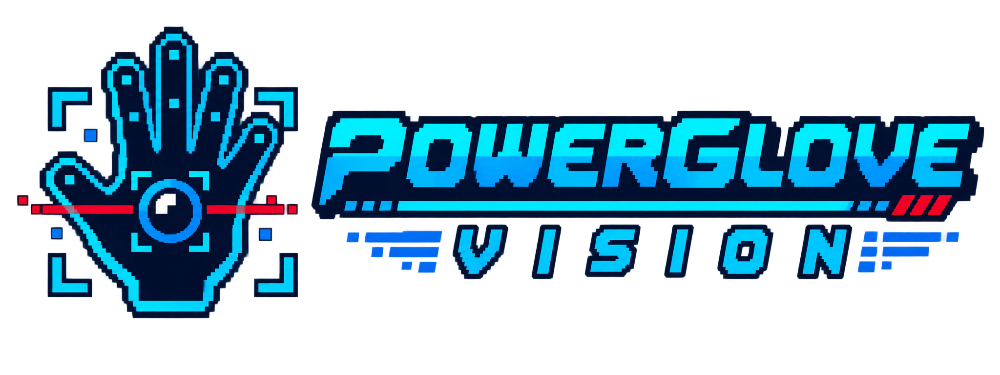
</p>

# Programs A-I: The Cartridge-Free Field Manual

**How Bad Street Brawler configured the original Power Glove - and how
PowerGlove Vision recreates the useful behaviour with a camera.**

## The wonderfully strange original idea

Bad Street Brawler contained nine configuration programs labelled A through I.
The player loaded one into the Power Glove, switched off the NES, swapped to a
different cartridge within roughly 30 seconds, and kept using the downloaded
mapping.

These programs were not replacement firmware. They were small configurations
for the glove's resident gesture interpreter. Each combined hand position,
depth, wrist angle, and finger flex into ordinary NES controller inputs. The
next game therefore did not need special Power Glove support.

> **POWERGLOVE VISION CHANGES THE WORKFLOW**  The UNO Q keeps all nine profiles
> ready at once. Select one on the Dashboard or let RetroPie choose it when a game
> launches. Bad Street Brawler never has to be opened first.

## Quick selector

| Program | Best fit | Camera-era personality |
| --- | --- | --- |
| **A** | Pinball | Two finger flippers, wrist tilt, combined-flipper mode |
| **B** | Joust | Steer by position; curl a finger to flap |
| **C** | Gyruss | Rotate by wrist angle; fire and bomb gestures |
| **D** | Challenge mode | Reversed directions with thumb/index buttons |
| **E** | Defender II | Ship movement, fire, smart bomb, evasive movement |
| **F** | Sesame Street 1-2-3 | Open-hand Yes and closed-hand No |
| **G** | Gun.Smoke | Walk by position; aim by wrist angle |
| **H** | Training / general play | Familiar controls with pulsed buttons |
| **I** | Knight Rider / driving | Wrist steering, throttle, brake, and turbo |

## Menu gestures shared by every program

| Gesture | See it | Controller result |
| --- | --- | --- |
| Hold a V sign for about 0.7 seconds | 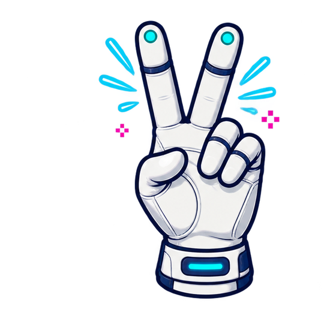 | Start or pause |
| Hold a thumbs-up with the other fingers closed for about 0.7 seconds | 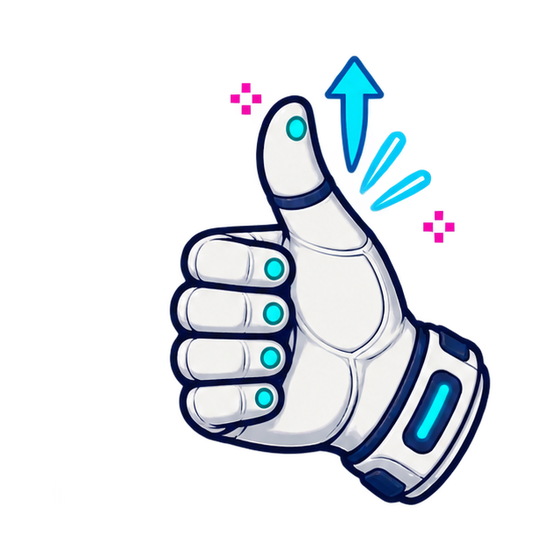 | Select |

These menu poses briefly suppress directions and action gestures while they
form. Return to a relaxed open hand after the command is recognized.

## Program cards

### A - Pinball rig

| Gesture | See it | Controller result |
| --- | --- | --- |
| Curl the index finger | 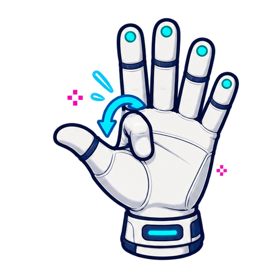 | Right flipper / A |
| Curl the thumb | 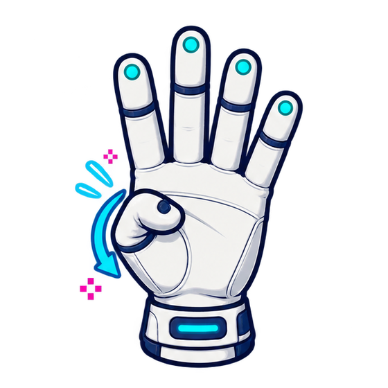 | Left flipper / Up |
| Rotate the wrist toward six o'clock | 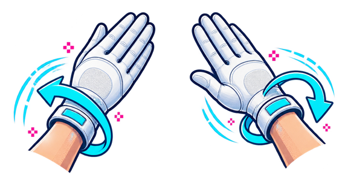 | Tilt / B |
| Pull the hand away from the camera | 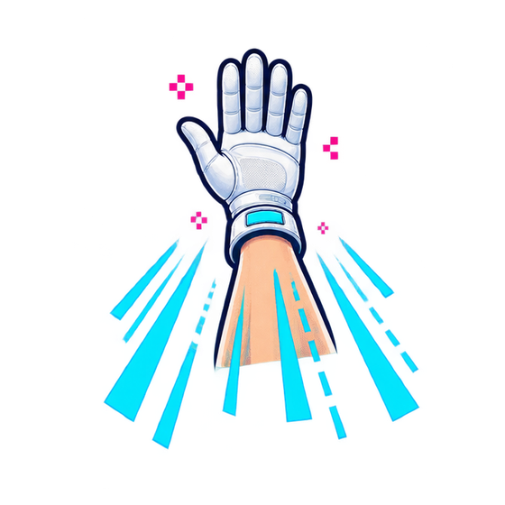 | Toggle combined-flipper behaviour |

**Use it for:** pinball tables and games that benefit from two independent
finger actions.

### B - Joust rig

| Gesture | See it | Controller result |
| --- | --- | --- |
| Move the hand left or right | 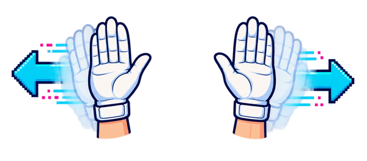 | Steer left or right |
| Curl the thumb |  | Turn the rider |
| Curl the index or middle finger |  | Pulsed flap input |

**Use it for:** Joust and any game where rhythmic, repeated presses matter.

### C - Gyruss rig

| Gesture | See it | Controller result |
| --- | --- | --- |
| Roll the wrist left or right |  | Rotate counter-clockwise or clockwise |
| Keep the index finger straight | 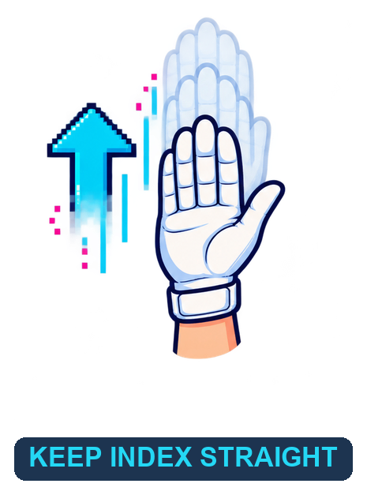 | Continuous fire |
| Pull the hand away from the camera |  | Launch a bomb |

**Use it for:** circular shooters and games with rotation plus rapid fire.

### D - Mirror-world rig

| Gesture | See it | Controller result |
| --- | --- | --- |
| Move the hand left or right |  | Reversed right or left direction |
| Raise or lower the hand | 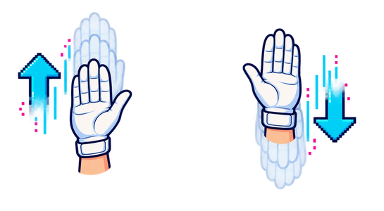 | Reversed down or up direction |
| Curl the thumb |  | First action button |
| Curl the index finger |  | Second action button |

**Use it for:** deliberate chaos, party challenges, or accessibility
experiments that need inverted direction mappings.

### E - Defender rig

| Gesture | See it | Controller result |
| --- | --- | --- |
| Move the whole hand | 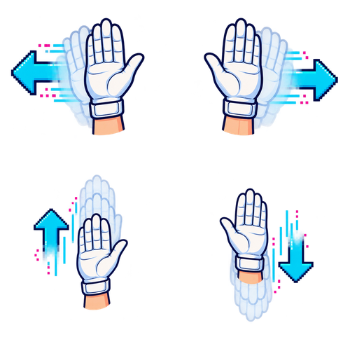 | Move the ship |
| Curl the thumb |  | Fire |
| Rotate the wrist toward six o'clock |  | Smart bomb |
| Curl the ring finger |  | Rapid horizontal movement |

**Use it for:** Defender II and multi-action shooters.

### F - Yes / No rig

| Gesture | See it | Controller result |
| --- | --- | --- |
| Close every finger into a fist | 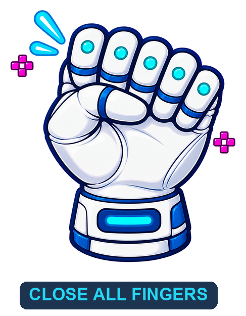 | No |
| Move an open hand in any direction |  | Yes |

**Use it for:** Sesame Street 1-2-3 and simple choice-driven games.

### G - Gun.Smoke rig

| Gesture | See it | Controller result |
| --- | --- | --- |
| Move the whole hand |  | Walk using X, Y, and depth movement |
| Curl the index finger |  | Fire |
| Roll the wrist |  | Choose firing direction |
| Curl the thumb and ring finger | 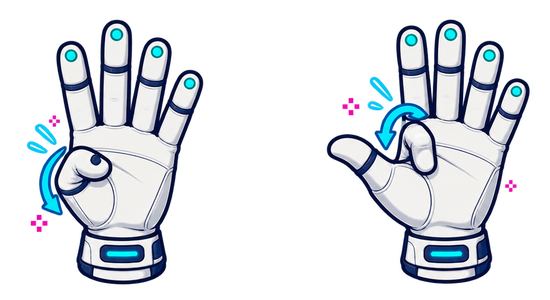 | Suppress action for menu navigation |

**Use it for:** Gun.Smoke and shooters with movement plus directional fire.

### H - Training rig

| Gesture | See it | Controller result |
| --- | --- | --- |
| Move the whole hand |  | Conventional directions |
| Curl the thumb |  | First pulsed action button |
| Curl the index finger |  | Second pulsed action button |
| Return the hand to center |  | Training acknowledgement |

**Use it for:** learning the system or giving an unmapped game a sensible
general-purpose starting point.

### I - Driving rig

| Gesture | See it | Controller result |
| --- | --- | --- |
| Roll the wrist left or right |  | Steer |
| Curl the index finger |  | Throttle |
| Lower the hand | 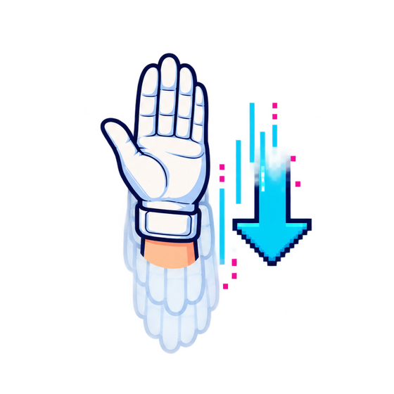 | Brake |
| Push the hand toward the camera | 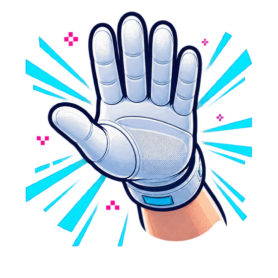 | Turbo |
| Curl the thumb |  | Auxiliary action |

**Use it for:** Knight Rider and driving games that need steering, speed, and
one extra action.

## How PowerGlove Vision selects a program

Manual selection is available on the UNO Q Setup page. Automatic selection uses
the exact, case-insensitive ROM basename in `/etc/powerglove/games.json`.
RetroPie's launch hook authenticates a profile request, the UNO Q releases any
held controls, changes mapping, recalibrates, and acknowledges the new profile
on its blue matrix.

```json
{
  "Joust (USA).zip": "program_b",
  "Gyruss (USA).nes": "program_c",
  "Gun.Smoke (USA).7z": "program_g"
}
```

The matrix displays `A` through `I`. Unknown games turn gesture control off,
preventing a previous title's mapping from leaking into the next one.

## Practise safely

1. Open `http://UNO-Q-NAME.local:8088/learn`.
2. Keep the whole hand visible and select **Center hand**.
3. Move slowly until the intended gesture is recognized consistently.
4. Open Debug to compare hand motion with generated controller output.
5. Start controller delivery only when ready to play.

Learn mode works without RetroPie and automatically starts the camera while
suppressing controller output. This also works while **Gestures off** is the
selected profile. Leaving Learn restores the selected mode, so it is a safe
place to build muscle memory without changing the saved or active selection.

## What remains special

The nine profiles emit useful conventional controller inputs, so ordinary NES
cores can use them today. Native Power Glove packets would still matter for
glove-aware software such as Super Glove Ball and Bad Street Brawler's
glove-only zap. PowerGlove Vision preserves the richer analogue and finger data
needed for that future emulator integration; it does not modify ROM images.

For installation, secure pairing, RetroArch mapping, and troubleshooting, see
`INSTALL_README.md`.

## Project note

PowerGlove Vision is an independent MIT-licensed hobbyist project by Iain
Bennett. Nintendo, NES, Power Glove, Bad Street Brawler, and other marks belong
to their respective owners. No ROM images are distributed with this project.
