# Programs A-I: The Cartridge-Free Field Manual

Bad Street Brawler supplied nine programs that configured the original
Power Glove for different games. This guide explains how those programs
worked and how PowerGlove Vision recreates their controls with a camera.

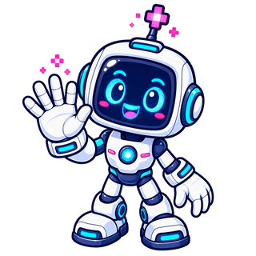

**Pixel Pal says:** Pick one program, practise one gesture, then try a round.
For a picture of each basic gesture, see [Your gesture reference](GAMEPLAY_GUIDE.md#your-gesture-reference).

## Choose a program and try it

  1. Use the selector below to choose a program for your game or experiment.
  2. Select that profile on Dashboard, wait for tracking, and check its gestures with controller delivery stopped.
  3. Select **Start controller** when ready to play. Use the [Gameplay Guide](GAMEPLAY_GUIDE.md) for game objectives and first-round exercises.
  4. If the mapping suits another game, add its exact filename to the registry using [Register games and select profiles](CONFIGURATION_REFERENCE.md#register-games-and-select-profiles).

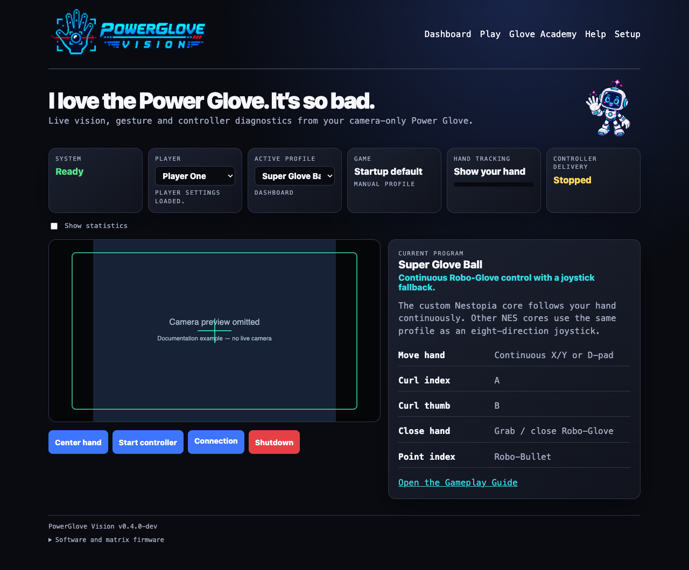

To change sensitivity without changing a program's button assignments, open
**Glove Academy → Tune gestures**. The threshold table is beneath the camera and the
matrix shows a scanning **T**, matching ordinary Glove Academy’s scanning **L**. See the illustrated [tuning walkthrough](CONFIGURATION_REFERENCE.md#tune-gesture-sensitivity).

## Where the programs came from

Bad Street Brawler contained nine configuration programs labelled A through I.
The player loaded one into the Power Glove, switched off the NES, swapped to a
different cartridge within roughly 30 seconds, and kept using the downloaded
mapping.

These programs were not replacement firmware. They were small configurations
for the glove's resident gesture interpreter. Each program mapped hand position, depth, wrist angle, and finger bends to
ordinary NES controller inputs. The
next game therefore did not need special Power Glove support.

PowerGlove Vision keeps all nine profiles ready at once. Select one on
Dashboard or let RetroPie choose it when a game launches. You do not need to
open Bad Street Brawler first.

## Quick selector

| Program | See it | Best fit | Main controls |
| --- | --- | --- | --- |
| **A** | 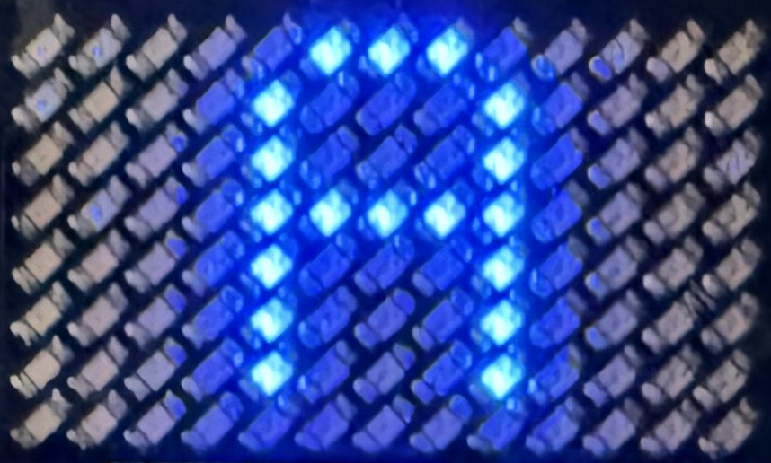 | Pinball | Two finger flippers, wrist tilt, combined-flipper mode |
| **B** | 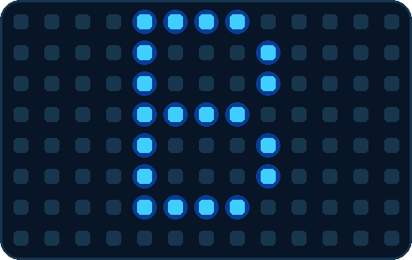 | Joust | Steer by position; curl a finger to flap |
| **C** | 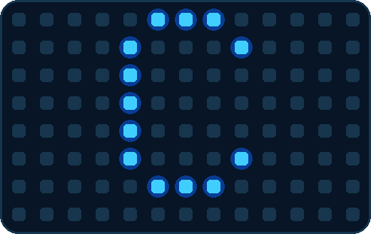 | Gyruss | Rotate by wrist angle; fire and bomb gestures |
| **D** | 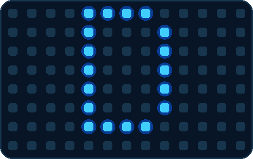 | Challenge mode | Reversed directions with thumb/index buttons |
| **E** | 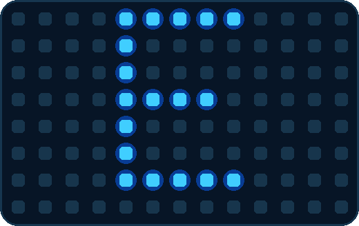 | Defender II | Ship movement, fire, smart bomb, evasive movement |
| **F** | 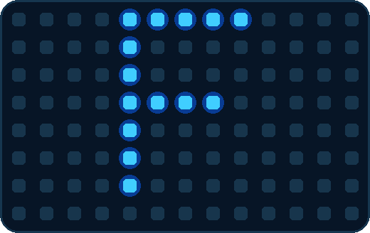 | Sesame Street 1-2-3 | Open-hand Yes and closed-hand No |
| **G** | 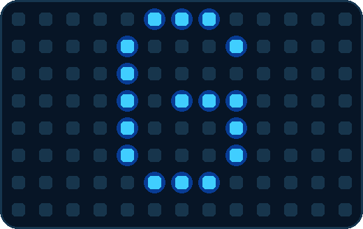 | Gun Smoke | Walk by position; combine index curl and a forward push to fire |
| **H** | 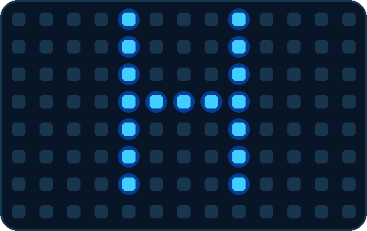 | Training / general play | Familiar controls with pulsed buttons |
| **I** | 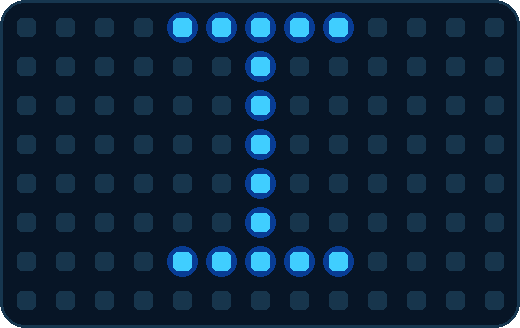 | Knight Rider / driving | Wrist steering, throttle, brake, and turbo |

## Menu gestures shared by every program

| Gesture | See it | Controller result |
| --- | --- | --- |
| Hold a V sign for about 0.7 seconds | 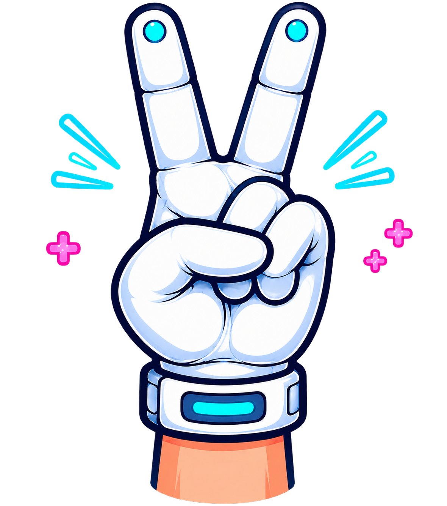 | Start or pause |
| Hold a thumbs-up with the other fingers closed for about 0.7 seconds |  | Select |

These menu poses suppress A/B attacks while they form. Some programs can still
produce directional output from wrist, depth, or finger gestures. Keep your
hand near its calibrated resting position, and return to a relaxed open hand
after the command is recognized.

<!-- PAGEBREAK -->

## Program cards

### A - Pinball rig

| Gesture | See it | Controller result |
| --- | --- | --- |
| Curl the index finger | 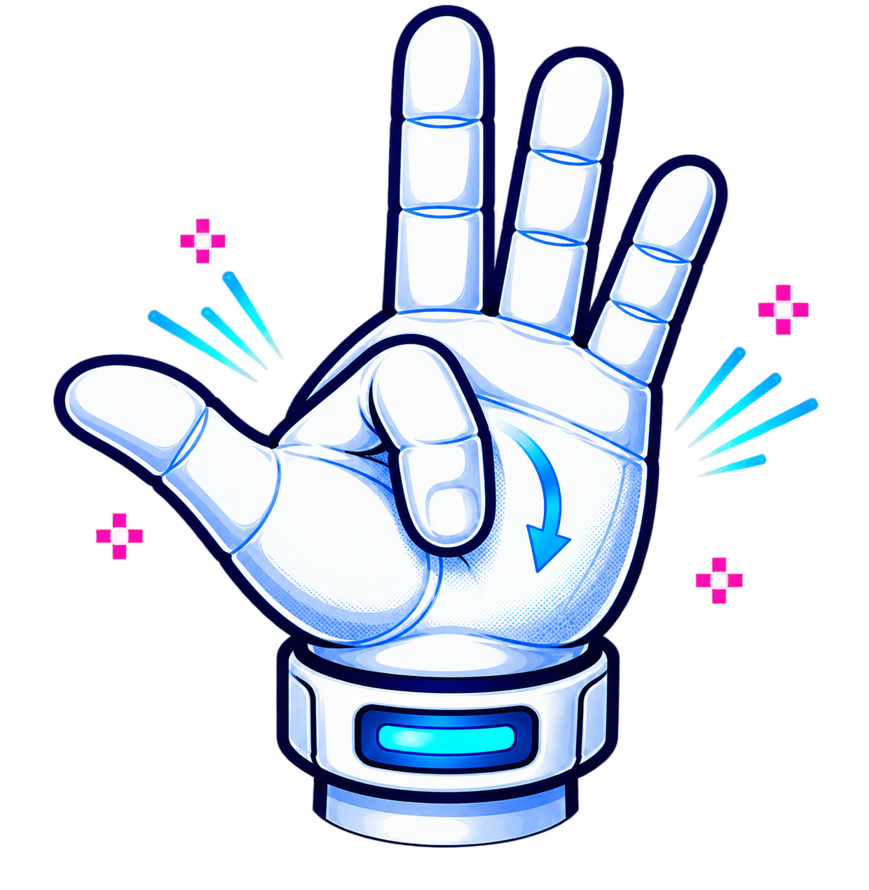 | Right flipper / A |
| Curl the thumb | 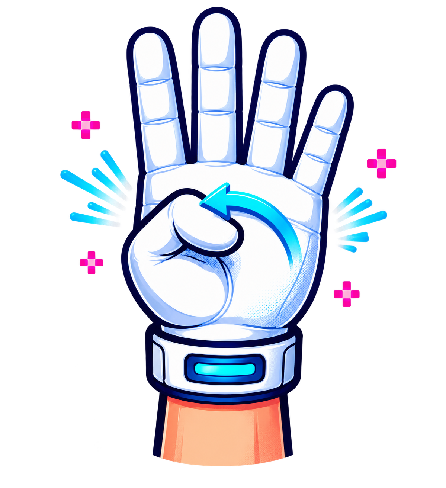 | Left flipper / Up |
| Roll the wrist left or right |  | Tilt / B |
| Pull the hand away from the camera | 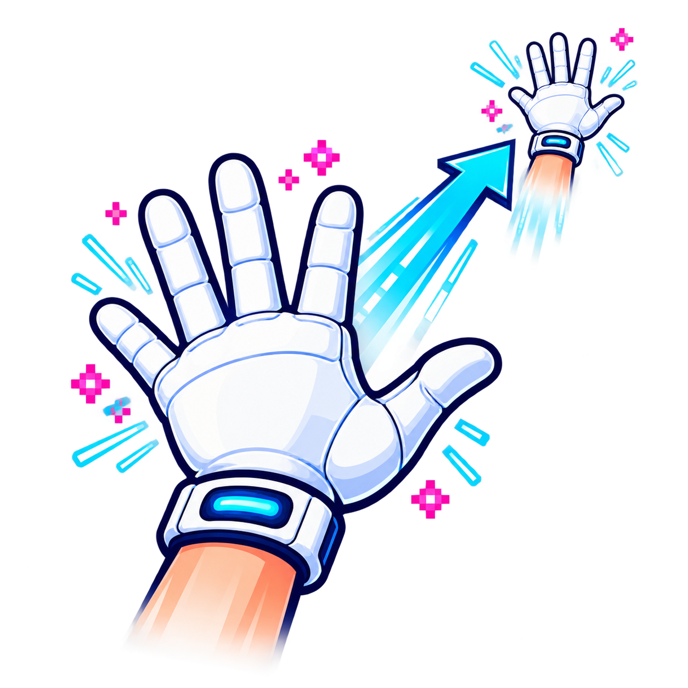 | Toggle combined-flipper behaviour |

Use this profile for pinball tables and games that benefit from two independent
finger actions.

### B - Joust rig

| Gesture | See it | Controller result |
| --- | --- | --- |
| Move the hand left or right |  | Steer left or right |
| Curl the thumb |  | B button; see the [Joust play card](GAMEPLAY_GUIDE.md#joust) for its in-game use |
| Curl the index or middle finger |  | Pulsed flap input |

Use this profile for Joust and any game where rhythmic, repeated presses matter.

### C - Gyruss rig

| Gesture | See it | Controller result |
| --- | --- | --- |
| Roll the wrist left or right |  | Rotate counter-clockwise or clockwise |
| Keep the index finger straight |  | Continuous fire |
| Pull the hand away from the camera |  | Launch a bomb |

Use this profile for circular shooters and games with rotation plus rapid fire.

### D - Mirror-world rig

| Gesture | See it | Controller result |
| --- | --- | --- |
| Move the hand left or right |  | Reversed right or left direction |
| Raise or lower the hand |  | Reversed down or up direction |
| Curl the thumb |  | First action button |
| Curl the index finger |  | Second action button |

Use this profile for deliberate chaos, party challenges, or accessibility
experiments that need inverted direction mappings.

### E - Defender rig

| Gesture | See it | Controller result |
| --- | --- | --- |
| Move the whole hand |  | Move the ship |
| Curl the thumb |  | Fire |
| Roll the wrist left or right |  | Smart bomb |
| Curl the ring finger |  | Rapid horizontal movement |

Use this profile for Defender II and multi-action shooters.

### F - Yes / No rig

| Gesture | See it | Controller result |
| --- | --- | --- |
| Close every finger into a fist |  | No |
| Move an open hand in any direction |  | Yes |

Use this profile for Sesame Street 1-2-3 and simple choice-driven games.

### G - Gun Smoke rig

| Gesture | See it | Controller result |
| --- | --- | --- |
| Move the whole hand |  | Walk using horizontal and vertical hand movement |
| Curl the index finger |  | Fire |
| Roll the wrist |  | Add left or right movement |
| Curl the thumb and ring finger |  | Suppress D-pad and A/B output |

A forward push sends B. Combine it with index curl (A) to send A+B.

Use this profile for Gun Smoke and shooters with movement plus directional fire.

### H - Training rig

| Gesture | See it | Controller result |
| --- | --- | --- |
| Move the whole hand |  | Conventional directions |
| Curl the thumb |  | Pulsed B |
| Curl the index finger |  | Pulsed A |
| Return the hand to center |  | Release directional input |

Use this profile for learning the system or giving an unmapped game a sensible
general-purpose starting point.

### I - Driving rig

| Gesture | See it | Controller result |
| --- | --- | --- |
| Roll the wrist left or right |  | Steer |
| Curl the index finger |  | Throttle |
| Lower the hand | 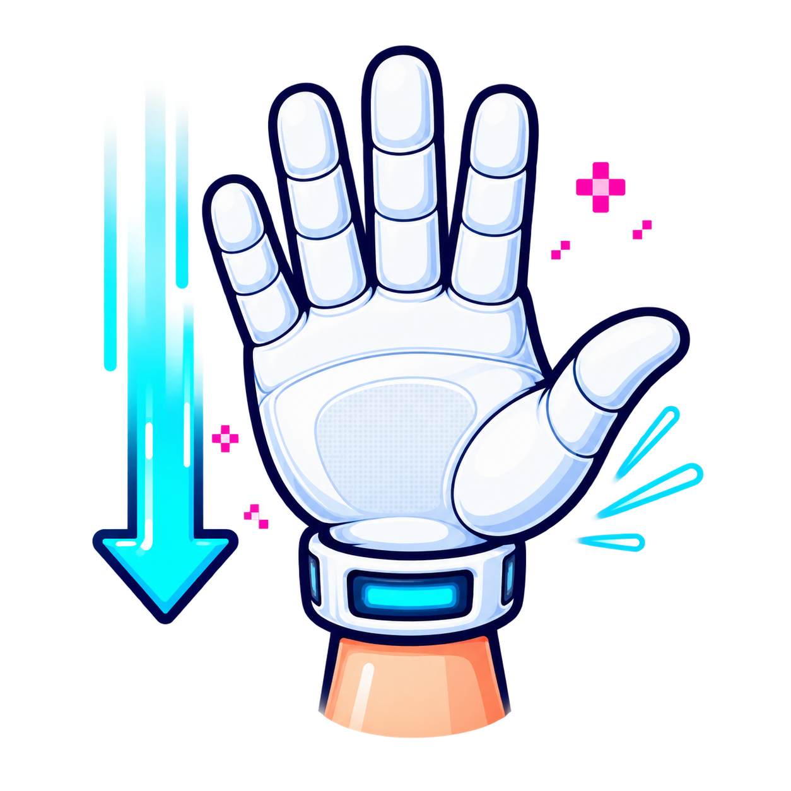 | Brake |
| Push the hand toward the camera | 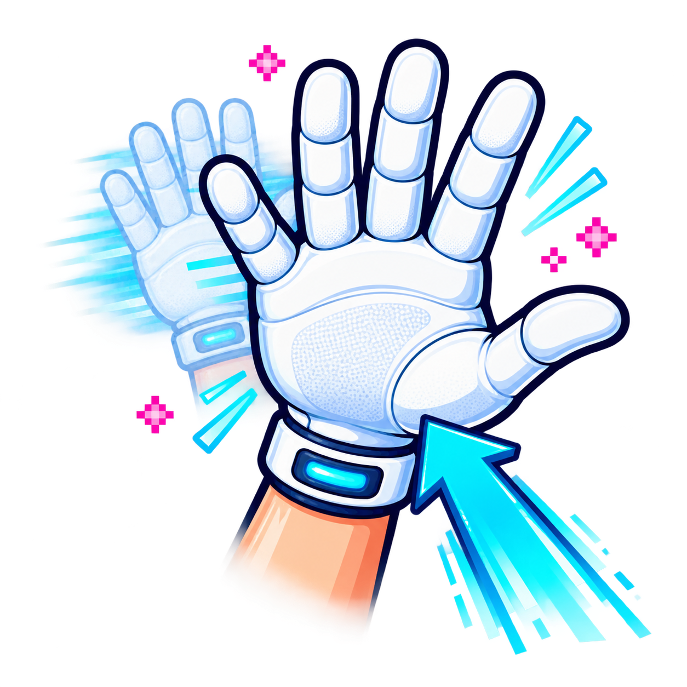 | Turbo |
| Curl the thumb |  | Auxiliary action |

Use this profile for Knight Rider and driving games that need steering, speed, and
one extra action.

## How PowerGlove Vision selects a program

Choose the current profile on Dashboard; choose the saved startup profile on
Setup. Automatic selection matches the complete ROM filename, including its
extension but excluding its folder path, against `/etc/powerglove/games.json`
on RetroPie. Matching ignores letter case.

The launch hook sends an authenticated profile request. The UNO Q releases held
controls, changes the mapping, reuses the saved calibration, and acknowledges
the new profile on its blue matrix. If no valid calibration is saved, it collects
an initial reference while you hold your open hand still in a comfortable
resting position.

```json
{
  "games": {
    "Joust (USA).zip": "program_b",
    "Gyruss (USA).nes": "program_c",
    "Gun.Smoke (USA).7z": "program_g"
  }
}
```

Merge entries into the existing `games` object; do not replace other registered
games. The matrix displays `A` through `I`. When an unknown game starts, the launch hook turns gesture control off so
the previous game's mapping does not remain active.

## Practise safely

  1. Open `http://UNO-Q-NAME.local:8088/learn`.
  2. Keep your whole hand visible. Select **Calibrate** on first use or when your resting position produces unwanted movement, then hold still.
  3. Move slowly until the intended gesture is recognized consistently.
  4. Open Debug to compare hand motion with generated controller output.
  5. Start controller delivery only when ready to play.

Glove Academy mode works without RetroPie and automatically starts the camera while
suppressing controller output. This also works while **Gestures off** is the
selected profile. Leaving Glove Academy restores the selected mode, so it is a safe
place to build muscle memory without changing the saved or active selection.

## What remains special

The nine profiles emit useful conventional controller inputs, so ordinary NES
cores can use them today. Bad Street Brawler's Glove Zap also works through
standard inputs: its dedicated profile emits a short simultaneous Left + Right
pulse. FCEUmm must allow opposing directions for that game. Richer native glove
integration remains separate work; PowerGlove Vision preserves analogue and
finger data for it and does not modify ROM images.

For installation, secure pairing, RetroArch mapping, and troubleshooting, see
the [Installation Guide](INSTALL_README.md).

## Project note

PowerGlove Vision is an independent MIT-licensed hobbyist project by Iain
Bennett. Nintendo, NES, Power Glove, Bad Street Brawler, and other marks belong
to their respective owners. No ROM images are distributed with this project.

### Personal sensitivity and practice

Glove Academy has twelve lessons, including **Glove Zap** and **Pull Back**. Tune an
individual gesture with open hand → gesture → open hand, three seconds per step.
Optional **Set up my hand** uses a gentle fist with the thumb outside for the
middle step. Open means fingers and thumb gently extended, wrist straight, with
the hand centered at a consistent camera distance. For push or Pull Back, return
to the starting distance for the final recording. Preview before saving.

Saved thresholds apply across profiles, including these programs. Movement
controls use separate activation and release thresholds, while program-specific
button pulses and mappings remain in effect. Extended-only fingers retain their
existing settings. Practice and tuning pause controller delivery.
